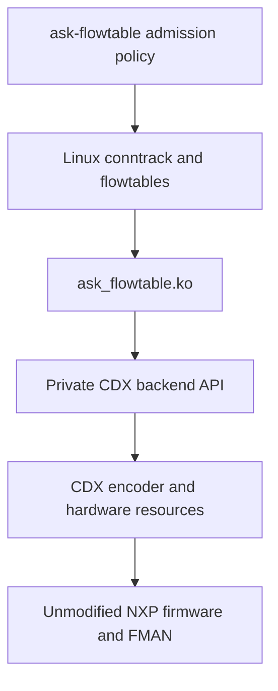

# Linux flowtable architecture

This is the current implementation contract after IPv4 TCP/UDP NAT, including
SNAT, MASQUERADE, DNAT and hairpin/double NAT (2026-09-15). The [project overview](linux-flowtable-offload.md) gives supported
scope and direction; the [history index](flowtable/history/README.md) retains
earlier designs, superseded restrictions and dated verification evidence.
Update this document when a contract changes, and record the proof separately.

## Components and ownership

Linux owns firewall decisions, conntrack and NAT mappings, routing, neighbours,
flow activity and expiry. The adapter validates native requests and tracks
their dependencies. CDX owns hardware encoding, allocation, retirement and
terminal failure state. Firmware forwards admitted packets without invoking
CMM or per-flow FCI commands. `dpa_app`/FMC still initialize the hardware once.

| Responsibility | Source |
| --- | --- |
| Native callback context, shared handles and route integration | [Kernel patch 140](../patches/kernel/140-ask-flowtable-context.patch) |
| Rule decoding, binding, dependency watches and work | [ask_flowtable.c](../cdx/ask_flowtable.c) |
| Private source interface | [cdx_flowtable_backend.h](../cdx/cdx_flowtable_backend.h) |
| Transactions, claim, port checks and fatal guard | [cdx_flowtable_backend.c](../cdx/cdx_flowtable_backend.c) |
| Independent directional encoding and retirement storage | [cdx_flowtable_hw.c](../cdx/cdx_flowtable_hw.c) |
| Shared classifier encoder and firmware operations | [cdx_ehash.c](../cdx/cdx_ehash.c) |
| Physical identity and configuration | [devman.c](../cdx/devman.c), [dpa_cfg.c](../cdx/dpa_cfg.c) |
| Admission configuration and revocation | [ask_flowtable.py](../tools/ask_flowtable.py) and [policy guide](flowtable-policy.md) |

The private interface uses GPL-only exports in `ASK_CDX_FLOWTABLE`. It exposes
typed rules, counters and opaque hardware handles, without CDX control/device
structures or firmware objects. It is maintained with this repository, with no
stable binary ABI promise. The adapter depends on `cdx` and `nf_flow_table`;
CDX has no flowtable-module dependency. Kernel integration targets the pinned
[6.12.103 recipe](../meta-ask/recipes-kernel/linux/linux-ask_6.12.bb) and SDK source.

## Mode selection and configuration seal

The test initramfs reads `ask.offload=cmm|flowtable`; absence selects CMM.
`ask.flowtable_observe=1` in flowtable mode validates requests but declines
installation. CDX owns the read-only `offload_owner` and `flowtable_observe`
module parameters. Select an owner through a clean boot; module reload and
starting CMM are not live handover mechanisms.

Flowtable startup loads CDX and then the adapter, skips CMM/FCI/auto_bridge, and
disables CDX's Wi-Fi and IPsec runtime hooks. If FCI is explicitly loaded, all
its commands, including queries, return `-EOPNOTSUPP` in this mode. Initial
hardware setup remains shared. The CMM service also checks ownership. The boot
selector is implemented in the test initramfs; production packaging and
persistent deployment remain separate work.

The adapter acquires an exclusive provider claim before publishing callbacks.
Claim is refused in CMM mode, after terminal failure, while another claim or
live directions exist, or while retirement is pending. The first successful
claim permanently seals provider configuration for that CDX instance, even if
adapter initialization subsequently fails. SET_PARAMS rechecks the seal under
the control lock. Release requires zero live directions; it cannot clear the
seal, quarantine or terminal latch.

## Native context and admission

One hardware flowtable may bind at most two physical Ethernet ports in the
initial network namespace. The adapter admits at most 32,768 directions, sufficient
for 16,384 fully accelerated connections. This is an admission budget, not a
firmware capacity claim. The [capacity guide](flowtable-capacity.md) describes
resource reasoning and the focused proof. Directions consume slots independently without eviction.

Binding/cookie and ingress/tuple lookups use separate fixed hash indexes, each
with 16,384 buckets, under the existing backend transaction. Full key comparison
resolves collisions; the tuple hash has a seed chosen at adapter load. Index
publication follows successful hardware installation and index removal shares
the entry's list lifetime. Dependency notifications still walk the bounded
watch list: a single prefix, neighbour or device change can affect every flow.

Patch 140 supplies borrowed conntrack, both selected destinations, effective
directional MTU and the table's accounting requirement. Context version 5 also
supplies a shared invalidation handle. Cookies are opaque and binding-local;
the adapter never recovers a parent flow through a cookie cast. No borrowed
conntrack or destination pointer survives the callback.

Admission requires exact supported masks and actions, default conntrack zones,
zero conntrack mark and a table without native `counter` accounting. Supported
packets are routed unicast IPv4 TCP/UDP and TCP/UDP source NAT (static or MASQUERADE) and destination or combined NAT. TCP additionally
requires an assured, established conntrack and precisely Netfilter's FIN/RST
exclusion. Helpers and sequence-adjusted connections are excluded by native
flowtable eligibility. Other protocols, encapsulations and NAT types require
separate contracts and proofs.

Rules contain four native Ethernet mangle words and a redirect, with the exact
translation/checksum sequence for admitted [TCP/UDP NAT](flowtable-nat.md). Ports
must be registered physical CDX devices, running with carrier, and
outside bridge/L3-slave configurations. Ingress and egress must be distinct
except for a completed combined SNAT/DNAT mapping (the hairpin contract). Physical lookup uses the device object,
not its name or a recyclable interface index. The requested source MAC must
match the egress device's **current** address. The encoder's source cache is
synchronized under its reader lock while admission holds its transaction and
RTNL. An OS rename preserves identity and forwarding semantics.

Both borrowed routes are checked under RTNL before insertion. The egress route
must be valid unicast IPv4 on the selected port, without XFRM, lightweight tunnel
state or an IPv6 gateway. The driver uses Linux's selected route rather than
repeating policy routing with incomplete packet context. Effective MTU must be
at least 68 and no greater than the egress device MTU.

The selected next hop needs a live ARP neighbour whose MAC matches the rewrite.
PERMANENT, REACHABLE, STALE, DELAY and PROBE are eligible; NOARP, unresolved,
failed and detached neighbours are refused. A neighbour is rechecked and its
watch published before hardware insertion so a racing change forces rollback.
Hardware activity calls Linux's neighbour-use path; it does not confirm
reachability or suppress normal ARP probing.

The table opts into neighbour-aware software output and shared hardware handles.
Those choices persist after unbinding. Concurrently constructed DIRECT flows
are retired so software fallback cannot retain a stale Ethernet rewrite. For
these tables, reverse IPv4 route lookup requires FIB success rather than an
on-link fallback after a failed forced-interface lookup. Ordinary kernel callers
retain their existing behaviour.

TCP admission depends on the deployed [soft parser](../dpa_app/files/etc/cdx_sp.xml):
`tcpschema` sends packets with `tcp.flags & 7` to Linux before hash lookup, so
SYN, FIN and RST cannot bypass Linux through an installed entry. CDX adds no
independent TCP sequence/window tracker. Parser or firmware changes require
revalidation of this behaviour.

TCP closure is asynchronous. A final pure ACK can cross hardware before deletion,
and conntrack's saved sequence state can lag offloaded data. Acceptance checks
endpoint closure/reset, Linux visibility of FIN/RST, hardware retirement and
bounded native conntrack expiry; it does not require a particular intermediate
conntrack state label. See the [TCP evidence](flowtable/history/connections-and-admission.md#tcp-increment-and-validation-2026-09-14).

Packet restrictions must hold for later packets with the same tuple, not just
the admission packet. The existing parser/preemptive checks and Linux fallback
have focused routed-UDP evidence for TTL/MTU exceptions, options and fragments.
Each new feature combination still needs its own exception proof; the first
static TCP/UDP SNAT increment does not establish every NAT exception combination.

## References and directional resources

| Object | Lifetime |
| --- | --- |
| Binding | Owns one ingress-device reference until callback release |
| Installed direction | Owns egress-device, neighbour and shared-handle references |
| Shared invalidation handle | Reference counted; retains no flow, conntrack, route, table or namespace pointer |
| Retained table pointer | Identity only outside the setup callback; setup borrows the live table to check emptiness |
| Hardware owner | CDX retains it until synchronized removal or safe terminal teardown |
| Provider module | Pinned by the adapter's imported symbols throughout load, use and exit |

Each direction has a private encoding entry, synthetic twin and embedded route.
They never join legacy connection/route hashes, ageing or CMM notification paths.
The hardware match remains the ingress tuple; for NAT the twin is the inverse
translated tuple. The [NAT guide](flowtable-nat.md#mapping-and-dependencies)
defines mapping validation and dependency addresses.

A direction reports success only after insertion. An identical replacement is
idempotent; a changed replacement retires the old entry first. A conflicting
cookie for the same hardware key is refused, as is a reused cookie with a
different shared generation. Capacity or unsupported-direction refusal can
leave the other direction accelerated. `[HW_OFFLOAD]` is not proof of a pair.

Matching-ingress RTNL contention instead invalidates that shared generation,
retiring a partial pair so native GC and fresh traffic can retry both directions
through the same table. A callback visiting the other bound port is rejected
before RTNL and cannot invalidate a successfully installed direction.

## Execution contexts and lock ordering

Backend begin/end transactions use the CDX control mutex to serialize hardware
operations and adapter state. Backend calls never call back into the adapter.
Native rule callbacks run in workqueue context; binding release runs after the
flow block excludes callbacks.

The required ordering and wait boundaries are:

- Indirect UNBIND takes the flowtable write lock before a backend transaction,
  protecting the callback-list move as well as Netfilter's later free.
- Admission and fatal recovery try RTNL inside a transaction. They never wait
  for RTNL while holding that transaction; RTNL holders can flush native work
  whose callbacks need the same control mutex.
- Configuration and final CDX shutdown acquire RTNL and try the control mutex.
  On contention they drop RTNL, wait for and release the mutex, then retry.
  Shutdown stops its timer before releasing both locks between cleanup retries.
- Netfilter work flushes always happen outside a backend transaction.
- Notifiers inspect immutable dependencies under `ft_watch_lock`, latch
  invalidation and queue work. They never start a backend transaction.
- Neighbour callbacks nest `ft_watch_lock` inside the neighbour lock. No path
  takes a neighbour lock or begins a transaction while holding the watch lock.

Binding and dependency publication/removal follow this same exclusion. An empty
binding still watches its device, and installed egress dependencies are watched
even if that device has no ingress binding. Unrelated devices are ignored.

## Dependency retirement and recovery

Selective retirement invalidates a shared handle, stopping Linux's cached lookup
immediately. Hardware retirement is asynchronous; native GC removes the obsolete
generation and fresh traffic can be admitted after resolution. Cause counters
count newly invalidated generations once per handle, not directions; concurrent
causes can coalesce. Hardware retirement errors escalate to global recovery.

| Change | Scope and recovery |
| --- | --- |
| Neighbour MAC, unusable state or object detachment | Retire dependent generations; ordinary resolution permits fresh admission |
| Committed IPv4 route prefix | Retire generations using the prefix; fresh route lookup permits readmission |
| MTU, going down, carrier loss or MAC change | Retire generations using the physical device; current port/route state gates readmission |
| Built-in FIB nexthop ADD/DEL during device/address synchronization | Retire all installed generations conservatively, preserving bindings |
| Rename or same-MAC usable NUD progress | Preserve valid entries |
| Routing policy, nexthop-object mutation, relevant unregister or upper-device change | Stop admission globally; recreate the table after configuration settles |
| Nexthop-object statistics query or notifier registration dump without bindings | No invalidation |

Route-prefix events cover every committed IPv4 alias insertion, replacement,
deletion and flush; selected-alias FIB notifications can precede commit and are
not the retirement source. Identical replacements and failed insertions emit no
committed event. Watches check the translated destination and match source,
covering both routed endpoints even if only one direction installed. All tables
and DSCP aliases are matched conservatively. Both borrowed destinations are
revalidated under RTNL to exclude stale queued work. Native route generation and
expiry checks remain in effect for software caches.

Global invalidation retires hardware, resolves pending barriers, flushes native
flowtable work outside the transaction, then publishes `invalidation_done` as
its final state change. This is distinct from selective generation retirement.
An unproven hardware unlink also latches provider terminal failure.

Healthy global recovery requires zero old bindings, entries, handle/neighbour
references and retirement quarantine, completed invalidation work, and an empty
candidate Linux flowtable. `rearm_ready=1` reports eligibility. The first
successful binding clears healthy invalidation and increments `rearms`; failure
to allocate a binding does neither. Counters remain cumulative. A table whose
hooks were detached can still contain cached flows, so pointer identity or
reattachment alone is insufficient. Binding never waits for the worker while
holding Netfilter locks. No recovery operation clears terminal failure.

## Hardware deletion and shutdown

| Deletion outcome | Required action |
| --- | --- |
| Unlinked and synchronized | Free hardware and its owner |
| Unlinked, barrier unproven | Retain existing owner/storage; retry the barrier without another destructive unlink |
| Unlink unproven | Latch terminal failure; retry datapath quiescence; retain possibly linked hardware storage until reset |

Every result consumes the adapter's hardware handle. A null handle is not proof
of retirement. The failure path uses the already allocated backend owner and
requires no allocation. CDX accounts for pending retirement after adapter claim
release and refuses a new claim while it remains unsafe.

Terminal recovery stops the datapath; completion does not establish usable
software fallback. A provider `NETDEV_PRE_UP` guard prevents physical ports
from restarting while that CDX instance retains unproven hardware state. The
guard survives adapter removal. Full provider teardown detaches the classifier
and permits software port operation again; a fresh boot is required for offload.
Possibly linked storage must not be freed into a live hardware hash chain.

Adapter exit invalidates its shared handles, removes procfs/notifiers, cancels
work, unregisters indirect callbacks and completes safe hardware retirement
before releasing the claim. Retries release the transaction between attempts;
unload can wait indefinitely when safety cannot be proved. Normal module
references prevent CDX unload while the adapter is loaded.

Healthy reload preserves provider configuration and owner. Existing nftables
flowtables continue in software; recreate the table to bind the new adapter.
Adapter counters reset on reload, while the provider seal and fatal latch persist.
Actual physical-driver removal additionally needs full CDX teardown to release
its configuration/queue pins. Drain the table, unload the adapter and any other
dependent modules, unload CDX, then unbind the physical driver. Do not force
removal or release references while hardware still uses the device.

## Statistics, diagnostics and verification

`/proc/cdx_flowtable` streams its header and flow rows through `seq_file`, so
reading policy status does not require rendering the entire table. Paged
iteration resumes by hash bucket and offset, without retaining an entry pointer
between transactions or rescanning all preceding entries. Policy
commands stop reading at the first flow row. Each iterator invocation holds the
backend transaction; separate reads of a changing table are not an atomic
snapshot. Diagnostics consumers must allow for several megabytes at capacity.

Hardware packet/byte counters are monotonic 64-bit classifier-hit totals. Bytes
include Ethernet headers and minimum padding but exclude FCS: a 256-byte UDP
payload accounts for 298 bytes, and an 8-byte payload for 60 bytes. Later punts,
including TTL/MTU exceptions, can already have incremented these counters.

Callbacks use deltas; a backwards sample triggers invalidation rather than
unsigned underflow. Firmware timestamps use 32-bit CDX jiffies, expanded relative
to current kernel time; supported idle intervals must stay below half that
clock's range. Linux owns activity refresh and expiry. Accurate post-punt
conntrack accounting cannot be reconstructed from these totals, so native
counter-enabled hardware tables are refused. Enabling counters on an existing
table causes the statistics guard to invalidate it without reporting hardware
deltas into conntrack. Recreate the table for a defined accounting transition.

`/proc/cdx_flowtable` exposes entries, tuple rewrites, raw counters, references,
invalidation causes, quarantine and recovery state. Preserve it before unload
when per-instance diagnostics matter. The test build's one-shot add fault stages
are 1 before allocation, 2 before hardware, 3 after hardware with rollback, and
4 matching contention after the peer direction installs. Load-only initialization
stages are 1 procfs, 2 netdev, 3 neighbour, 4 FIB, 5 indirect registration and
6 nexthop-object registration. The provider's test-only unlink fault leaves a
real key linked; it is a terminal test requiring a fresh boot afterward.

Verification combines production-code host checks, relevant KASAN/lockdep DUT
tests, exact endpoint delivery and independent hardware/software counters. SDK
netdev totals include hardware traffic, and software RX alone can miss a GRO-
disabled flowtable-consumed packet; use software TX enqueue counts and endpoint
captures to distinguish execution paths. Flags, throughput and CPU usage alone
do not prove offload. The [foundation](flowtable-foundation.md#acceptance-and-limits)
and [NAT](flowtable-nat.md#focused-verification) guides define the accepted limits
and focused commands. Measured results belong in [history](flowtable/history/README.md).
