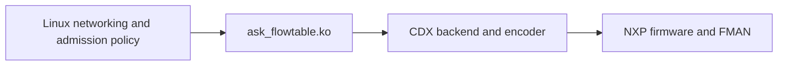

<a id="linux-flowtable-offload-design-and-first-proof-of-concept"></a>

# Linux flowtable offload

The bounded CMM-retirement foundation and IPv4 TCP/UDP NAT
increments are implemented and verified. Native Linux flowtables and the loadable
`ask_flowtable` adapter control CDX hardware without CMM or FCI. This is the
only offload path the test image boots; CMM, FCI and auto_bridge are no longer
built, and their `cmm/`, `fci/` and `auto_bridge/` sources remain in the tree
only as reference while the transition completes.

Development branch: `feat/linux-flowtable-offload`, starting at `7603f11`.
Current checkpoint: IPv6, 802.1Q VLAN, bridging, PPPoE, IPv4 TCP/UDP NAT and
32,768-direction capacity (2026-09-16).

## Reading guide

| Need | Document |
| --- | --- |
| Current interfaces, ownership, locking and lifetime contracts | [Architecture](architecture.md) |
| Accepted foundation, recovery matrix and verification limits | [Foundation checkpoint](foundation.md) |
| Controller recovery, fault-injection coverage and remaining resilience work | [Resilience test plan](resilience.md) |
| Configure scope/exclusions, revoke active flows, migrate CMM settings | [Policy guide](policy.md) |
| Supported NAT mappings and their focused proof | [NAT guide](nat.md) |
| IPv6 eligibility, what the family really changes, and its proof | [IPv6 guide](ipv6.md) |
| Where VLAN tags come from, the logical/physical split, and its proof | [VLAN guide](vlan.md) |
| Why a bridged flow keeps its destination, where its tags come from, and its proof | [Bridge guide](bridge.md) |
| Why a PPPoE session is handed over rather than derived, what stands in for its neighbour, where its counters live, and its proof | [PPPoE guide](pppoe.md) |
| How a port's and a VLAN device's `ip -s link` come to include offloaded traffic, the measured framing, and its proof | [Interface counters guide](statistics.md) |
| Why a bridged group has to learn its own key from traffic, what the MDB cannot supply, and its proof | [Multicast design](multicast.md) |
| Why a routed group needs no learning at all, what `ipmr` states outright, and how the two learners share one hardware key | [Routed multicast design](multicast-routed.md) |
| Admission budget, pressure and resource reuse | [Capacity guide](capacity.md) |
| Original proposal, implementation snapshots and dated measurements | [History by topic and chronology](history/README.md) |
| Remaining intermittent UDP/link observations | [UDP loss investigation](udp-loss-investigation.md) |
| Why live UDP flows are spuriously retired, and what it is not | [Retirement investigation](retirement-investigation.md) |
| What CMM still owns, and the order to absorb it | [CMM retirement roadmap](cmm-porting-roadmap.md) |
| Bench setup and packet-counter interpretation | [Testing guide](../testing.md) |

The architecture and feature guides describe current behaviour. Historical
records retain original wording, failures and superseded restrictions. In
particular, the initial proposal and implementation snapshot are not current
configuration instructions.

## Supported scope

| Area | Current boundary |
| --- | --- |
| Kernel and hardware | Repository Linux 6.12.103 with its pinned SDK, LS1046A DPAA/FMAN and existing proprietary NXP firmware |
| Topology and capacity | One hardware flowtable, two initial-netns physical Ethernet ports, at most 32,768 directional entries |
| Routed traffic | Unicast IPv4 and IPv6 UDP and established/assured TCP; default conntrack zones and zero conntrack mark |
| Encapsulation | 802.1Q VLAN subinterfaces on either port, up to two stacked tags per direction, ingress and egress independently. The tag stack is derived from the devices Linux routed through and the pop/push actions must agree with it. 802.1ad, a VLAN device overriding its parent's MAC, and any upper device that is neither an 802.1Q VLAN, a bridge nor a PPPoE session (bond, MACVLAN) are declined |
| PPPoE | One session per direction in either address family, outermost, over a physical port or over the VLAN device or bridge below it. The session is not derived but carried from the kernel's own forwarding-path walk through patch 140, because a ppp device registers no lower neighbour and the session lives in a pppox socket; the push action's sid must agree with it. A session spends one of the two encapsulation slots, so it admits one tag alongside and PPPoE over QinQ is declined. A session egress has no neighbour and no Ethernet destination — Netfilter writes zeros, and the concentrator the session names is required instead. The insert opcode names no PPP protocol id, so the microcode chooses one; measured on this bench, it chooses correctly for IPv6 |
| Interface counters | A physical port's and a VLAN device's `ip -s link` and `/proc/net/dev` include the traffic the hardware forwarded on their behalf, folded from the firmware's own per-interface records by `dev_get_stats()` and restated into each device's units; `ethtool -S` stays the driver's software view, so the difference between the two is the offloaded traffic. One plain record per VLAN device and one timestamped record per `ppp` device, each held for the device's life and shared by every flow over it; the pools are 122 and 4 deep and shared with the legacy owner, so a device the pool has nothing for forwards uncounted and `/proc/cdx_flowtable` says so. A tag with no device behind it — a vlan-aware bridge's own — has no counter |
| Bridging | One bridge master per direction, which must be the physical port's own master. Its effective tag stack is derived from the bridge's VLAN groups exactly as `br_vlan_fill_forward_path_*()` derives it, so a vlan-aware bridge over a tagged or an untagged port and a plain bridge are all described. A bridge port that is itself a stacked device, a port reporting a switchdev parent, and a bridge whose MAC differs from the egress port's are declined. Transmit stays NEIGH: patch 140 keeps the borrowed destination on a bridged path so the routed contract applies unchanged |
| Multicast | Two learners against one encoder, both families. **Bridged**: an `(S,G)` per source observed carrying a group the bridge's MDB has a membership for, keyed on the physical ingress port the traffic arrived on and replicating to bridge ports; a `(*,G)` membership is a permission and is never itself installed. **Routed**: an MFC entry in the default multicast table (`ipmr`/`ip6mr`), with a specific source, every oif at threshold 1, an iif resolving to one physical port directly or through 802.1Q VLAN devices, and oifs resolving to ports, VLAN devices or bridges. Both refuse link-local scope, a group the box itself has joined on the ingress, and more than eight listeners; the classifier keeps one entry per address pair, so the two share a key register and the second claimant stays in software. Router ports of a bridge oif, other multicast tables, a multicast policy rule and a bridged ingress are declined. `bridge mdb show`, `ip mroute show` and `ip -s mroute` report what is offloaded; `/proc/cdx_flowtable` names the clause that refused the rest |
| Throughput | Loki → Vision TCP NAT: 9.414 Gb/s receive, 1.84% aggregate DUT CPU on the KASAN image. Routed IPv6 TCP: 9.173 Gb/s forward and 9.260 Gb/s reverse on the same image, against 97.9 Mb/s with the same flow forwarded in software |
| NAT | TCP/UDP static source NAT, MASQUERADE, destination and hairpin/double NAT in IPv4, including address/port translation and inverse reply translation. IPv6 source and destination NAT, with the full 128-bit address rewrite and its inverse |
| Routing and neighbours | Direct routes, IPv4 gateways, IPv6 gateways including link-local next hops, permanent neighbours, ordinary ARP and neighbour discovery |
| Automatic recovery | Dependent route, neighbour, physical MTU/MAC and link-state retirement followed by fresh admission. A bridged flow additionally retires when the FDB entry that chose its egress port moves, ages out or is deleted, and when the bridge's per-port VLAN membership is reconfigured. A PPPoE session dropping retires selectively through the route watch, leaving the bindings up and admission enabled, so a redial readmits without the table being touched |
| Lifetime and policy | Conntrack/flow expiry and deletion, safe adapter unload, explicit global recovery, live policy revocation, bounded capacity fallback |
| Ownership | The flowtable adapter is the only hardware flow owner; CDX's FCI entry point refuses every command with `-EOPNOTSUPP` |

The bound is 32,768 **directions**, sufficient for 16,384 fully accelerated connections.
Admission is directional: a capacity or unsupported-direction refusal can leave
the other direction accelerated. Matching transient admission contention has
explicit partial-generation recovery. Hardware flags alone do not establish
that both directions are offloaded.

Counter-enabled hardware tables are admitted, since OpenWrt's firewall declares
`counter` on every flowtable. Conntrack accounting then includes the hardware
traffic, restated in Netfilter's units by subtracting the ingress Ethernet,
VLAN and PPPoE framing the classifier counted. Enabling `counter` on a table
whose flows are already in hardware keeps them there, and their hardware
traffic is accounted from the next statistics pass. Two bounded residuals
remain, sub-minimum frames reading high by their padding and a frame punted
after its classifier hit counting twice; see
[statistics](architecture.md#statistics-diagnostics-and-verification).

Multicast, IPsec, tunnels and Wi-Fi each have an eligibility contract and a
hardware proof of their own, linked from the [reading guide](#reading-guide);
MACVLAN has neither and is out of scope, because CMM never offloaded it either.
Unsupported hardware traffic remains governed by Linux forwarding and firewall
policy.

A PPPoE session renegotiated under a `pppN` device that never disappears is not
detected. Every change to the device a session runs over destroys the session,
which pppd turns into the ppp device going away and the adapter retires on; a
reconnection that keeps the unit changes the id and the concentrator under a
device that stayed. The failure mode is loss rather than misdelivery, and no
exported interface reports a session change.

A frame the software fast path forwards is counted by the port it arrived on
but not by the VLAN device above it: Netfilter's hook runs on the physical port
and forwards from there, so the frame never reaches the 8021q layer. That is
the kernel's own accounting, not the fold's; the hardware path counts the VLAN
device from its own record. See the
[interface counters guide](statistics.md) for what is and is not
counted.

Both families share one admission budget and one set of adapter indexes, so
the 32,768 bound counts IPv4 and IPv6 directions together. Within IPv6 the
boundary is narrower than IPv4's in three respects, each a stated exclusion
rather than an omission: a flow endpoint may not be link-local, because such an
address is scoped to one link and cannot be forwarded between the two ports (a
*gateway* may be, and normally is); the accepted MTU floor is the IPv6 minimum
link MTU of 1280 rather than 68; and extension headers have no eligibility
contract, so only packets whose transport header follows the fixed header are
described by an admitted rule. Because the microcode fragments IPv6 as
readily as IPv4, a direction whose path is smaller than its ingress
interface's IPv6 MTU stays in software, where Linux sends Packet Too Big
([ipv6.md](ipv6.md#packets-larger-than-the-path)). What IPv6 still lacks
against IPv4 is a sustained-churn proof at full capacity; the Packet Too Big
bound, device-MTU retirement, budget accounting, masquerade and hairpin double
NAT each have one.

## How the components fit



Linux owns conntrack, NAT mappings, routing, neighbours and flow lifetimes.
The adapter validates native requests and tracks dependencies. CDX owns hardware
resources, encoding and safe retirement. `dpa_app`/FMC still initialize the
hardware once; there are no per-flow FCI commands in this path.

The [architecture](architecture.md) defines the kernel patch, private
provider API, lock ordering, references, selective/global invalidation and fatal
failure boundary. The source interface can evolve with this repository; upstream
acceptance and a stable binary ABI are not dependencies.

## Operation and verification

The test initramfs always loads CDX and then the adapter.
`ask.flowtable_observe=1` on the kernel command line validates requests without
installing hardware. Healthy adapter reload retains provider ownership;
automatic reconciliation restores the configured binding when the daemon
retains authority, otherwise explicitly reapply the policy.

The shipped `/etc/ask/offload.conf` enables eligible traffic by default. Use
`ask-flowtable check`, `render`, `apply`, `status`, `stop` and `resume` as described
in the [policy guide](policy.md). Manual apply/stop pause automatic
reconciliation until explicit resume, including across service restarts.
Policy replacement drains existing hardware before publishing new admission.
Changing unrelated firewall rules alone does not revoke a cached hardware flow;
follow the [firewall revocation sequence](policy.md#firewall-ordering-and-revocation).

For relevant hardware validation, build with `KASAN=1 make ask-image` and always
run `make stage-image` after a successful image build. Boot the staged image
and verify its running identities. One boot runs the whole suite; select
individual tests using `-k`, since `make ask-test` without that filter runs
unrelated tests too. For example, on the current bench:

```sh
ASK_WAN_IPERF_IP=10.0.0.232 ASK_FLOWTABLE_SPORT=55000 \
  make ask-test ASK_TEST_ARGS='-q -k test_flowtable_udp_snat'
```

The [foundation](foundation.md#focused-reproduction) and
[NAT](nat.md#focused-verification) guides give focused reproduction
commands; the [capacity guide](capacity.md#focused-verification) covers
full occupancy, overflow and resource reuse. Failure tests can stop the datapath or require a fresh boot; follow
their documented boundaries. The full KASAN suite and alternative-kernel exercise
were explicitly excluded from the foundation work.

Proof combines exact endpoint delivery, packet rewrites/checksums, directional
hardware counters, software TX counts, CPU observations and clean diagnostics.
Neither throughput nor `[HW_OFFLOAD]` alone is sufficient. The latest
[UDP SNAT evidence](history/udp-snat.md) includes both ordinary and zero
UDP checksums, route readmission, software fallback on the same conntrack and
socket, and the existing TCP/UDP startup regression. No broader acceptance is
implied by reorganizing these documents.

The [TCP SNAT evidence](history/tcp-snat.md) extends this to established
TCP, including bulk transfers, retransmission, policy withdrawal and FIN/RST.

The [DNAT evidence](history/dnat.md) covers WAN-initiated TCP/UDP port
forwarding, receive checksums, route retirement and live software fallback.

The [combined NAT evidence](history/double-nat.md) covers simultaneous
source/destination translation and same-port hairpin routing through the DUT.

The [capacity evidence](history/capacity.md) proves 16,384 fully
accelerated mixed TCP/UDP connections, overflow fallback, slot reuse and paced
recovery after full route retirement. Its small explicit UDP loss allowance
does not change the earlier delivery proofs.

## Next work and longer-term direction

The four bounded IPv4 TCP/UDP NAT increments and the
[full-rate Loki → Vision benchmark](history/nat-throughput.md) are complete:
9.414 Gb/s TCP receive throughput with 1.84% aggregate DUT CPU.
The full 32,768-direction capacity proof also passes. Admission-rate stress,
simultaneous recovery bursts and longer soaks remain distinct work: an unpaced
restart after full route retirement produced material UDP loss during readmission.
Prove each increment before expanding its supported boundary. The
[foundation checkpoint](foundation.md) remains the base for further
interface and protocol features.

Multicast, IPsec and tunnels needed feature-specific Linux integration and
firmware eligibility rather than being forced through a unicast flowtable
contract that cannot express their behaviour, and all three are now delivered
on that basis — each with its own control plane (the bridge's snooping and
`ipmr`'s MFC, `xfrmdev_ops`, `ndo_fill_forward_path` on the tunnel netdevs),
its own eligibility contract and its own hardware proof. MACVLAN remains
out of scope because CMM never offloaded it either; `ISSUES.md` A38 is the
record of that deferral.

The durable direction is Linux ownership of networking state with a maintained
hardware backend. Firmware is proprietary and cannot be changed here. Kernel
interfaces, adapters and patches remain in this repository and must evolve with
Linux. Preserve focused compatibility boundaries rather than freezing an
assumption about how Linux will develop over decades.

eBPF/XDP is optional later work for observation, policy or specialised software
processing. It is not required to deploy the supported flowtable/CDX subset.
CPU XDP hooks do not observe traffic already forwarded entirely by FMAN, and
BPF would still need the same hardware ownership and retirement guarantees.

## Engineering and documentation rules

The PoC is the maintained base. Small scope never excuses incomplete validation,
ignored cleanup, unsafe retirement or a fabricated success result. Decline
unsupported requests, and establish actual software fallback before claiming
it. Terminal failure must retain its stop and ownership guards.

Update the architecture or feature guide when behaviour changes. Record each
proved increment in the relevant history topic, including source/image identity,
measurements, failed attempts and limitations; update the
[chronology](history/README.md#chronology). Keep current explanations in
one guide and link to them from new evidence. Create descriptive topic files as
needed, without returning to an ever-growing overview or date-only filenames.

Existing unexplained link observations remain documented. A passing later test
does not establish that an unrelated failure was fixed. Historical artifact paths
refer to bench files and are not a guarantee of permanent storage.

## Earlier section links

These links preserve the former document's section fragments for bookmarks.
They lead to the unchanged historical section in its new location. Use the
reading guide above for current contracts and operating instructions.

| Former section | Archived location |
| --- | --- |
| <a id="purpose-and-constraints"></a>Purpose and constraints | [Open section](history/initial-proposal.md#purpose-and-constraints) |
| <a id="current-architecture-and-reusable-parts"></a>Current architecture and reusable parts | [Open section](history/initial-proposal.md#current-architecture-and-reusable-parts) |
| <a id="architectural-direction"></a>Architectural direction | [Open section](history/initial-proposal.md#architectural-direction) |
| <a id="parallel-development-and-mode-ownership"></a>Parallel development and mode ownership | [Open section](history/initial-proposal.md#parallel-development-and-mode-ownership) |
| <a id="smallest-meaningful-poc"></a>Smallest meaningful PoC | [Open section](history/initial-proposal.md#smallest-meaningful-poc) |
| <a id="implementation-increments"></a>Implementation increments | [Open section](history/initial-proposal.md#implementation-increments) |
| <a id="1-establish-the-reference-and-inspect-requests"></a>1. Establish the reference and inspect requests | [Open section](history/initial-proposal.md#1-establish-the-reference-and-inspect-requests) |
| <a id="2-establish-a-narrow-internal-hardware-interface"></a>2. Establish a narrow internal hardware interface | [Open section](history/initial-proposal.md#2-establish-a-narrow-internal-hardware-interface) |
| <a id="3-enable-installation-and-complete-the-lifecycle"></a>3. Enable installation and complete the lifecycle | [Open section](history/initial-proposal.md#3-enable-installation-and-complete-the-lifecycle) |
| <a id="4-verify-compatibility-and-return-to-normal-mode"></a>4. Verify compatibility and return to normal mode | [Open section](history/initial-proposal.md#4-verify-compatibility-and-return-to-normal-mode) |
| <a id="engineering-contracts-required-from-day-one"></a>Engineering contracts required from day one | [Open section](history/initial-proposal.md#engineering-contracts-required-from-day-one) |
| <a id="acceptance-evidence"></a>Acceptance evidence | [Open section](history/initial-proposal.md#acceptance-evidence) |
| <a id="expansion-and-long-term-direction"></a>Expansion and long-term direction | [Open section](history/initial-proposal.md#expansion-and-long-term-direction) |
| <a id="references"></a>References | [Open section](history/initial-proposal.md#references) |
| <a id="implemented-poc-contracts"></a>Implemented PoC contracts | [Open section](history/implementation-snapshot.md#implemented-poc-contracts) |
| <a id="running-the-focused-checks"></a>Running the focused checks | [Open section](history/implementation-snapshot.md#running-the-focused-checks) |
| <a id="validation-record--2026-09-14"></a>Validation record — 2026-09-14 | [Open section](history/udp-poc.md#validation-record--2026-09-14) |
| <a id="terminal-lifecycle-validation--2026-09-14"></a>Terminal lifecycle validation — 2026-09-14 | [Open section](history/udp-poc.md#terminal-lifecycle-validation--2026-09-14) |
| <a id="healthy-invalidation-recovery-verified-2026-09-14"></a>Healthy invalidation recovery verified (2026-09-14) | [Open section](history/udp-poc.md#healthy-invalidation-recovery-verified-2026-09-14) |
| <a id="tcp-increment-and-validation-2026-09-14"></a>TCP increment and validation (2026-09-14) | [Open section](history/connections-and-admission.md#tcp-increment-and-validation-2026-09-14) |
| <a id="ordinary-arp-increment-2026-09-14"></a>Ordinary ARP increment (2026-09-14) | [Open section](history/neighbours-and-gateways.md#ordinary-arp-increment-2026-09-14) |
| <a id="gateway-next-hop-increment"></a>Gateway next-hop increment | [Open section](history/neighbours-and-gateways.md#gateway-next-hop-increment) |
| <a id="bounded-multiple-connections--2026-09-15"></a>Bounded multiple connections — 2026-09-15 | [Open section](history/connections-and-admission.md#bounded-multiple-connections--2026-09-15) |
| <a id="verification"></a>Verification | [Open section](history/connections-and-admission.md#verification) |
| <a id="selective-neighbour-invalidation-verified-2026-09-15"></a>Selective neighbour invalidation verified (2026-09-15) | [Open section](history/neighbours-and-gateways.md#selective-neighbour-invalidation-verified-2026-09-15) |
| <a id="selective-ipv4-route-retirement--verified-2026-09-15"></a>Selective IPv4 route retirement — verified 2026-09-15 | [Open section](history/route-retirement.md#selective-ipv4-route-retirement--verified-2026-09-15) |
| <a id="cdx-backend-interface--verified-2026-09-15"></a>CDX backend interface — verified 2026-09-15 | [Open section](history/backend-and-module.md#cdx-backend-interface--verified-2026-09-15) |
| <a id="loadable-flowtable-adapter--verified-2026-09-15"></a>Loadable flowtable adapter — verified 2026-09-15 | [Open section](history/backend-and-module.md#loadable-flowtable-adapter--verified-2026-09-15) |
| <a id="2026-09-15-device-dependency-filtering"></a>2026-09-15: device dependency filtering | [Open section](history/backend-and-module.md#2026-09-15-device-dependency-filtering) |
| <a id="automatic-physical-port-mtu-recovery--verified-2026-09-15"></a>Automatic physical-port MTU recovery — verified 2026-09-15 | [Open section](history/device-lifecycle.md#automatic-physical-port-mtu-recovery--verified-2026-09-15) |
| <a id="administrative-port-recovery--verified-2026-09-15"></a>Administrative port recovery — verified 2026-09-15 | [Open section](history/device-lifecycle.md#administrative-port-recovery--verified-2026-09-15) |
| <a id="physical-mac-and-rename-recovery--verified-2026-09-15"></a>Physical MAC and rename recovery — verified 2026-09-15 | [Open section](history/device-lifecycle.md#physical-mac-and-rename-recovery--verified-2026-09-15) |
| <a id="physical-removal-and-terminal-restart-guard--verified-2026-09-15"></a>Physical removal and terminal restart guard — verified 2026-09-15 | [Open section](history/device-lifecycle.md#physical-removal-and-terminal-restart-guard--verified-2026-09-15) |
| <a id="transient-admission-recovery--verified-2026-09-15"></a>Transient admission recovery — verified 2026-09-15 | [Open section](history/connections-and-admission.md#transient-admission-recovery--verified-2026-09-15) |
| <a id="nexthop-object-retirement--verified-2026-09-15"></a>Nexthop-object retirement — verified 2026-09-15 | [Open section](history/route-retirement.md#nexthop-object-retirement--verified-2026-09-15) |
| <a id="configuration-and-live-exclusion-replacement--verified-2026-09-15"></a>Configuration and live exclusion replacement — verified 2026-09-15 | [Open section](history/policy-and-startup.md#configuration-and-live-exclusion-replacement--verified-2026-09-15) |
| <a id="startup-independence--verified-2026-09-15"></a>Startup independence — verified 2026-09-15 | [Open section](history/policy-and-startup.md#startup-independence--verified-2026-09-15) |
| <a id="resource-pressure-and-concurrent-reconfiguration--verified-2026-09-15"></a>Resource pressure and concurrent reconfiguration — verified 2026-09-15 | [Open section](history/connections-and-admission.md#resource-pressure-and-concurrent-reconfiguration--verified-2026-09-15) |
| <a id="foundation-closure-and-legacy-return--2026-09-15"></a>Foundation closure and legacy return — 2026-09-15 | [Open section](history/policy-and-startup.md#foundation-closure-and-legacy-return--2026-09-15) |
| <a id="static-udp-source-nat--2026-09-15"></a>Static UDP source NAT — 2026-09-15 | [Open section](history/udp-snat.md#static-udp-source-nat--2026-09-15) |
