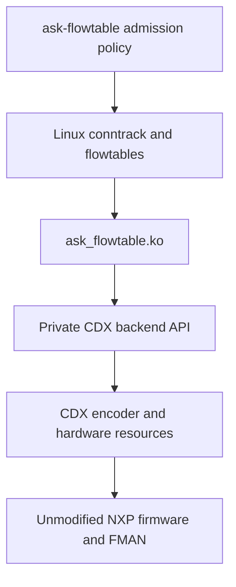

# Linux flowtable architecture

This is the current implementation contract after IPv4 TCP/UDP NAT, including
SNAT, MASQUERADE, DNAT and hairpin/double NAT (2026-09-15). The [project overview](README.md) gives supported
scope and direction; the [history index](history/README.md) retains
earlier designs, superseded restrictions and dated verification evidence.
Update this document when a contract changes, and record the proof separately.

## Components and ownership

Linux owns firewall decisions, conntrack and NAT mappings, routing, neighbours,
flow activity and expiry. The adapter validates native requests and tracks
their dependencies. CDX owns hardware encoding, allocation, retirement and
terminal failure state. Firmware forwards admitted packets without invoking
CMM or per-flow FCI commands. `dpa_app`/FMC still initialize the hardware once.

| Responsibility | Source |
| --- | --- |
| Native callback context, shared handles and route integration | [Kernel patch 140](../../patches/kernel/140-ask-flowtable-context.patch) |
| Whether an nftables commit is still being applied, for routed multicast confirmation; whether nf_tables (`nft_port_dependent()`) or iptables-legacy (`nf_xt_port_dependent()`, an ip_tables/ip6_tables walker reached through hooks typed `NF_HOOK_OP_XTABLES` and the NAT core's `NF_HOOK_OP_NAT`) could tell a routed group's streams apart by port; and `net->nf.xt_seq`, the count of x_tables table changes a caller re-asks on | [Kernel patch 148](../../patches/kernel/148-netfilter-nftables-commit-in-progress.patch) |
| Rule decoding, binding, dependency watches and work | [ask_flowtable.c](../../cdx/ask_flowtable.c) |
| Private source interface | [cdx_flowtable_backend.h](../../cdx/cdx_flowtable_backend.h) |
| Transactions, claim, port checks and fatal guard | [cdx_flowtable_backend.c](../../cdx/cdx_flowtable_backend.c) |
| Independent directional encoding and retirement storage | [cdx_flowtable_hw.c](../../cdx/cdx_flowtable_hw.c) |
| Shared classifier encoder and firmware operations | [cdx_ehash.c](../../cdx/cdx_ehash.c) |
| Physical identity and configuration | [devman.c](../../cdx/devman.c), [dpa_cfg.c](../../cdx/dpa_cfg.c) |
| Admission configuration and revocation | [ask-flowtable](../../flowtable/src/main.c) and [policy guide](policy.md) |

The private interface uses GPL-only exports in `ASK_CDX_FLOWTABLE`. It exposes
typed rules, counters and opaque hardware handles, without CDX control/device
structures or firmware objects. It is maintained with this repository, with no
stable binary ABI promise. The adapter depends on `cdx` and `nf_flow_table`;
CDX has no flowtable-module dependency. Kernel integration targets the pinned
[6.12.103 recipe](../../meta-ask/recipes-kernel/linux/linux-ask_6.12.bb) and SDK source.

## Startup and configuration seal

The flowtable adapter is the only hardware flow owner; there is no boot-time
owner selection. The test initramfs loads CDX and then the adapter. CMM, FCI
and auto_bridge are neither built nor shipped; their source trees remain only
as reference. CDX no longer carries an FCI entry point or command handlers:
the flowtable adapter and the tc, devlink and netdev verbs are its only
control surfaces. `ask.flowtable_observe=1` on the kernel command
line validates requests but declines installation; CDX owns the read-only
`flowtable_observe` module parameter. Module loading is implemented in the test
initramfs; production packaging and persistent deployment remain separate work.

The adapter acquires an exclusive provider claim before publishing callbacks.
Claim is refused after terminal failure, while another claim or
live directions exist, or while retirement is pending. The first successful
claim permanently seals provider configuration for that CDX instance, even if
adapter initialization subsequently fails. SET_PARAMS rechecks the seal under
the control lock. Release requires zero live directions; it cannot clear the
seal, quarantine or terminal latch.

## Native context and admission

One hardware flowtable may bind at most two physical Ethernet ports in the
initial network namespace. The adapter admits at most 32,768 directions, sufficient
for 16,384 fully accelerated connections. This is an admission budget, not a
firmware capacity claim. The [capacity guide](capacity.md) describes
resource reasoning and the focused proof. Directions consume slots independently without eviction.

Binding/cookie and ingress/tuple lookups use separate fixed hash indexes, each
with 16,384 buckets, under the existing backend transaction. Full key comparison
resolves collisions; the tuple hash has a seed chosen at adapter load. Index
publication follows successful hardware installation and index removal shares
the entry's list lifetime. Dependency notifications still walk the bounded
watch list: a single prefix, neighbour or device change can affect every flow.

Patch 140 supplies borrowed conntrack, both selected destinations, effective
directional MTU and the table's accounting requirement. Context version 5 also
supplies a shared invalidation handle. Cookies are opaque and binding-local;
the adapter never recovers a parent flow through a cookie cast. No borrowed
conntrack or destination pointer survives the callback.

Admission requires exact supported masks and actions, default conntrack zones,
zero conntrack mark and a table without native `counter` accounting. Supported
packets are routed unicast IPv4 TCP/UDP and TCP/UDP source NAT (static or MASQUERADE) and destination or combined NAT. TCP additionally
requires an assured, established conntrack and precisely Netfilter's FIN/RST
exclusion. Helpers and sequence-adjusted connections are excluded by native
flowtable eligibility. Other protocols, encapsulations and NAT types require
separate contracts and proofs.

Rules contain four native Ethernet mangle words and a redirect, with the exact
translation/checksum sequence for admitted [TCP/UDP NAT](nat.md). Ports
must be registered physical CDX devices, running with carrier, and
outside bridge/L3-slave configurations. Ingress and egress must be distinct
except for a completed combined SNAT/DNAT mapping (the hairpin contract). Physical lookup uses the device object,
not its name or a recyclable interface index. The requested source MAC must
match the egress device's **current** address. The encoder's source cache is
synchronized under its reader lock while admission holds its transaction and
RTNL. An OS rename preserves identity and forwarding semantics.

Both borrowed routes are checked under RTNL before insertion. The egress route
must be valid unicast IPv4 on the selected port, without XFRM, lightweight tunnel
state or an IPv6 gateway. The driver uses Linux's selected route rather than
repeating policy routing with incomplete packet context. Effective MTU must be
at least 68 and no greater than the egress device MTU.

An IPv4 direction that is neither TCP nor to or from an SA is admitted only
while nothing larger than its MTU can arrive. The microcode fragments a packet
without DF that exceeds the entry's MTU, and for a frame received on an
Ethernet port those fragments leave with correct headers and an all-zero
payload, so the receiver discards them. Fragments of the SEC output, which
reaches the classifier through the offline port, are correct. What can arrive
is the ingress device's MTU, but never less than a standard 1500-byte
Ethernet payload less whatever the direction strips (a PPPoE session's 8
bytes, a tunnel's outer header): a DPAA port keeps receiving full frames after
its MTU is lowered, and the hosts behind it keep sending them unless each is
configured, since DHCP's MTU option is widely ignored. A TCP direction is
carried into the smaller path: TCP sets DF, the preemptive
`PREEMPT_DFBIT_HONOR` check hands an oversized DF packet to Linux for its
Fragmentation Needed, and one that clamps the MSS rarely sees any. The one
exception, a sender that clears DF on TCP into an unclamped smaller path,
loses those segments and stalls rather than delivering corrupt data, since
the zero payload fails the receiver's checksum. A refused direction stays
on the software flowtable path, where `ip_forward()` fragments correctly; the
reverse direction is admitted on its own. Equal MTUs, the ordinary Ethernet
WAN, are unaffected. A smaller upstream is where it shows: UDP leaving a LAN
by PPPoE (1492) or a 4in6 tunnel (1452) runs in software in that direction,
and TCP and the download direction stay in hardware. Device and route MTU
changes retire installed directions through their events, so the bound is
checked at admission.

A direction into an SA is exempt because its entry is bounded differently. The
bound is the bundle's MTU that Linux enforces, the smaller of the SA's MTU on
the path to the peer and the inner route's, with SEC's expansion on top, which
the microcode adds before comparing. `PREEMPT_DFBIT_HONOR` therefore hands
Linux exactly the DF packets Linux would answer, and a packet without DF goes
to SEC whole. A change to that path -- the port's MTU, a route to the peer, a
learned PMTU -- retires the directions the SA encrypts, so readmission reads
the new bound ([ipsec.md](ipsec.md), A227, A230, A231).

A refused direction does not stay refused quietly. Linux offers a flow again
at most about once a second for as long as the software fast path forwards
either direction's packets: `flow_offload_refresh()` queues the whole flow, and
the offload work offers both directions. A direction the MTU bound is certain to refuse is therefore refused
before RTNL is taken, counted as a reject and never as busy, retiring nothing:
IPv4 other than TCP whose path is below the larger of the ingress device's MTU
and 1452 bytes (a full frame less a session and a 4in6 outer header, the most
any ingress strips), or IPv6 whose path is below the ingress IPv6 MTU. It does
so only while no xfrm policy or blocking default is configured and neither
destination carries a transform, because an SA exempts an IPv4 direction and a
policy denial retires the generation, and only the walk under RTNL finds out
either. Whatever passes is held to the exact bound there. A full table is
refused the same way, before RTNL and counted as a reject, for a direction
software keeps offering; one nothing offers again goes on to admission, where a
hardware key its previous generation still holds retires it before capacity
refuses it (see below).

The selected next hop needs a live ARP neighbour whose MAC matches the rewrite.
PERMANENT, REACHABLE, STALE, DELAY and PROBE are eligible; NOARP, unresolved,
failed and detached neighbours are refused. A neighbour is rechecked and its
watch published before hardware insertion so a racing change forces rollback.
Hardware activity calls Linux's neighbour-use path; it does not confirm
reachability or suppress normal ARP probing.

The table opts into neighbour-aware software output and shared hardware handles.
Those choices persist after unbinding. Concurrently constructed DIRECT flows
are retired so software fallback cannot retain a stale Ethernet rewrite. For
these tables, reverse IPv4 route lookup requires FIB success rather than an
on-link fallback after a failed forced-interface lookup. Ordinary kernel callers
retain their existing behaviour.

TCP admission depends on the deployed [soft parser](../../dpa_app/files/etc/cdx_sp.xml):
`tcpschema` sends packets with `tcp.flags & 7` to Linux before hash lookup, so
SYN, FIN and RST cannot bypass Linux through an installed entry. CDX adds no
independent TCP sequence/window tracker. Parser or firmware changes require
revalidation of this behaviour.

TCP closure is asynchronous. A final pure ACK can cross hardware before deletion,
and conntrack's saved sequence state can lag offloaded data. Acceptance checks
endpoint closure/reset, Linux visibility of FIN/RST, hardware retirement and
bounded native conntrack expiry; it does not require a particular intermediate
conntrack state label. See the [TCP evidence](history/connections-and-admission.md#tcp-increment-and-validation-2026-09-14).

Packet restrictions must hold for later packets with the same tuple, not just
the admission packet. The existing parser/preemptive checks and Linux fallback
have focused routed-UDP evidence for TTL/MTU exceptions, options and fragments.
Each new feature combination still needs its own exception proof; the first
static TCP/UDP SNAT increment does not establish every NAT exception combination.

## References and directional resources

| Object | Lifetime |
| --- | --- |
| Binding | Owns one ingress-device reference until callback release |
| Installed direction | Owns egress-device, neighbour and shared-handle references |
| Shared invalidation handle | Reference counted; retains no flow, conntrack, route, table or namespace pointer |
| Retained table pointer | Identity only outside the setup callback; setup borrows the live table to check emptiness |
| Hardware owner | CDX retains it until synchronized removal or safe terminal teardown |
| Provider module | Pinned by the adapter's imported symbols throughout load, use and exit |

Each direction has a private encoding entry, synthetic twin and embedded route.
They never join legacy connection/route hashes, ageing or CMM notification paths.
The hardware match remains the ingress tuple; for NAT the twin is the inverse
translated tuple. The [NAT guide](nat.md#mapping-and-dependencies)
defines mapping validation and dependency addresses.

A direction reports success only after insertion. An offer for a direction
already installed in the same generation is answered from its entry (below);
one that arrives while a global latch is pending goes through admission, which
takes the entry out if it no longer parses and replaces it if it parses
differently. A conflicting cookie for the same hardware key is refused, as is
a reused cookie with a different shared generation. Capacity or
unsupported-direction refusal can leave the other direction accelerated.
`[HW_OFFLOAD]` is not proof of a pair.

The periodic offer of a partially offloaded flow includes its installed
direction, and that offer is answered from the entry without RTNL or a new
walk. Nothing it describes can differ from what was installed without the
generation being retired first: the rule is built from the flow's tuple,
destinations, session and tunnel records and MTU, all fixed for the
generation, and what those resolve through -- routes, neighbours, device MTU,
address, link and uppers of every device the path names or crosses, bridge
forwarding state, tunnel parameters, egress queues, SAs -- retires it by event.
A fully offloaded flow, which is never offered again, relies on exactly that.
The conntrack mark and a police filter are sampled once at admission, as for
any offloaded flow ([QoS](qos.md)). What no event reports is rechecked on the
offer: the policy generation and the two borrowed routes, as before any parse,
and the IPv6 ingress MTU, a sysctl, as on every statistics pass. A pending
global latch sends the offer through admission as before.

An offer that loses `rtnl_trylock()` is declined with `-EAGAIN` and counted as
busy. Where software will offer the direction again it retires nothing: the
fast path forwards the direction and offers the flow again within about a
second, and an installed direction keeps its hardware entry. Two kinds of
direction are never offered again by their own traffic, and for those the busy
generation is invalidated instead, so that native GC and fresh traffic retry
both directions through the same table -- otherwise an installed sibling, whose
own traffic no longer reaches software, would keep the partial pair alive from
hardware statistics indefinitely:

- every direction while an xfrm policy or blocking default is configured, since
  the flowtable hook then hands every packet of a table with hardware handles
  to the normal stack, which never offers an existing flow again;
- a direction arriving through a tunnel (4in6, 6in4), whose tuple names the
  port below the tunnel, where the fast path sees only the outer packet and
  cannot parse it.

Visits to the other bound ports' callbacks, which native work makes for every
direction, are neither refusals nor RTNL users: they are answered first,
counted nowhere, and cannot invalidate a successfully installed direction.

Two more refusals clear by themselves and are retried by retiring only that
generation. Admission allocation failures do so whatever the direction:
adapter entry and hardware-owner `-ENOMEM`, and genuine native admission
work/rule/action allocation failures, invalidate the opted-in generation,
because memory pressure is when a retry a second later is least likely, and
where nothing offers the direction again hardware activity in its installed
sibling would keep the partial pair alive. A hardware key still held by
another generation of the same connection (`-EEXIST`, whose removal Linux
queues on a different workqueue from the new offer and completes within a GC
pass) retires the generation only for a direction nothing offers again.
Capacity (`-ENOSPC`) does not: a readmission would compete for the same full
table, and the installed direction is worth more than a flow churning through
it. Nor does a neighbour the adapter cannot use. For a routed direction Linux
builds neither direction's rule unless that neighbour is valid, so what reaches
the adapter is a change racing the offer or a state it never accepts, and
retiring on the latter would readmit forever. A tunnel's egress is the
exception, because Linux resolves only the tunnel device's own NOARP neighbour
and never the outer next hop the adapter checks: an outer neighbour still
resolving waits for the next offer, and one that resolved to another address
than the walk recorded at flow creation is stale for the whole generation and
retires it (`-ESTALE`, as a changed source address does;
[tunnels](tunnels.md#what-stands-in-for-the-neighbour)). Native work already pending and failed
statistics/deletion work allocations retain their normal semantics;
unsupported match/action construction is not treated as memory pressure.
See the [failslab recovery contract](resilience.md#allocation-failure-recovery--2026-09-21).

## Execution contexts and lock ordering

Backend begin/end transactions use the CDX control mutex to serialize hardware
operations and adapter state. Backend calls never call back into the adapter.
Native rule callbacks run in workqueue context; binding release runs after the
flow block excludes callbacks.

The required ordering and wait boundaries are:

- Indirect UNBIND takes the flowtable write lock before a backend transaction,
  protecting the callback-list move as well as Netfilter's later free.
- Admission and fatal recovery try RTNL inside a transaction. They never wait
  for RTNL while holding that transaction; RTNL holders can flush native work
  whose callbacks need the same control mutex.
- Configuration and final CDX shutdown acquire RTNL and try the control mutex.
  On contention they drop RTNL, wait for and release the mutex, then retry.
  Shutdown stops its timer before releasing both locks between cleanup retries.
- Netfilter work flushes always happen outside a backend transaction.
- Notifiers inspect immutable dependencies under `ft_watch_lock`, latch
  invalidation and queue work. They never start a backend transaction.
- Neighbour callbacks nest `ft_watch_lock` inside the neighbour lock. No path
  takes a neighbour lock or begins a transaction while holding the watch lock.

Binding and dependency publication/removal follow this same exclusion. An empty
binding still watches its device, and installed egress dependencies are watched
even if that device has no ingress binding. Unrelated devices are ignored.

## Dependency retirement and recovery

Selective retirement invalidates a shared handle, stopping Linux's cached lookup
immediately. Hardware retirement is asynchronous; native GC removes the obsolete
generation and fresh traffic can be admitted after resolution. Cause counters
count newly invalidated generations once per handle, not directions; concurrent
causes can coalesce. Hardware retirement errors escalate to global recovery.

| Change | Scope and recovery |
| --- | --- |
| Neighbour MAC, unusable state or object detachment | Retire dependent generations; ordinary resolution permits fresh admission |
| Committed IPv4 route prefix | Retire generations using the prefix; fresh route lookup permits readmission |
| MTU, going down, carrier loss or MAC change | Retire generations using the device on either side: physical or logical (VLAN, bridge, ppp, tunnel), or one the path crosses without naming it (a VLAN device under a session, a tunnel or another tag, the ppp device under a tunnel), each held while the direction is installed; current port/route state gates readmission |
| Unregistration of a device that is neither bound nor any direction's port -- a VLAN device, bridge, ppp or tunnel device, named or only crossed | Retire the generations using it, leaving bindings and admission up, whether or not a route retirement got there first |
| Upper-device change on a device paths only cross | Retire the generations crossing it |
| Built-in FIB nexthop ADD/DEL during device/address synchronization | Retire all installed generations conservatively, preserving bindings |
| Bridge FDB entry moved, aged out or deleted for a flow's destination MAC | Retire generations pinned to that entry; relearning permits readmission |
| Bridge per-port VLAN membership add or delete | Stop admission globally; recreate the table after configuration settles |
| Rename or same-MAC usable NUD progress | Preserve valid entries |
| Routing policy, nexthop-object mutation, a port's unregistration, or an upper-device change on a port or on a device a flow names | Stop admission globally; recreate the table after configuration settles |
| Nexthop-object statistics query or notifier registration dump without bindings | No invalidation |

Route-prefix events cover every committed IPv4 alias insertion, replacement,
deletion and flush; selected-alias FIB notifications can precede commit and are
not the retirement source. Identical replacements and failed insertions emit no
committed event. Watches check the translated destination and match source,
covering both routed endpoints even if only one direction installed. All tables
and DSCP aliases are matched conservatively. Both borrowed destinations are
revalidated under RTNL to exclude stale queued work. Native route generation and
expiry checks remain in effect for software caches.

Global invalidation retires hardware, resolves pending barriers, flushes native
flowtable work outside the transaction, then publishes `invalidation_done` as
its final state change. This is distinct from selective generation retirement.
An unproven hardware unlink also latches provider terminal failure.

Healthy global recovery requires zero old bindings, entries, handle/neighbour
references and retirement quarantine, and completed invalidation work. A binding
made while an invalidation is latched is parked rather than refused: it counts
in `bindings` and `parked` and declines every flow, so the consumer's
transaction commits with its flows in software. Recovery makes every parked
binding live, clears the invalidation and increments `rearms`, in the same
backend transaction as the event that completed it: the release of the last old
binding (an atomic reload's commit), the worker publishing `invalidation_done`,
or the parking bind itself when nothing is left to wait for. While only an
unproven deletion remains, the parked binding retries that barrier every second.
A global event raised while anything is parked, or a parking bind into a table
that already holds flows, is counted and needs a further worker pass: a parked
table's software flows are flushed before it goes live. Netfilter's refresh
offers the parked tables' flows again, so they enter hardware with no reload. `rearm_ready=1` reports eligibility; failure to
allocate a binding neither parks nor rearms. Counters remain cumulative. The
first binding after a full detach still requires an empty candidate flowtable: a
table whose hooks were detached can still contain cached flows, so pointer
identity or reattachment alone is insufficient. Binding never waits for the
worker while holding Netfilter locks. No recovery operation clears terminal
failure; after one, and past the binding bound, a bind is accepted passively
(`passive`) so the transaction still commits.

## Hardware deletion and shutdown

| Deletion outcome | Required action |
| --- | --- |
| Unlinked and synchronized | Free hardware and its owner |
| Unlinked, barrier unproven | Retain existing owner/storage; retry the barrier without another destructive unlink |
| Unlink unproven | Latch terminal failure; retry datapath quiescence; retain possibly linked hardware storage until reset |

Every result consumes the adapter's hardware handle. A null handle is not proof
of retirement. The failure path uses the already allocated backend owner and
requires no allocation. CDX accounts for pending retirement after adapter claim
release and refuses a new claim while it remains unsafe.

Pending retirement includes entries CDX parked for its own paths: a multicast
group delete or listener swap, or an IPsec SA delete, whose barrier failed. The
backend refuses a claim and every new entry while any remain. One completed
barrier proves every unlink before it, because the SoC runs a single FMan PCD.
So a successful backend delete, or a backend retry through either list,
releases the backend's retired entries and CDX's parked ones together; CDX's
own barriers release only its own. The waiters retry that barrier
themselves: a claim once per attempt, admission at most once a second, the
unload loop and invalidation worker on each pass, and a parked binding every
second. A parked backlog therefore no longer waits for an unrelated delete of
the same kind. A key that may still be linked is never released by a barrier.
Inside the table API the same rule covers the cumulative nodes of a colliding
bucket. A node that a delete or an add displaced while its sync failed is
parked there, and the first later sync on the PCD that completes frees it.

Terminal recovery stops the datapath; completion does not establish usable
software fallback. A provider `NETDEV_PRE_UP` guard prevents physical ports
from restarting while that CDX instance retains unproven hardware state. The
guard survives adapter removal. Full provider teardown detaches the classifier
and permits software port operation again; a fresh boot is required for offload.
Possibly linked storage must not be freed into a live hardware hash chain.

Adapter exit invalidates its shared handles, removes procfs/notifiers, cancels
work, unregisters indirect callbacks and completes safe hardware retirement
before releasing the claim. Retries release the transaction between attempts;
unload can wait indefinitely when safety cannot be proved. Normal module
references prevent CDX unload while the adapter is loaded.

Healthy reload preserves provider configuration and owner. Existing nftables
flowtables continue in software; recreate the table to bind the new adapter.
Adapter counters reset on reload, while the provider seal and fatal latch persist.
The multicast switch (the adapter's `multicast` parameter) comes back on, so a
service that was stopped or paused has to stop again; see the
[policy guide](policy.md).
Actual physical-driver removal additionally needs full CDX teardown to release
its configuration/queue pins. Drain the table, unload the adapter and any other
dependent modules, unload CDX, then unbind the physical driver. Do not force
removal or release references while hardware still uses the device.

## Statistics, diagnostics and verification

`/proc/cdx_flowtable` streams its header and flow rows through `seq_file`, so
reading policy status does not require rendering the entire table. Paged
iteration resumes by hash bucket and offset, without retaining an entry pointer
between transactions or rescanning all preceding entries. Policy
commands stop reading at the first flow row. Each iterator invocation holds the
backend transaction; separate reads of a changing table are not an atomic
snapshot. Diagnostics consumers must allow for several megabytes at capacity.

Hardware packet/byte counters are monotonic 64-bit classifier-hit totals. Bytes
include Ethernet headers and minimum padding but exclude FCS: a 256-byte UDP
payload accounts for 298 bytes, and an 8-byte payload for 60 bytes. Later punts,
including TTL/MTU exceptions, can already have incremented these counters.

Callbacks use deltas; a backwards sample triggers invalidation rather than
unsigned underflow. Firmware timestamps use 32-bit CDX jiffies, expanded relative
to current kernel time; supported idle intervals must stay below half that
clock's range. Linux owns activity refresh and expiry.

Linux asks for the counters once a tenth of the offload timeout has passed
without the flow being refreshed, and (patch 140) once that long has passed
since it last asked for a flow with any direction in hardware. The second
clause is what reaches a partially offloaded flow: software refreshes its
timeout on every packet of the software half, so the first alone never came
due, and the installed half's bytes reached conntrack -- and the statistics
pass's neighbour keepalive its neighbour -- only once software fell silent.
A fully offloaded flow is asked at the same pace as before, and since the
callback reports deltas, nothing is counted twice.

Counter-enabled hardware tables are admitted, and a reported delta is restated
in the units Netfilter counts in. The two counters disagree about framing, not
about packets: a classifier hit counts the frame as it arrived, while
`nf_ct_acct_update()` in the software fast path counts `skb->len` after
`nf_flow_encap_pop()` has removed the Ethernet header, every tag above it and
any PPPoE session header. `ft_l2_overhead()` subtracts exactly that stack, taken
from the direction's own ingress framing, and saturates at zero rather than
wrapping when a delta cannot carry it.

Per-interface counters are a separate set of firmware records, folded into a
port's or a VLAN device's `rtnl_link_stats64` by the `dev_get_stats()` hook and
restated the same way into that device's units; the
[interface counters guide](statistics.md) has the records, the
measured framing and the lifetime rules.

Two residuals remain, both bounded and neither correctable from a total:

- **Padding.** A frame below the sixty-byte minimum was padded before it was
  counted, and padding is invisible in an aggregate. A flow of minimum-size
  frames — pure TCP acknowledgements, small RTP — reads high by at most ten
  bytes per frame.
- **Punts.** A frame punted after its hit was counted here is counted again by
  the path that handled it. That is bounded by exception traffic (TTL, MTU,
  TCP state), which is zero on a healthy flow.

This was previously resolved the other way: counter-enabled tables were refused
outright and enabling counters on a live table invalidated it. That refused
every flow under the configuration consumers actually ship — OpenWrt's firewall
renders `counter` on every flowtable unconditionally — to avoid a per-frame
constant that is arithmetic rather than unknowable. `/proc/cdx_flowtable`
continues to expose the raw hardware counters, so diagnostics still see what
the classifier saw.

`/proc/cdx_flowtable` exposes entries, tuple rewrites, raw counters, references,
invalidation causes, quarantine and recovery state. Preserve it before unload
when per-instance diagnostics matter. The test build's one-shot add fault stages
are 1 before allocation, 2 before hardware, 3 after hardware with rollback, and
4 matching contention after the peer direction installs. Load-only initialization
stages are 1 procfs, 2 netdev, 3 neighbour, 4 FIB, 5 indirect registration,
6 nexthop-object registration, 7 bridge FDB and 8 bridge VLAN objects. The provider's test-only unlink fault leaves a
real key linked; it is a terminal test requiring a fresh boot afterward.

Verification combines production-code host checks, relevant KASAN/lockdep DUT
tests, exact endpoint delivery and independent hardware/software counters. SDK
netdev totals include hardware traffic, and software RX alone can miss a GRO-
disabled flowtable-consumed packet; use software TX enqueue counts and endpoint
captures to distinguish execution paths. Flags, throughput and CPU usage alone
do not prove offload. The [foundation](foundation.md#acceptance-and-limits)
and [NAT](nat.md#focused-verification) guides define the accepted limits
and focused commands. Measured results belong in [history](history/README.md).
