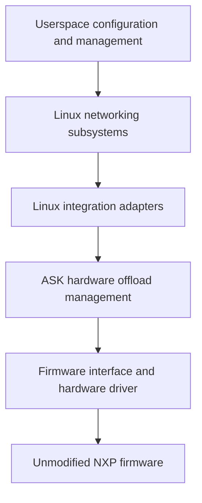

# Initial proposal: history

[Project overview](../../linux-flowtable-offload.md) · [Current architecture](../../flowtable-architecture.md) · [History index](README.md)

Original objectives, ownership constraints, engineering standards and proposed increments.

Archived from the consolidated record at `cc34cef`. Sections retain their
original wording, commands, measurements, failures and limits; relative links
have been adjusted for this location. Claims and next-step instructions apply
to their recorded increment, and may be superseded. References to earlier or
later work follow the chronology in the [history index](README.md#chronology).

## Purpose and constraints

Develop an alternative to CMM's automatic flow management in which Linux
networking subsystems request hardware offload through a small kernel integration
layer. Reuse the existing FMAN programming knowledge while making ownership,
lifecycle, and compatibility boundaries explicit.

The constraints are:

- NXP's hardware offload firmware is proprietary. Its source is unavailable, and
  the project must work with its existing capabilities and binary interfaces.
- This work will remain downstream. Implementation sources, kernel patches,
  compatibility work, documentation, and tests live in this repository; upstream
  acceptance is not a dependency.
- The existing CMM path must remain available and be the default. Developing the
  new path must preserve the ability to return to established ASK behaviour.
- Time, cost, and implementation complexity do not justify weakening correctness.
- The long-term direction is provisional. Linux interfaces and suitable designs
  may evolve; extend this document as evidence changes the decisions.

The PoC is intended to become the maintained foundation. Its small scope limits
the features supported, not the quality of their implementation. Approach it with
perfection as the engineering objective from the first change: no knowingly
incorrect lifecycle, ignored failure, fabricated success, or deferred cleanup is
acceptable on the grounds that this is an experiment. Verification establishes
bounded evidence; it cannot establish the absence of every possible defect.

## Current architecture and reusable parts

CMM observes Linux conntrack and networking state, resolves dependencies, and
sends commands through FCI. CDX translates those commands into hardware entries
and actions. Eligible packets then run through FMAN without passing through CMM.

CDX contains more than hardware encoding. It also implements command dispatch,
connection pairs, routes, ageing, resource management, and statistics. Replacing
CMM requires adapting this control model; calling the existing command dispatcher
from kernel callbacks would not by itself establish the intended architecture.

Useful starting points in this repository are:

| Responsibility | Existing implementation |
| --- | --- |
| CMM event handling and registration | [cmm/src/conntrack.c](../../../cmm/src/conntrack.c) |
| FCI dispatch and control serialization | [cdx/cdx_cmdhandler.c](../../../cdx/cdx_cmdhandler.c) |
| Connection pairs, routes, installation, ageing | [cdx/control_ipv4.c](../../../cdx/control_ipv4.c) |
| Classifier entries, hardware actions, activity, safe deletion | [cdx/cdx_ehash.c](../../../cdx/cdx_ehash.c) |
| Initial classifier and physical-port setup | [cdx/dpa_cfg.c](../../../cdx/dpa_cfg.c) |
| Device and queue information | [cdx/devman.c](../../../cdx/devman.c) |
| Software RX measurement | [tools/ask_orch/counters.py](../../../tools/ask_orch/counters.py) |

The baseline [kernel recipe](../../../meta-ask/recipes-kernel/linux/linux-ask_6.12.bb)
selects Linux 6.12.103 plus the separately pinned NXP SDK and ASK patches. The
[kernel configuration](../../../meta-ask/recipes-kernel/linux/files/defconfig) already
enables nftables flow offload. The selected SDK DPAA driver has no flowtable
offload callback or native XDP hook; those facilities cannot be assumed from the
capabilities of the separate mainline DPAA driver.

CDX already initializes physical ports through its existing setup. The PoC can
retain firmware loading, `dpa_app`, classifier configuration, and port setup
without starting CMM to install flows. Verify this independence on a clean boot,
including startup scripts and test fixtures.

## Architectural direction

These are responsibility boundaries, not a commitment to separate modules or a
new public API for every box.

Linux owns networking policy and connection state. Our integration translates
eligible operations into hardware requests and reports results and activity.
Hardware bookkeeping remains necessary: handles, shared resources, references,
pending work, synchronization, and recovery belong to the driver.

Concentrate Linux-specific structures, callbacks, references, and execution
contexts in small adapters. Keep common validation and firmware encoding
testable without the board where practical. Avoid both scattered version checks
and a general-purpose compatibility framework that recreates Linux.

Treat the firmware interface as a maintained specification: layouts, byte order,
actions, capabilities, resource limits, synchronization, counters, and reset
semantics. Record exact firmware identities and tested feature combinations.
Preserving this interface does not require preserving CMM or FCI as the new
path's control protocol.

Software forwarding remains the behavioural reference and fallback for supported
product features. Hardware eligibility must account for the complete required
behaviour, including exceptions and policy visibility. An unusable firmware
feature may need to be disabled; a host driver cannot guarantee a repair for
every defect inside an unavailable firmware implementation.

eBPF/XDP may later provide observation, classification, or specialized software
processing. It is not required for this PoC or a substitute for hardware lifetime
management. CPU XDP hooks do not see packets forwarded entirely by FMAN. Adding
BPF does not remove the need to maintain kernel-facing interfaces.

## Parallel development and mode ownership

Both paths must be buildable into the same image. The first PoC selects an
immutable mode at boot; the exact configuration interface is to be designed.

| Mode | Hardware flow controller | Expected behaviour |
| --- | --- | --- |
| Normal, default | CMM through FCI | Existing ASK functionality and interfaces |
| Experimental, explicit opt-in | Linux flowtable adapter | Only the documented PoC subset |

The adapter must be inactive in normal mode. Its presence must not change legacy
ageing, command semantics, statistics, or flow selection. Preserve existing
behaviour when factoring shared helpers, and validate that separately from new
functionality.

Enforce one controller for hardware flow state in the kernel. Stopping a daemon
or hiding a service is not sufficient ownership enforcement. Reject mutations
from the inactive controller before they change shared state; account for reset,
route, interface, and other indirect operations as well as connection insertion.
Audit FCI, ioctls, automatic bridge handling, and startup utilities for relevant
writers. Explicitly distinguish shared initialization and permitted diagnostics
from controller-owned mutations.

Experimental resources need identifiable ownership and a complete teardown path.
They must not accidentally enter CMM notifications or legacy ageing. Shared
physical resources must retain their existing lifetime guarantees.

Initially, returning to normal operation means booting normal mode with clean
hardware and restored normal networking configuration. A clean initramfs alone
does not prove that hardware state was reset; the test must establish that.
Starting CMM on top of experimental entries is not a supported handover.

Live mode changes, simultaneous ownership of different traffic, and preservation
of established connections across a handover are outside the first PoC. A future
live transition would need to stop admission, drain work, retire old hardware
state, detach the previous controller, and activate the next one. Never claim a
successful handover if hardware removal or synchronization is unproven.

## Smallest meaningful PoC

Demonstrate one IPv4 UDP connection, forwarded in both directions by FMAN,
installed, observed, and retired through Linux flowtable with CMM never started.

| Dimension | Initial support |
| --- | --- |
| Topology | Two hosts routed through two physical DPAA ports |
| Network context | Initial network namespace and default conntrack zone |
| Addresses and next hops | Fixed IPv4 routes and permanent neighbour entries |
| Traffic | One explicitly selected unicast UDP echo connection with numbered payloads |
| Forwarding | Normal Ethernet/IPv4 routing, correct MAC rewrite and TTL decrement |
| Encapsulation and translation | No NAT, VLAN, bridge, PPPoE, tunnel, or IPsec |
| Normal packet shape | Ordinary IPv4 headers and packets within the tested MTU |
| Lifecycle | Install, activity/statistics, explicit deletion, idle expiry, rollback, teardown |

Use the existing [test bench](../../testing.md), with an explicit PoC fixture that
supplies return routes on both hosts and removes NAT for the selected traffic.
Restore the normal fixture when testing CMM mode. Do not hardcode lab addresses
or silently depend on CMM-based test helpers. Confirm userspace tools and the
resolved kernel configuration needed by the fixture are present in the image.

Stable topology is a supported condition, not permission to forward using stale
state. The initial implementation may conservatively invalidate the whole PoC
offload on relevant route, neighbour, interface, MAC, or MTU changes. Define and
verify this response before installation is enabled. Efficient dynamic updates
and broader topology support come later.

Likewise, limiting the admission packet is insufficient: later packets with the
same tuple may have options, fragments, expired TTL, or excessive length. Verify
that the classifier/firmware handles or punts such packets correctly. A claimed
restriction must be enforceable throughout the installed flow's lifetime.

## Implementation increments

### 1. Establish the reference and inspect requests

Boot without CMM and establish empty hardware flow state. Verify the selected
traffic through ordinary Linux forwarding, then software flowtable forwarding.
Record packet contents, forwarding transformations, delivery, and counters.

Add the opt-in ownership mechanism and the smallest flowtable adapter. Initially
record supported request information and decline hardware installation, leaving
the software path operational. Successful binding or request logging is a
plumbing milestone, not proof of hardware offload.

On the baseline kernel, inspect the `TC_SETUP_FT` registration path and
`FLOW_CLS_REPLACE`, `FLOW_CLS_STATS`, and `FLOW_CLS_DESTROY` callbacks. Choose the
driver/indirect binding mechanism against the exact patched source used to build
the DUT. Do not derive behaviour from a neighbouring checkout or kernel version.

### 2. Establish a narrow internal hardware interface

Implement validation and the conceptual operations install, read activity/stats,
and remove. Back them with existing CDX hardware machinery through typed internal
interfaces. Do not make the experimental path depend on per-flow userspace FCI
commands or hardcoded hardware entries.

Resolve the mismatch between directional Linux requests and paired CDX entries.
Treat Linux cookies as opaque identifiers. Document which object owns each
direction, route, resource, and timer, and exactly when an operation may report
success. Reusing code must not import incompatible ownership assumptions.

Linux controls the experimental flow lifecycle. Hardware activity is reported
through the adapter; legacy CDX ageing must not independently expire a flow that
Linux still treats as installed. Preserve legacy behaviour for legacy objects.

### 3. Enable installation and complete the lifecycle

Enable only fully validated PoC rules. Exercise both directions, statistics,
active refresh, idle expiry, explicit removal, duplicate requests, partial
failure, teardown under traffic, and conservative invalidation.

Maintain distinct states for an installed entry, a failed or partial operation,
an entry removed from lookup but awaiting a hardware barrier, and an entry whose
removal cannot be proved. A null software pointer is not evidence of hardware
removal. Reuse existing quarantine and synchronization work only after reviewing
its complete contract. If recovery cannot establish safe software forwarding,
quiesce the affected datapath and report failure; do not announce fallback while
stale hardware may still forward.

### 4. Verify compatibility and return to normal mode

Run focused CMM compatibility tests with the experimental code present but
inactive. Run the PoC in experimental mode, then boot normal mode and repeat
those checks. The full KASAN suite takes about 80 minutes and is explicitly
excluded from this undertaking at the user's request. Include a build with the
experiment excluded if the design provides a compile-time option.

Accept the foundation only with the evidence below. New feature work builds on
accepted increments; discovery of a defect must update the implementation,
regression coverage, and any affected claims.

## Engineering contracts required from day one

- Validate every match, mask, action, ingress/egress device, and network context.
  Unsupported combinations must be declined without incomplete hardware rules.
- Document callback context, lock ordering, references, work cancellation, and
  unload/unbind behaviour. A callback replacing FCI must not bypass the
  serialization on which current CDX code relies.
- Define partial-install rollback, duplicate add/delete behaviour, resource
  exhaustion, and failures during deletion and synchronization. Prevent late work
  from reviving retired state or accessing released devices and flow objects.
- Define how hardware activity and byte/packet counters map to Linux, including
  units, clock conversion, deltas, reset/wrap behaviour, and directional
  aggregation. Avoid double accounting and false refresh of idle entries.
- Specify binary layouts with explicit widths and byte order, and test the
  production encoding functions against independently specified expectations.
- Keep meaningful failure reasons and ownership/resource diagnostics available
  without CMM. Report unsupported functionality and degraded operation honestly.
- Preserve the default CMM mode through focused changes and legacy regression
  coverage. Do not solve experimental lifecycle needs by changing all legacy
  objects' behaviour.

Before hardware installation is enabled, record the concrete choices for these
contracts in this document or a linked design supplement. Open design choices
must not become implicit implementation assumptions.

## Acceptance evidence

All rows are requirements. Passing measurements and remaining acceptance limits
are recorded below; an isolated passing run does not erase an unexplained failure.

| Area | Required demonstration |
| --- | --- |
| Independence | Clean boot, CMM never started, no leftover legacy entries or hidden per-flow FCI setup |
| Ownership | Default mode unchanged; attempts by an inactive controller cannot mutate flow state |
| Admission | Supported rule accepted; unsupported matches/actions/contexts leave no partial installation |
| Installation | Linux requests map to identifiable entries for both directions; success matches hardware reality |
| Packet behaviour | Numbered payloads delivered with correct MAC rewrite, TTL, and checksums, without unexpected loss or duplication |
| Exceptions | Same-tuple exception packets and topology changes are handled, punted, or conservatively invalidated according to the contract |
| Hardware execution | Successful delivery plus advancing per-entry hardware counters and a small measured software RX delta after warm-up |
| Statistics and activity | Defined counter accounting; sustained traffic survives idle thresholds; idle traffic expires |
| Removal | Flowtable removal retires hardware entries; subsequent packets use Linux and cannot recreate offload through the removed table |
| Failure and teardown | Allocation/installation failures, partial directions, deletion/barrier failures, and teardown with pending work follow their documented recovery paths |
| Resource lifetime | Repeated healthy cycles return resource counts to baseline; failure quarantine is accounted for and never silently reused |
| Kernel diagnostics | Relevant sanitizer, locking, and build checks pass; no unexplained kernel diagnostics |
| Legacy compatibility | Focused existing CMM tests pass before the experimental run and after returning to normal mode; the full suite is outside this run's scope |

The `[HW_OFFLOAD]` flag, throughput, CPU idle, and connection presence are
supporting information, not sufficient proof. ASK netdev totals include hardware
traffic. Use the physical SDK DPAA `rx packets [TOTAL]` counter through the
existing helper for software RX, together with successful endpoint delivery and
hardware counters. Missing measurement sources fail the test; do not substitute
a counter with different semantics. See [counter interpretation](../../testing.md#interpreting-packet-counters).

Define traffic counts, warm-up completion, timeout bounds, and tolerances before
each test; justify allowances for background traffic and counter granularity.
Poll observable state with bounded waits instead of treating a sleep as proof.
Use endpoint captures where CPU capture hooks cannot observe hardware forwarding.

Keep host tests for production validation/encoding and resource-state logic,
appropriate instrumented kernel tests, and real-DUT packet and failure tests.
Mocks do not establish firmware behaviour. Record the source revision and local
diff, resolved kernel/SDK configuration, toolchain, firmware identity, image and
DTB identities, running module identities, fixture configuration, packet traces,
counters, diagnostics, and test results needed to reproduce each acceptance run.

## Expansion and long-term direction

After the first lifecycle is accepted, broaden dynamic route/neighbour/device
behaviour and exception coverage. Exercise the same small feature on a second
kernel version early to test whether the compatibility boundary is useful.
After the bounded multiple-connection increment described below, candidate expansions are
selective invalidation, IPv4 NAT, IPv6, additional interface types,
bridging, QoS, tunnels, and IPsec, each with separate eligibility and verification
criteria. This is a suggested sequence, not a fixed roadmap or a claim that one
Linux API covers every feature.

The direction is to reduce CMM's duplicated networking management while retaining
CDX's useful hardware knowledge in a more focused driver. Linux may supply the
appropriate abstractions through flowtable, bridge/switchdev, traffic control,
XFRM, or future facilities. Keep the existing path available until replacement
behaviour has been demonstrated feature by feature; retirement is not part of
the first PoC.

All compatibility work remains this project's responsibility. Support a declared
set of kernel versions, retain reproducible baselines, and continuously test new
versions. Preserve source and interface documentation independently of opaque
firmware. Longevity means an architecture we can keep adapting, not an assurance
that today's internal Linux interfaces or firmware features will last unchanged.

## References

- [Linux Netfilter flowtable documentation](https://docs.kernel.org/networking/nf_flowtable.html)
  describes software/hardware offload and also notes stale-cache limitations;
  integration alone does not prove invalidation correctness.
- [Linux kernel driver interface policy](https://docs.kernel.org/process/stable-api-nonsense.html)
  explains why a downstream driver must track internal interface changes.
- [BPF kernel functions](https://docs.kernel.org/bpf/kfuncs.html) describe explicit
  exposure and compatibility constraints for BPF access to kernel facilities.
- [ASK testing](../../testing.md), [versioning](../../versioning.md), and the
  [SDK source pin](../../../pins/nxp-sdk-srcrev.inc) define existing project practices.
