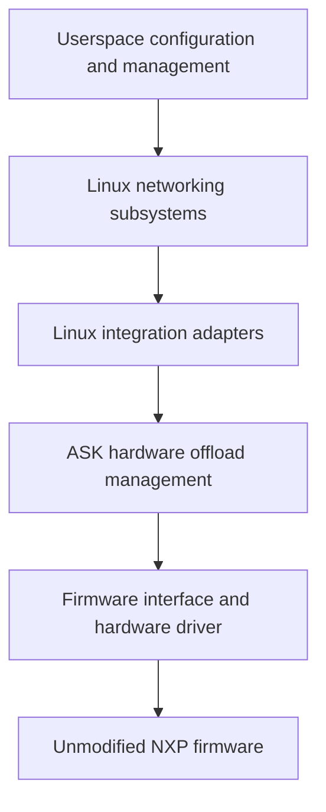

# Linux flowtable offload: design and first proof of concept

Status: IPv4 UDP and TCP offload implemented; ordinary ARP and IPv4 gateway
routing, invalidation and recovery demonstrated on the DUT.
The earlier intermittent UDP loss remains unresolved and deferred; its scope and
evidence are recorded separately below.
Development branch: `feat/linux-flowtable-offload`, starting at `7603f11`.
This document records the direction, initial scope, and acceptance requirements.
Concrete implementation contracts and the remaining acceptance work appear below.

## Purpose and constraints

Develop an alternative to CMM's automatic flow management in which Linux
networking subsystems request hardware offload through a small kernel integration
layer. Reuse the existing FMAN programming knowledge while making ownership,
lifecycle, and compatibility boundaries explicit.

The constraints are:

- NXP's hardware offload firmware is proprietary. Its source is unavailable, and
  the project must work with its existing capabilities and binary interfaces.
- This work will remain downstream. Implementation sources, kernel patches,
  compatibility work, documentation, and tests live in this repository; upstream
  acceptance is not a dependency.
- The existing CMM path must remain available and be the default. Developing the
  new path must preserve the ability to return to established ASK behaviour.
- Time, cost, and implementation complexity do not justify weakening correctness.
- The long-term direction is provisional. Linux interfaces and suitable designs
  may evolve; extend this document as evidence changes the decisions.

The PoC is intended to become the maintained foundation. Its small scope limits
the features supported, not the quality of their implementation. Approach it with
perfection as the engineering objective from the first change: no knowingly
incorrect lifecycle, ignored failure, fabricated success, or deferred cleanup is
acceptable on the grounds that this is an experiment. Verification establishes
bounded evidence; it cannot establish the absence of every possible defect.

## Current architecture and reusable parts

CMM observes Linux conntrack and networking state, resolves dependencies, and
sends commands through FCI. CDX translates those commands into hardware entries
and actions. Eligible packets then run through FMAN without passing through CMM.

CDX contains more than hardware encoding. It also implements command dispatch,
connection pairs, routes, ageing, resource management, and statistics. Replacing
CMM requires adapting this control model; calling the existing command dispatcher
from kernel callbacks would not by itself establish the intended architecture.

Useful starting points in this repository are:

| Responsibility | Existing implementation |
| --- | --- |
| CMM event handling and registration | [cmm/src/conntrack.c](../cmm/src/conntrack.c) |
| FCI dispatch and control serialization | [cdx/cdx_cmdhandler.c](../cdx/cdx_cmdhandler.c) |
| Connection pairs, routes, installation, ageing | [cdx/control_ipv4.c](../cdx/control_ipv4.c) |
| Classifier entries, hardware actions, activity, safe deletion | [cdx/cdx_ehash.c](../cdx/cdx_ehash.c) |
| Initial classifier and physical-port setup | [cdx/dpa_cfg.c](../cdx/dpa_cfg.c) |
| Device and queue information | [cdx/devman.c](../cdx/devman.c) |
| Software RX measurement | [tools/ask_orch/counters.py](../tools/ask_orch/counters.py) |

The baseline [kernel recipe](../meta-ask/recipes-kernel/linux/linux-ask_6.12.bb)
selects Linux 6.12.103 plus the separately pinned NXP SDK and ASK patches. The
[kernel configuration](../meta-ask/recipes-kernel/linux/files/defconfig) already
enables nftables flow offload. The selected SDK DPAA driver has no flowtable
offload callback or native XDP hook; those facilities cannot be assumed from the
capabilities of the separate mainline DPAA driver.

CDX already initializes physical ports through its existing setup. The PoC can
retain firmware loading, `dpa_app`, classifier configuration, and port setup
without starting CMM to install flows. Verify this independence on a clean boot,
including startup scripts and test fixtures.

## Architectural direction



These are responsibility boundaries, not a commitment to separate modules or a
new public API for every box.

Linux owns networking policy and connection state. Our integration translates
eligible operations into hardware requests and reports results and activity.
Hardware bookkeeping remains necessary: handles, shared resources, references,
pending work, synchronization, and recovery belong to the driver.

Concentrate Linux-specific structures, callbacks, references, and execution
contexts in small adapters. Keep common validation and firmware encoding
testable without the board where practical. Avoid both scattered version checks
and a general-purpose compatibility framework that recreates Linux.

Treat the firmware interface as a maintained specification: layouts, byte order,
actions, capabilities, resource limits, synchronization, counters, and reset
semantics. Record exact firmware identities and tested feature combinations.
Preserving this interface does not require preserving CMM or FCI as the new
path's control protocol.

Software forwarding remains the behavioural reference and fallback for supported
product features. Hardware eligibility must account for the complete required
behaviour, including exceptions and policy visibility. An unusable firmware
feature may need to be disabled; a host driver cannot guarantee a repair for
every defect inside an unavailable firmware implementation.

eBPF/XDP may later provide observation, classification, or specialized software
processing. It is not required for this PoC or a substitute for hardware lifetime
management. CPU XDP hooks do not see packets forwarded entirely by FMAN. Adding
BPF does not remove the need to maintain kernel-facing interfaces.

## Parallel development and mode ownership

Both paths must be buildable into the same image. The first PoC selects an
immutable mode at boot; the exact configuration interface is to be designed.

| Mode | Hardware flow controller | Expected behaviour |
| --- | --- | --- |
| Normal, default | CMM through FCI | Existing ASK functionality and interfaces |
| Experimental, explicit opt-in | Linux flowtable adapter | Only the documented PoC subset |

The adapter must be inactive in normal mode. Its presence must not change legacy
ageing, command semantics, statistics, or flow selection. Preserve existing
behaviour when factoring shared helpers, and validate that separately from new
functionality.

Enforce one controller for hardware flow state in the kernel. Stopping a daemon
or hiding a service is not sufficient ownership enforcement. Reject mutations
from the inactive controller before they change shared state; account for reset,
route, interface, and other indirect operations as well as connection insertion.
Audit FCI, ioctls, automatic bridge handling, and startup utilities for relevant
writers. Explicitly distinguish shared initialization and permitted diagnostics
from controller-owned mutations.

Experimental resources need identifiable ownership and a complete teardown path.
They must not accidentally enter CMM notifications or legacy ageing. Shared
physical resources must retain their existing lifetime guarantees.

Initially, returning to normal operation means booting normal mode with clean
hardware and restored normal networking configuration. A clean initramfs alone
does not prove that hardware state was reset; the test must establish that.
Starting CMM on top of experimental entries is not a supported handover.

Live mode changes, simultaneous ownership of different traffic, and preservation
of established connections across a handover are outside the first PoC. A future
live transition would need to stop admission, drain work, retire old hardware
state, detach the previous controller, and activate the next one. Never claim a
successful handover if hardware removal or synchronization is unproven.

## Smallest meaningful PoC

Demonstrate one IPv4 UDP connection, forwarded in both directions by FMAN,
installed, observed, and retired through Linux flowtable with CMM never started.

| Dimension | Initial support |
| --- | --- |
| Topology | Two hosts routed through two physical DPAA ports |
| Network context | Initial network namespace and default conntrack zone |
| Addresses and next hops | Fixed IPv4 routes and permanent neighbour entries |
| Traffic | One explicitly selected unicast UDP echo connection with numbered payloads |
| Forwarding | Normal Ethernet/IPv4 routing, correct MAC rewrite and TTL decrement |
| Encapsulation and translation | No NAT, VLAN, bridge, PPPoE, tunnel, or IPsec |
| Normal packet shape | Ordinary IPv4 headers and packets within the tested MTU |
| Lifecycle | Install, activity/statistics, explicit deletion, idle expiry, rollback, teardown |

Use the existing [test bench](testing.md), with an explicit PoC fixture that
supplies return routes on both hosts and removes NAT for the selected traffic.
Restore the normal fixture when testing CMM mode. Do not hardcode lab addresses
or silently depend on CMM-based test helpers. Confirm userspace tools and the
resolved kernel configuration needed by the fixture are present in the image.

Stable topology is a supported condition, not permission to forward using stale
state. The initial implementation may conservatively invalidate the whole PoC
offload on relevant route, neighbour, interface, MAC, or MTU changes. Define and
verify this response before installation is enabled. Efficient dynamic updates
and broader topology support come later.

Likewise, limiting the admission packet is insufficient: later packets with the
same tuple may have options, fragments, expired TTL, or excessive length. Verify
that the classifier/firmware handles or punts such packets correctly. A claimed
restriction must be enforceable throughout the installed flow's lifetime.

## Implementation increments

### 1. Establish the reference and inspect requests

Boot without CMM and establish empty hardware flow state. Verify the selected
traffic through ordinary Linux forwarding, then software flowtable forwarding.
Record packet contents, forwarding transformations, delivery, and counters.

Add the opt-in ownership mechanism and the smallest flowtable adapter. Initially
record supported request information and decline hardware installation, leaving
the software path operational. Successful binding or request logging is a
plumbing milestone, not proof of hardware offload.

On the baseline kernel, inspect the `TC_SETUP_FT` registration path and
`FLOW_CLS_REPLACE`, `FLOW_CLS_STATS`, and `FLOW_CLS_DESTROY` callbacks. Choose the
driver/indirect binding mechanism against the exact patched source used to build
the DUT. Do not derive behaviour from a neighbouring checkout or kernel version.

### 2. Establish a narrow internal hardware interface

Implement validation and the conceptual operations install, read activity/stats,
and remove. Back them with existing CDX hardware machinery through typed internal
interfaces. Do not make the experimental path depend on per-flow userspace FCI
commands or hardcoded hardware entries.

Resolve the mismatch between directional Linux requests and paired CDX entries.
Treat Linux cookies as opaque identifiers. Document which object owns each
direction, route, resource, and timer, and exactly when an operation may report
success. Reusing code must not import incompatible ownership assumptions.

Linux controls the experimental flow lifecycle. Hardware activity is reported
through the adapter; legacy CDX ageing must not independently expire a flow that
Linux still treats as installed. Preserve legacy behaviour for legacy objects.

### 3. Enable installation and complete the lifecycle

Enable only fully validated PoC rules. Exercise both directions, statistics,
active refresh, idle expiry, explicit removal, duplicate requests, partial
failure, teardown under traffic, and conservative invalidation.

Maintain distinct states for an installed entry, a failed or partial operation,
an entry removed from lookup but awaiting a hardware barrier, and an entry whose
removal cannot be proved. A null software pointer is not evidence of hardware
removal. Reuse existing quarantine and synchronization work only after reviewing
its complete contract. If recovery cannot establish safe software forwarding,
quiesce the affected datapath and report failure; do not announce fallback while
stale hardware may still forward.

### 4. Verify compatibility and return to normal mode

Run focused CMM compatibility tests with the experimental code present but
inactive. Run the PoC in experimental mode, then boot normal mode and repeat
those checks. The full KASAN suite takes about 80 minutes and is explicitly
excluded from this undertaking at the user's request. Include a build with the
experiment excluded if the design provides a compile-time option.

Accept the foundation only with the evidence below. New feature work builds on
accepted increments; discovery of a defect must update the implementation,
regression coverage, and any affected claims.

## Engineering contracts required from day one

- Validate every match, mask, action, ingress/egress device, and network context.
  Unsupported combinations must be declined without incomplete hardware rules.
- Document callback context, lock ordering, references, work cancellation, and
  unload/unbind behaviour. A callback replacing FCI must not bypass the
  serialization on which current CDX code relies.
- Define partial-install rollback, duplicate add/delete behaviour, resource
  exhaustion, and failures during deletion and synchronization. Prevent late work
  from reviving retired state or accessing released devices and flow objects.
- Define how hardware activity and byte/packet counters map to Linux, including
  units, clock conversion, deltas, reset/wrap behaviour, and directional
  aggregation. Avoid double accounting and false refresh of idle entries.
- Specify binary layouts with explicit widths and byte order, and test the
  production encoding functions against independently specified expectations.
- Keep meaningful failure reasons and ownership/resource diagnostics available
  without CMM. Report unsupported functionality and degraded operation honestly.
- Preserve the default CMM mode through focused changes and legacy regression
  coverage. Do not solve experimental lifecycle needs by changing all legacy
  objects' behaviour.

Before hardware installation is enabled, record the concrete choices for these
contracts in this document or a linked design supplement. Open design choices
must not become implicit implementation assumptions.

## Acceptance evidence

All rows are requirements. Passing measurements and remaining acceptance limits
are recorded below; an isolated passing run does not erase an unexplained failure.

| Area | Required demonstration |
| --- | --- |
| Independence | Clean boot, CMM never started, no leftover legacy entries or hidden per-flow FCI setup |
| Ownership | Default mode unchanged; attempts by an inactive controller cannot mutate flow state |
| Admission | Supported rule accepted; unsupported matches/actions/contexts leave no partial installation |
| Installation | Linux requests map to identifiable entries for both directions; success matches hardware reality |
| Packet behaviour | Numbered payloads delivered with correct MAC rewrite, TTL, and checksums, without unexpected loss or duplication |
| Exceptions | Same-tuple exception packets and topology changes are handled, punted, or conservatively invalidated according to the contract |
| Hardware execution | Successful delivery plus advancing per-entry hardware counters and a small measured software RX delta after warm-up |
| Statistics and activity | Defined counter accounting; sustained traffic survives idle thresholds; idle traffic expires |
| Removal | Flowtable removal retires hardware entries; subsequent packets use Linux and cannot recreate offload through the removed table |
| Failure and teardown | Allocation/installation failures, partial directions, deletion/barrier failures, and teardown with pending work follow their documented recovery paths |
| Resource lifetime | Repeated healthy cycles return resource counts to baseline; failure quarantine is accounted for and never silently reused |
| Kernel diagnostics | Relevant sanitizer, locking, and build checks pass; no unexplained kernel diagnostics |
| Legacy compatibility | Focused existing CMM tests pass before the experimental run and after returning to normal mode; the full suite is outside this run's scope |

The `[HW_OFFLOAD]` flag, throughput, CPU idle, and connection presence are
supporting information, not sufficient proof. ASK netdev totals include hardware
traffic. Use the physical SDK DPAA `rx packets [TOTAL]` counter through the
existing helper for software RX, together with successful endpoint delivery and
hardware counters. Missing measurement sources fail the test; do not substitute
a counter with different semantics. See [counter interpretation](testing.md#interpreting-packet-counters).

Define traffic counts, warm-up completion, timeout bounds, and tolerances before
each test; justify allowances for background traffic and counter granularity.
Poll observable state with bounded waits instead of treating a sleep as proof.
Use endpoint captures where CPU capture hooks cannot observe hardware forwarding.

Keep host tests for production validation/encoding and resource-state logic,
appropriate instrumented kernel tests, and real-DUT packet and failure tests.
Mocks do not establish firmware behaviour. Record the source revision and local
diff, resolved kernel/SDK configuration, toolchain, firmware identity, image and
DTB identities, running module identities, fixture configuration, packet traces,
counters, diagnostics, and test results needed to reproduce each acceptance run.

## Expansion and long-term direction

After the first lifecycle is accepted, broaden dynamic route/neighbour/device
behaviour and exception coverage. Exercise the same small feature on a second
kernel version early to test whether the compatibility boundary is useful.
After the gateway increment described below, candidate expansions are
multiple connections, selective invalidation, IPv4 NAT, IPv6, additional interface types,
bridging, QoS, tunnels, and IPsec, each with separate eligibility and verification
criteria. This is a suggested sequence, not a fixed roadmap or a claim that one
Linux API covers every feature.

The direction is to reduce CMM's duplicated networking management while retaining
CDX's useful hardware knowledge in a more focused driver. Linux may supply the
appropriate abstractions through flowtable, bridge/switchdev, traffic control,
XFRM, or future facilities. Keep the existing path available until replacement
behaviour has been demonstrated feature by feature; retirement is not part of
the first PoC.

All compatibility work remains this project's responsibility. Support a declared
set of kernel versions, retain reproducible baselines, and continuously test new
versions. Preserve source and interface documentation independently of opaque
firmware. Longevity means an architecture we can keep adapting, not an assurance
that today's internal Linux interfaces or firmware features will last unchanged.

## References

- [Linux Netfilter flowtable documentation](https://docs.kernel.org/networking/nf_flowtable.html)
  describes software/hardware offload and also notes stale-cache limitations;
  integration alone does not prove invalidation correctness.
- [Linux kernel driver interface policy](https://docs.kernel.org/process/stable-api-nonsense.html)
  explains why a downstream driver must track internal interface changes.
- [BPF kernel functions](https://docs.kernel.org/bpf/kfuncs.html) describe explicit
  exposure and compatibility constraints for BPF access to kernel facilities.
- [ASK testing](testing.md), [versioning](versioning.md), and the
  [SDK source pin](../pins/nxp-sdk-srcrev.inc) define existing project practices.

## Implemented PoC contracts

The implementation is on `feat/linux-flowtable-offload`. The interfaces below
are implemented; the acceptance matrix above remains the gate for claiming a
verified foundation. Hardware measurements and any resulting restrictions will
be recorded alongside the tests.

The test initramfs reads `ask.offload=cmm|flowtable` from the kernel command line;
absence selects CMM. `ask.flowtable_observe=1` with flowtable ownership validates
requests but refuses hardware installation. CDX exposes these as read-only module
parameters `offload_owner` and `flowtable_observe`. Selecting a mode requires a
clean boot. The experimental init script skips `auto_bridge` and CMM; CDX skips
the Wi-Fi and IPsec runtime offload hooks. All FCI commands return
`-EOPNOTSUPP` in experimental mode, including queries. Initial `dpa_app` setup is
shared, and subsequent SET_PARAMS requests are rejected. Read-only hardware
inspection remains available through `/proc/cdx_flowtable`, independently of CMM.
The systemd CMM service also checks ownership; the kernel-command-line selector
itself is currently implemented by the test initramfs, not a production installer.

`cdx_flowtable.c` uses Linux's indirect `TC_SETUP_FT` binding callbacks and
`TC_SETUP_CLSFLOWER` requests. It accepts one flowtable, at most two initial-netns
physical Ethernet ports, and at most two directional entries. Cookies are opaque
and local to a binding. Unsupported selectors and actions fail before insertion.
The admitted rule has exact IPv4 TCP or UDP addresses and ports, an ingress
ifindex, four Ethernet rewrite words, and a redirect. TCP additionally requires
an assured, established Linux conntrack and the exact FIN/RST exclusion generated
by Netfilter; the parser contract and teardown semantics are described below.
The protocol participates in private hardware encoding and duplicate-key checks.
NAT, nondefault conntrack zones, conntrack marks, unsupported devices, and other
action lists are rejected. An alive, resolved ARP neighbour for the selected route
next hop on the egress port must match the requested destination MAC. Permanent entries
remain supported; ordinary REACHABLE, STALE, DELAY and PROBE entries are also
eligible. NOARP, unresolved, failed and detached entries are declined.
The current source MAC must equal the physical port's
permanent MAC. Both directly reachable destinations and IPv4 gateways are
supported through the route supplied by Linux. IPv6 gateways remain excluded.

Patch `140-ask-flowtable-context.patch` supplies borrowed conntrack and selected
route context, the directional effective MTU, and the table's accounting
requirement to callbacks. Neither borrowed pointer nor a Linux flow object is
retained. This explicit, downstream, kernel-internal
interface avoids recovering a parent flow by casting its cookie. The adapter
must be built against this patch; the test image includes the native flowtable
and nftables modules it needs.

`cdx_flowtable_hw.c` presents install, statistics, and consuming deletion
operations. Each installed direction owns a private CDX encoding object, a dummy
reverse tuple, and an embedded route. These objects never enter the legacy
connection hash, route hash, CMM notification path, or ageing wheel. The existing
classifier encoder supplies routing actions, preemptive checks, and hardware
statistics. The adapter holds one ingress-device reference per binding and one
egress-device reference per installed direction. Installation uses the existing
ehash encoder and allocator. The adapter's backend owns its installed hardware
handles and their retirement; legacy objects retain their existing ownership.

Linux submits the two directions independently. A direction reports success
only after hardware installation succeeds. An identical replacement is
idempotent; a changed replacement retires the old entry before adding the new
one. A conflicting cookie for an existing hardware key is rejected. A rejected
second direction can leave the valid first direction installed, as permitted by
Linux flowtable semantics; the other direction uses software. Linux's
`[HW_OFFLOAD]` flag is therefore explicitly insufficient evidence that both
directions are accelerated. Tests inspect both hardware entries and both
physical software RX counters.

Statistics use monotonically increasing 64-bit hardware packet/byte counters;
callbacks report only the delta since the previous callback. A backwards sample
disables admission and retires the experiment instead of causing unsigned
underflow. Firmware timestamps use CDX's 32-bit jiffies clock. The adapter expands
them relative to current kernel jiffies; the supported idle interval must remain
below half that clock's range. Linux owns activity refresh and idle expiry.

Firmware counts classifier matches, including some later punts to Linux.
Hardware bytes include the Ethernet header and minimum-frame padding, excluding
FCS. Measurements give 298 bytes for a 256-byte UDP payload and 60 bytes for an
8-byte payload, in both directions. Same-tuple TTL/MTU exceptions also increment
the match counters before Linux handles them. These aggregates cannot recover
independently forwarded packets or exact IP bytes. Passing them into conntrack
accounting would mix byte units and count some packets twice.

The adapter therefore rejects a table with nftables `counter` enabled, leaving
it on software forwarding and accounting. If an existing table enables counters,
the next statistics callback invalidates the experiment without reporting its
hardware deltas to conntrack. Recreate the table to change accounting policy at
a defined boundary; do not interpret a running table's flag change as an atomic
accounting transition. Admitted tables use hardware activity for ageing, while
proc diagnostics expose raw classifier counters. Conntrack does not receive
hardware accounting contributions when the native `counter` flag is absent.
Accurate hardware accounting requires a separately verified post-punt firmware
measurement facility; it is outside this PoC's contract.

The control mutex serializes list changes and all firmware operations. Netfilter
rule callbacks execute in workqueue context. Binding release runs after the flow
block excludes its callbacks. Notifiers latch invalidation and queue work; they
never acquire the control mutex. ARP callbacks inspect pinned, immutable
dependencies under a separate spinlock, nested inside the neighbour lock.
Invalidation deletes the experimental entries
before flushing Linux flowtable work, releasing the control mutex before that
flush. Module exit removes the proc entry and notifiers, cancels invalidation
work, and unregisters indirect callbacks before global CDX teardown acquires its
locks. Installation and fatal recovery use RTNL trylock under the control mutex,
because RTNL holders can wait for Netfilter callbacks. A busy RTNL lock declines
installation to software; fatal recovery releases the mutex and retries. A port
must also match the netdevice recorded by CDX, not merely its name. Flowtables
must be bound after CDX initializes; incomplete indirect replay requests are
declined.

Relevant initial-netns IPv4 route and ARP-neighbour changes, or interface down,
unregister, MTU, MAC, rename, or upper-device changes conservatively disable new
hardware admission until the recovery boundary below. IPv4 route events remain
namespace-wide. ARP invalidation now follows watched neighbours: a changed MAC,
unusable state or detached object retires the whole table, while same-MAC NUD
progress and unrelated ARP updates do not. Configure routes before binding;
neighbours may resolve through ordinary ARP after binding. Invalidation is
asynchronous; inspect
`invalidation_done` before claiming retirement is complete.

Healthy invalidation can recover by deleting and recreating the flowtable after
configuration has settled. Admission remains closed while any old binding or
entry exists, invalidation work is incomplete, or either retirement quarantine
contains storage. With all of these cleared, `rearm_ready=1` reports that the
driver can accept recovery. The candidate Linux table must also be empty: a
table with its hooks removed can still contain cached flows and queued callbacks.
The first successful binding to an empty table clears `invalidated` and
`invalidation_done`.
That binding increments `rearms`; adding the second port does not. Allocation
failure leaves the recovery state untouched. Install, delete and error counters
remain cumulative. Every new rule still passes the full Linux-context validation.

The control mutex protects this transition. The worker publishes completion as
its last state change, after hardware retirement and Linux flow cleanup. Binding
never waits for the worker: Netfilter locks held by a binding operation can be
needed by the cleanup being awaited. Recovery depends on complete withdrawal of
the old bindings, not a comparison of opaque table pointers, which can be reused.
The `TC_SETUP_FT` setup call borrows a live `struct nf_flowtable` from Netfilter;
only this call reads its hash population. The retained table pointer is used
solely for identity in other paths. This check is against the exact downstream
kernel interface and must be reviewed when porting the adapter.
Keeping an invalidated table bound does not re-enable it automatically. Fully
detaching and reattaching its devices is refused while cached flows remain;
deleting and recreating the table provides an empty candidate. Fatal
state independently refuses binding and installation, even with empty quarantine;
there is no runtime command to clear the fatal latch.

Deletion has three outcomes: synchronized removal, unlinked storage retained for
a barrier, or unproven unlink. All outcomes consume the adapter's software
handle. Failed deletion retains the already allocated backend owner in a private
retirement list, requiring no new allocation on the failure path. The worker
retries barriers until they succeed; it never retries the destructive unlink.
Quarantine and errors remain observable; a null handle is never treated as proof
of synchronization. Unproven unlink latches a fatal condition
and retries datapath quiescence until it succeeds or module shutdown takes over.
Fatal completion means the datapath was stopped, not that software fallback is
available. Reboot is required. Possibly linked hardware storage stays allocated
until reset; freeing it would leave a dangling hash-chain link. Shutdown releases
unlinked storage only after global datapath quiescence is proven. Healthy
invalidation waits for retirement barriers and flushes the affected software
flowtables, allowing ordinary forwarding.

The test build exposes a one-shot `flowtable_fail_stage` parameter: 1 before
adapter allocation, 2 before hardware installation, and 3 after installation,
forcing rollback through the real delete path. Production builds omit this
parameter. A separate test-only `flowtable_fail_unlink` boolean consumes one
delete attempt before destructive unlink, leaving the real key linked and
forcing fatal retirement. It exercises stopped classifier ports and retained
storage; it does not simulate a recoverable synchronization failure.
Host tests compile the production rule decoder and lifecycle code
with fault-injected kernel/firmware boundaries under ASan and UBSan; hardware
acceptance uses the real classifier and endpoint traffic.

`tools/tests/test_flowtable_offload.py` is explicitly gated by
`ASK_FLOWTABLE_TESTS=1`. It supplies a selected-protocol NAT exemption, permanent DUT
neighbours, a WAN host return route, and a numbered echo server, then restores
the fixture. TCP tests reuse the topology with a TCP peer instead of the echo
server. It uses the LAN UART and target/WAN agents without CMM helpers.
Runs can set `ASK_FLOWTABLE_ARTIFACTS` to retain measurements and packet captures.
The rearm test exercises three recovery cycles without rebooting. It changes the
LAN endpoint's actual MAC and its permanent DUT neighbour while traffic runs,
then changes a direct host-route MTU, then injects two retirement-barrier failures.
Each cycle proves software forwarding during invalidation and fresh hardware
forwarding after table recreation. Strict delivery checks use the NIC's normal
receive filter. Software TX enqueues distinguish software forwarding from
hardware delivery. The SDK RX statistic alone cannot do so: with GRO disabled,
software flowtable forwarding can consume an skb and return before the driver
increments RX. The test also refuses reattachment of a populated table whose
hooks have all been withdrawn. The separate invalidation-only test leaves
admission closed.

`ASK_FLOWTABLE_TERMINAL=unload|unlink` separately selects a terminal lifecycle
test with `-k flowtable_offload_terminal`. Use a fresh experimental boot for
each variant. The test removes the inactive FCI module dependency, verifies
both hardware directions under traffic, and then unloads CDX or injects an
unproven unlink. The latter checks fatal status and disabled FMan receive ports,
refuses hardware bindings for a newly created flowtable, then removes CDX for
cleanup. Both variants finish by checking 64 ordinary UDP
exchanges with CDX absent. A continuous sender spans the intentional datapath
stop and validates every received payload; interruption during that stop is
recorded separately from the normal zero-loss forwarding oracle. DUT control
and fixture restoration use UART when the datapath can be unavailable. Neither
variant reloads CDX or switches owners; reboot afterward.

## Running the focused checks

Build with `KASAN=1 make ask-image`, then run `make stage-image`. Boot the staged
RAM image with `ask.offload=flowtable`; add `ask.flowtable_observe=1` for an
observe-only boot. Start from a clean boot for each invalidation variant. The
boot selector is transient; returning to CMM means rebooting with both experimental
arguments absent. Do not unload/reload modules to switch owners.

With the normal LAN UART and DUT/WAN agents available, run:

```sh
ASK_FLOWTABLE_TESTS=1 ASK_WAN_IPERF_IP=<WAN-address> make ask-test \
  ASK_TEST_ARGS='-k flowtable_offload -x -q'
```

The ordinary run selects five PoC scenarios: reference/forwarding/lifecycle,
same-tuple exceptions, installation rollback, recovery, and neighbour invalidation. The
optional long-exchange diagnostic skips by default. The lifecycle includes a
512-packet hardware measurement, minimum-size packets, three removals under
traffic, 65 seconds of activity refresh, and a bounded idle-expiry wait. Tests
validate payloads and Ethernet/IP behaviour; they never equate classifier hits
or Linux's hardware flag with successful delivery.

For the recovery increment alone, select just the recovery and fatal-refusal
checks on a fresh experimental boot:

```sh
ASK_FLOWTABLE_TESTS=1 ASK_FLOWTABLE_TERMINAL=unlink \
  ASK_WAN_IPERF_IP=<WAN-address> make ask-test \
  ASK_TEST_ARGS='-k "flowtable_offload_rearm or flowtable_offload_terminal" -x -q'
```

The terminal test removes CDX, so reboot in experimental mode afterward. The
recovery test itself needs no reboot or return to CMM between its cycles.

On a separate experimental boot, exercise failed retirement barriers with:

```sh
ASK_FLOWTABLE_TESTS=1 ASK_FLOWTABLE_INVALIDATION=barrier \
  ASK_WAN_IPERF_IP=<WAN-address> make ask-test \
  ASK_TEST_ARGS='-k flowtable_offload_invalidation -x -q'
```

`ASK_FLOWTABLE_BASELINE=software|flowtable|hardware` with
`-k flowtable_offload_long_exchange` selects an explicit 4,096-packet diagnostic
through ordinary routing, software flowtable, or hardware offload. It leaves the
LAN NIC out of promiscuous mode and records raw frames, classifier state,
conntrack, and endpoint error counters on a timeout. Other packet checks use
promiscuous capture so an unexpected Ethernet destination remains observable.

After a normal CMM boot, the selected compatibility checks are:

```sh
ASK_WAN_IPERF_IP=<WAN-address> make ask-test \
  ASK_TEST_ARGS='-k "test_cmm_unsupported_commands or test_iperf_ipv4_tcp_offload" -x -q'
```

The focused host command is `sudo /opt/askd-agent/venv/bin/pytest -c
tools/pyproject.toml tools/host_tests -k 'flowtable or cdx_shutdown' -q` with the
standard host setup. These tests compile production decoder, backend ownership,
and teardown code under ASan/UBSan. This procedure does not run the full DUT
KASAN suite.

`ASK_FLOWTABLE_INVALIDATION=counter` selects a separate-boot test which enables
accounting on an active hardware table and verifies retirement and software
fallback. It exercises the runtime accounting guard in addition to the normal
test's refusal to install into a table that already requests counters.

## Validation record — 2026-09-14

The final candidate was built and staged with KASAN, lockdep, kmemleak support,
and FAILSLAB enabled. Running kernel/CDX build IDs and the dpa_app, CMM, and FMC
hashes matched the build. Image SHA-256:
`dfcdbc950f5bb3a84f8982a16e360f0d673602f4454da28a44ae13de006600c5`.
Kernel build ID: `e5a2b9c4cbd3e2c2f6b2f3bdf46fcbb9a57e274a`.
CDX build ID: `1fd916d9338c3e2a8464e6ed3431da1f2ba2dc7a`.
Build output contained six existing forced-task/build-path notices and no
compiler warnings. Source manifests include the new, untracked files as well as
the tracked diff captured before this checkpoint.

| Check | Result and bounds |
| --- | --- |
| Focused host checks | 3 passed under ASan/UBSan: decoder/lifecycle, backend ownership, and shutdown ordering |
| Current PoC lifecycle, exceptions, rollback | 3 passed in 128.26 seconds on the final candidate |
| Hardware execution | Both directions advanced from 62 to 574 classifier hits during 512 successful echoes; software RX increased by 1 on eth3 and 9 on eth4; payload, MAC, TTL, and request checksum checks passed |
| Minimum frames | 32 eight-byte UDP payloads advanced each hardware counter by 32 packets and 1,920 Ethernet bytes |
| Activity/removal | Three removals under traffic returned entries/bindings to zero; 65 seconds of active traffic stayed installed; idle expiry retired both directions |
| Counter admission | A counter-enabled table forwarded in software and installed zero hardware entries |
| Counter change | Enabling counters on an active table completed invalidation with zero entries, errors, fatal state, or quarantine; subsequent echoes succeeded |
| Longer forwarding windows | Final candidate passed 4,096 echoes through software flowtable and another 4,096 through hardware, with LAN promiscuous mode disabled |
| Earlier observe/invalidation checks | Observe mode, neighbour invalidation, and two injected delete-barrier failures passed on earlier instrumented builds; the retirement backend is unchanged in the final candidate |
| Kernel diagnostics | Selected scenarios reported no KASAN/UBSAN/BUG/WARN/lockdep findings; a separate I2C error flood is described below |
| CMM return | Final candidate rebooted with CMM ownership; unsupported-command handling and IPv4 TCP hardware offload both passed in 17.11 seconds |

The barrier-failure run consumed both injected failures, recorded two errors,
completed invalidation, drained quarantine to zero, and continued forwarding in
Linux. Host tests additionally exercise failed barrier retries, unproven unlink,
and failed/busy quiescence. Hard unlink failure and module unload with live
experimental traffic had not yet been demonstrated in this initial validation;
the later terminal lifecycle validation is recorded below. Host checks do not
substitute for those hardware cases.

During development, several hardware runs lost an individual UDP request or
reply, including after table removal. In one long run, request 3,014 reached the
WAN endpoint and both directional classifier counters reached 3,012 (the first
two packets had used software), but the reply did not appear in the LAN capture.
LAN NIC error counters did not increase. Ordinary-routing windows of 4,096
packets and CMM windows of 4,096 and 8,192 packets passed. Those failures used the
earlier counter-enabled experiment, which the final adapter now declines because
its accounting is incorrect. The counter restriction is not a demonstrated
explanation or fix for the loss. Preserve this as an open acceptance item;
successful subsequent windows are bounded evidence, not grounds to erase it or
increase test loss tolerances. Do not broaden the PoC on an assumption that this
failure has been explained.

The DUT later began repeatedly reporting `i2c-1: SCL is stuck low` across warm
boots in both ownership modes. That also disrupted UART command parsing. Final
diagnostic boots used `loglevel=1 log_buf_len=4M` to keep UART usable and retain
kernel messages; instrumentation remained enabled. A subsequent live
investigation isolated the stuck branch to the FLEXOPTIX DAC's mux channel;
unplugging and reinserting the DAC restored both modules, and a normal reboot
passed the board self-tests. The original trigger remains unresolved.

The [follow-up UDP investigation](flowtable-udp-loss-investigation.md)
reproduced losses on this exact final image with I2C healthy. It recorded one
ordinary-routing loss with an X550 receive CRC error, and hardware losses
counted by the DUT's LAN transmit MAC without a corresponding LAN reply or
endpoint error increment. Subsequent 16,384-packet software and hardware
windows passed after a diagnostic X550 reset and fresh DUT boot. These results
narrow the investigation but do not establish a common cause or close delivery
acceptance. Detailed counter deltas, excluded diagnostic attempts and the
physical isolation plan are retained in the linked record.

Artifacts are retained under `/tmp/ask-flowtable/` on the build host: image/source
identity, build and boot logs, pytest XML, endpoint capture, hardware counters,
exception results, fault recovery, and failed-exchange diagnostics. The full
suite was stopped at the user's request after 159 passes and no failures; it was
not resumed. No full-suite or full kmemleak-scan acceptance is claimed.

At the end of these initial checks, the DUT returned to default CMM ownership.
No persistent boot configuration or flash image was changed.

## Terminal lifecycle validation — 2026-09-14

A subsequent test image adds the test-only hard-unlink hook described above.
The forwarding and retirement implementation is unchanged; the new hook leaves
one real installed key linked to exercise the existing fatal path. It is absent
from production builds. The image was built and staged with the same KASAN,
lockdep, kmemleak and FAILSLAB configuration. Build output contained three
existing forced-task notices and no compiler warnings. Running identities
matched the build:

- Image SHA-256: `f1afad25011630343366d2c5a1abb89e950f1693abbf1ee656bd743cbbc78bec`.
- Kernel build ID: `365a93b26ed2ecc05966696c1e6e87a7111be0b1`.
- CDX build ID: `65912f90a0bac30c99cf1db93c923f67f02792bb`.

These runs used the operator's replacement RJ45 cable with the same FS module,
X550 and physical ports. They are lifecycle tests, not a controlled comparison
establishing that the original cable caused the earlier UDP loss. The LAN link
was checked after the terminal tests and reported 1 Gb/s. No 10 Gb/s
performance acceptance is claimed or required for these lifecycle checks.

| Check | Result and bounds |
| --- | --- |
| Focused host checks | 3 passed under ASan/UBSan, including one-shot hard-unlink injection, preservation of the linked key, no destructive retry, and a subsequent healthy delete |
| Module unload under traffic | Passed in 23.45 seconds. Both hardware directions had 164 hits immediately before unload. CDX and its proc entry disappeared; 64 subsequent ordinary-routing echoes passed. The 12-second stream spanning shutdown received 1,837 of 1,906 sent packets; lossless unload is not claimed. |
| Hard unlink failure | Passed in 22.54 seconds. Both directions were active before injection; the one-shot hook was consumed, errors increased by one, and fatal invalidation completed with entries/bindings zero. FMan receive ports 6 and 7 both changed from enabled to disabled. The kernel recorded one retained linked key; WAN delivery stopped while the LAN sender continued. |
| Fatal cleanup | Removing CDX after the hard-unlink test restored ordinary forwarding; 64 echoes passed with the module absent. This is explicit teardown after the fatal observation, not software fallback by the invalidation worker. The boot was then reset before using ASK again. |
| Kernel diagnostics | Both successful terminal tests completed their capture windows without KASAN/UBSAN/BUG/WARN/lockdep findings. No full suite or kmemleak scan was run. |
| CMM control compatibility | Unsupported-command handling passed in 4.81 seconds after rebooting the same image with default ownership. |
| CMM forwarding compatibility | A separate five-second paced TCP measurement delivered 500,170,752 bytes at 799.94 Mb/s. CMM's hardware connection table grew from zero to two entries. DUT LAN software RX increased by only 268 packets versus a conservative lower bound of 333,447 data frames. No kernel splats were recorded. |
| DUT CPU during CMM forwarding | `/proc/stat` showed 1.87% average busy time over an idle baseline and 3.46% over the traffic window, averaged across all four CPUs. The busiest core during traffic was 4.68%. These are DUT measurements; iperf's endpoint CPU figures are not used. |

The first hard-unlink attempt stopped before injection because interactive shell
prompts contaminated the test's JSON output. Cleanup succeeded; it is excluded
from hard-unlink acceptance. The maintained test now sends Python as a single
encoded command and explicitly frames actual console output. The successful
replacement run used that framing. The finite traffic task is awaited before
UART reuse, and fatal cleanup runs even if its packet checks fail.

The existing CMM throughput test requires at least 1 Gb/s of application
throughput, which the replacement link cannot supply. Its threshold was not
changed. The paced compatibility measurement instead combines received data,
hardware table population, software-path packet counts and DUT CPU usage. Its
temporary checker and raw measurements are retained with the lifecycle
artifacts. Low CPU usage corroborates the software-path counters; it is not
treated as a delivery oracle by itself.

Artifacts are under `/tmp/ask-flowtable-lifecycle/`: image/source manifests,
build and boot logs, pytest XML, live-entry snapshots, port-enable states,
terminal traffic counts and raw UART logs. The build log is
`/tmp/ask-flowtable-lifecycle-build.log`. The two previously missing terminal
hardware cases now have direct DUT evidence. Earlier unexplained UDP loss
remains documented; the operator explicitly deferred further dedicated loss
diagnosis so work could continue on this foundation.

For subsequent work, keep the DUT in experimental ownership between tests.
Recreate the table after healthy invalidation; reboot within that mode after a
fatal failure or a test that removes CDX. Return
to CMM only when the compatibility test itself requires it. The operator has
made the DUT available for continued development.

Final runtime state: the tested image is booted with `ask.offload=flowtable`,
observe mode off, and entries, bindings, installs, deletes, errors, invalidated,
fatal and quarantine all zero. CMM and auto_bridge are absent, both fault knobs
are clear, and no experimental nftables table remains. The ready boot has no
kernel splats or I2C stuck messages. Persistent boot settings and flash remain
unchanged.

## Healthy invalidation recovery verified (2026-09-14)

The first follow-on increment is complete: healthy invalidation can restore
hardware admission after full detachment and binding an empty Linux flowtable.
Fatal retirement remains latched. Work stops at this increment; ordinary ARP,
gateway routes and selective invalidation are subsequent work.

The KASAN image was rebuilt and staged, and live kernel/CDX build notes matched
the built artifacts before both hardware checks. KASAN, lockdep and FAILSLAB
were enabled; the full KASAN suite was not run. The build had no compiler
warnings; its three BitBake warnings concerned previously forced recipe tasks.

| Identity | Value |
| --- | --- |
| Staged image SHA-256 | `50d8b8510421e8f6998e423baa1f99c958f66731ac06f2c7a1eba5039362af9a` |
| Kernel build ID | `2da28a7c60a44c08886618dfa4bda39e3eeb363b` |
| CDX build ID | `3f04f3e1c4082d88053ddb2c9cbe7dbfc063ec3a` |
| Recovery test boot | `724fcb2a-5349-4580-836e-9fed961aeb1e` |
| Successful fatal test boot | `45bb4344-a8ae-4e36-b604-641b69216e98` |

| Check | Confirmed result |
| --- | --- |
| Focused host checks | 11 passed in 0.48 seconds. Production adapter/backend lifecycle and shutdown checks use ASan/UBSan; counter-parser checks cover both directions. |
| Recovery admission guards | Host checks exercise incomplete cleanup, failed barriers, both quarantine lists, partial detachment, populated Linux tables, allocation failures, shutdown and fatal state. A notifier arriving during ordinary bind allocation remains latched. Eight recovery cycles preserve references and cumulative counters. |
| Healthy DUT recovery | Passed in 24.17 seconds. MAC change, host-route MTU change and two injected retirement-barrier failures each completed invalidation and recovered after table recreation, all within one boot. `rearms` advanced exactly once per cycle, from 0 to 3. |
| Closed admission | Each cycle delivered 64 strict echoes through software with no new hardware installs and exactly 64 LAN software TX enqueues. Existing bindings did not reopen admission. Reattaching the populated, fully detached table returned `Operation not supported`. |
| Recovered forwarding | Each cycle delivered 512 strict echoes with the normal LAN receive filter, exactly 512 hardware hits per direction, and software TX deltas of 0 on eth3 and 8 on eth4. The changed destination MAC was accepted by the endpoint; after the MTU change, the reply rule used 1100 and the original direction retained 1200. |
| Barrier history | Both injected delete-barrier failures were consumed, quarantine drained, and recovery retained the cumulative error count of 2. No fatal condition was raised. |
| Fatal refusal | Passed in 25.64 seconds on the same image. Unproven unlink raised one error, completed fatal invalidation and disabled FMan receive ports 6 and 7. Creating a hardware flowtable returned `Operation not supported`; bindings, entries, `rearm_ready` and `rearms` remained zero. |
| Fatal cleanup | WAN delivery ceased while the finite sender continued attempting traffic. After explicit CDX removal, all 64 ordinary software echoes passed. Neither the worker nor flowtable recreation cleared the fatal latch. |
| Sanitizers | Neither successful DUT check reported a KASAN, UBSan or lockdep splat. |

Transition measurements remain separate from stable forwarding acceptance. The
MAC transition received 980 of 997 datagrams during the deliberate address
mismatch. The successful fatal observation sent 1,158 datagrams, received 687
and recorded 20 send timeouts across the intentional stop. The finite sender
records backpressure and keeps attempting sends; every received payload is
validated. These are not lossless-transition or throughput claims.

The first recovery attempt exposed an unsuitable RX-counter assertion, not a
delivery failure. The SDK counter excludes some software flowtable traffic when
GRO is disabled; the recovered-forwarding proof now uses software TX counters.
Earlier fatal attempts are excluded: malformed nft syntax, a corrupted UART
script, LAN unavailability before the first flow, an already removed FCI module,
and unhandled send backpressure prevented full acceptance. The harness now
requires the specific offload-refusal error, verifies chunked UART scripts by
SHA-256 before execution, tolerates an absent inactive FCI dependency, and records
send timeouts only in the intentional-stop traffic helper. Strict exchange
checks retain their zero-loss requirement.

Artifacts are in `/tmp/ask-flowtable-rearm/`, with the build log at
`/tmp/ask-flowtable-rearm-build.log`. `focused.xml` contains the successful
recovery case and the excluded earlier terminal case; `terminal.xml` contains
the successful replacement terminal run. Separate manifests identify both
boots. Excluded attempts and raw UART logs are retained in subdirectories.
The DUT is restored to a clean boot of this image in experimental ownership;
no return to CMM is needed between healthy recovery cycles.

## TCP increment and validation (2026-09-14)

This increment admits one IPv4 TCP connection using the same physical ports,
direct host routes, permanent neighbours and two-direction limit. CMM remains
absent. It adds no NAT, dynamic ARP or gateway resolution. The backend carries
the protocol through both private tuple objects, hashing and classifier table
selection; the existing TCP encoder provides the forwarding actions. UDP and
TCP tuples with identical addresses and ports are distinct keys. Hardware
ownership, retirement, quarantine and healthy rearm mechanisms are unchanged.

Admission requires the rule protocol to match its borrowed conntrack context.
TCP requires `nf_conntrack_tcp_established()` (ESTABLISHED plus ASSURED) and
exactly Netfilter's TCP flags key zero with mask FIN|RST. Missing flags, extra
selectors, different masks and unsupported protocols are declined before
allocation. No TCP sequence/window tracker is added to CDX.

This relies on a concrete parser contract: the `tcpschema` section of
`dpa_app/files/etc/cdx_sp.xml` exits to the host when `tcp.flags & 7` is nonzero,
before TCP hash lookup. SYN, FIN and RST therefore cannot bypass Linux through
an installed TCP entry. The live soft-parser and PCD XML files were compared
byte-for-byte with this repository. Any change to that parser or firmware
requires revalidation of this contract; merely accepting a flags selector in
the adapter would not establish hardware support.

Linux's observable conntrack state during offloaded teardown is asynchronous:

- A FIN punts and marks the flow for teardown immediately. The flowtable GC
  queues hardware deletion separately. A final pure ACK can cross hardware
  before deletion, leaving conntrack in LAST_ACK even though both endpoints
  completed closure. The test requires both FINs at Linux's forward hook, the
  final ACK in a WAN packet capture, prompt hardware removal, no OFFLOAD flag,
  and eventual conntrack expiry.
- After offloaded data, Linux's saved sequence/ACK state can be stale. The
  RST handling in `nf_conntrack_proto_tcp.c` deliberately permits ESTABLISHED
  to remain while allowing a possible RFC5961 challenge ACK, but applies the
  short CLOSE timeout. The test requires the receiving socket to report reset,
  RST at Linux's forward hook, prompt hardware removal, no OFFLOAD flag, a
  bounded CLOSE timeout and eventual conntrack expiry. It does not require a
  particular intermediate state label.

These are Linux flowtable/conntrack semantics, not new CDX timeout policy.
The two initial test runs stopped on overly strict TIME_WAIT and CLOSE label
assertions respectively. Those runs are excluded from complete acceptance;
the replacement assertions establish delivery, visibility and bounded cleanup.

`tools/tests/test_flowtable_tcp.py` uses a TCP variant of the shared fixture.
The staged `flowtable_tcp_peer.py` keeps a single LAN console operation alive
while commands and payloads travel over the tested TCP connection. Each payload
block is checked and the complete transfer is hashed. Test-only endpoint packet
loss and sysctl changes are restored in cleanup. The FIN test temporarily uses
a four-second flowtable timeout and ten-second LAST_ACK/TIME_WAIT timeouts;
the latter leave time to inspect state after asynchronous retirement.

The KASAN image was rebuilt and staged. Live kernel/CDX build notes and userspace
hashes matched the built files; KASAN, lockdep and FAILSLAB remained enabled.
There were no compiler warnings. The three BitBake warnings concerned previously
forced recipe tasks. Only focused tests were run, not the full KASAN suite.

| Identity | Value |
| --- | --- |
| Staged image SHA-256 | `d49400be27012f9498278f1b38380c330e88acf0b8647911bda240a34dd852fe` |
| Kernel build ID | `c1a3c3ef605c24e3a3bda6dfc45f2c0a4e79d7d6` |
| CDX build ID | `8dac0662d4e27299d067083fb017be7d8f8af907` |
| Test boot | `346ef62e-bfc2-4242-8790-444373f1d214` |

| Check | Confirmed result |
| --- | --- |
| Focused host checks | 11 passed. ASan/UBSan checks cover protocol/state/flag rejection, protocol-separated keys, 128 alternating TCP/UDP adapter and backend lifecycle cycles, and existing failure/shutdown guards. |
| TCP lifecycle | Both TCP tests passed in 57.32 seconds. After increasing the FIN inspection timeout margin, the FIN/expiry test and UDP exception regression passed in 41.94 seconds. |
| Admission | Both handshake SYN packets reached Linux; hardware entries reported protocol 6. Both installed directions remained live through transfers lasting twice the configured idle timeout. |
| Sustained upload | 64 MiB delivered and verified in 8.00 seconds; 59,393 data-direction hardware hits. Software TX deltas: eth3 0, eth4 11. Aggregate DUT CPU 1.80%, versus 2.01% idle; softirq 0.38%. |
| Sustained download | 64 MiB delivered and verified in 8.00 seconds; 59,394 data-direction hardware hits. Software TX deltas: eth3 0, eth4 10. Aggregate DUT CPU 1.80%; softirq 0.35%. |
| Idle and reuse | Both hardware entries expired while the TCP socket remained open. Sending again installed exactly two new entries on the same connection. |
| Retransmission | An exact-tuple WAN INPUT drop rule counted 4 dropped packets. The LAN sender reported 22 retransmissions; all 8 MiB arrived correctly. The temporary rule was removed. |
| Withdrawal during traffic | Deleting the flowtable during a 16 MiB download preserved correct delivery. Entries/bindings/quarantine reached zero; LAN software TX increased by 12,587, demonstrating software forwarding. |
| Recreated table | The same TCP connection offloaded again and delivered another verified 64 MiB, with 59,393 data-direction hits and software TX deltas eth3 0/eth4 10. No CMM restart or reboot was needed. |
| FIN | Both FINs reached Linux, the final ACK appeared on the wire, both sockets closed, hardware entries disappeared within the three-second check, and LAST_ACK expired without an OFFLOAD flag. |
| RST | The WAN socket reported reset, Linux counted RST, hardware entries disappeared within the three-second check, and conntrack expired within the native ten-second CLOSE timeout plus polling margin. |
| UDP regression | Same-tuple TTL expiry, MTU/DF ICMP, IPv4 options, fragments and ordinary echo checks passed. |
| Sanitizers | No KASAN, UBSan or lockdep splats in the successful focused hardware tests. |

These are paced forwarding and lifecycle results, not a maximum-throughput
claim. CPU readings include background work and management traffic; endpoint
delivery together with hardware hits and software TX counters identifies the
forwarding path. The previous unexplained UDP loss is not closed by these tests.

Artifacts are in `/tmp/ask-flowtable-tcp/`: `tcp.xml`, `final-fin-udp.xml`,
`host.xml`, per-case JSON, `tcp-fin.pcap`, image/parser identities and UART logs.
`attempt1.xml` and `attempt2.xml` preserve the excluded runs. The build log is
`/tmp/ask-flowtable-tcp-build.log`. The DUT remains in experimental ownership
with test tables, routes, neighbours, NAT exemptions and timeout changes cleaned
up. Stop at this increment; dynamic ARP and gateway support remain future work.

## Ordinary ARP increment (2026-09-14)

The direct-route topology now supports ordinary ARP neighbours for both UDP and
TCP. Routing, two physical ports, the two-direction limit and explicit
flowtable recreation remain the boundaries. This does not add gateway next-hop
resolution or per-flow invalidation.

Each installed direction pins its actual Linux neighbour and publishes a watch
before hardware insertion. Publication rechecks the address and state under the
neighbour lock; a notification during insertion can therefore latch invalidation
and force rollback. The watch contains immutable dependency data, protected by
`ft_neigh_lock` against removal. Lock ordering is control mutex, neighbour lock,
then watch lock. The notifier never acquires the control mutex or calls firmware.
Removal withdraws the watch before releasing the reference and entry storage.
`neighbour_refs` in `/proc/cdx_flowtable` exposes the reference count, including
zero after failed installation, invalidation and table removal. Recovery also
requires that count to be zero.

An alive neighbour with an unchanged address can progress through REACHABLE,
STALE, DELAY and PROBE without interrupting hardware forwarding. PERMANENT
continues to work. An unusable state, changed MAC or detached neighbour object
latches whole-table invalidation. Unrelated ARP notifications do not invalidate
the table; route and device invalidation retain their conservative scope.

Positive hardware counter deltas call `neigh_event_send(neigh, NULL)` through
the existing Netfilter statistics work. This records use and lets Linux's own
timers send ARP probes. It does not call `neigh_confirm()`: classifier activity,
including reverse traffic, is not treated as proof of reachability. Idle counter
samples do not refresh neighbour use. A valid cache entry remains usable during
probing, as in ordinary Linux output; failed resolution retires hardware.

This increment also fixes the software fallback contract. Native hardware
flowtables can select `FLOW_OFFLOAD_XMIT_DIRECT`, caching Ethernet addresses even
when hardware admission is rejected. A focused counter-enabled-table test
reproduced lost replies after Linux had learned the peer's changed MAC, with
zero hardware entries. That path bypassed normal neighbour output.

Patch 140 now lets CDX request neighbour output for ASK-owned tables. The
kernel initializes this request to false; CDX sets it only on a successful bind,
and it remains set for that table after unbinding. Routed software tuples keep
their route reference and use native `FLOW_OFFLOAD_XMIT_NEIGH`, including when
the hardware request is declined. Hardware rule generation remains available.
A DIRECT tuple constructed concurrently with binding is retired before packet
rewriting in either IP family; its union contains no retained route pointer and
must never be reinterpreted as a NEIGH tuple. Initial binding, like recovery,
requires an empty table. Other tables and the default CMM mode retain their
existing policy. This is a downstream kernel-internal extension, not a new
userspace interface.

The tests in `tools/tests/test_flowtable_arp.py` exercise cold ARP resolution
after binding, sustained forwarding through natural ageing, a real endpoint
MAC change announced through ARP, unsuccessful probes and recovery. Failure
injection suppresses only LAN ARP replies while leaving IP traffic possible.
Starting that bounded failure from STALE avoids depending on a randomized
reachable timer; the preceding steady phase exercises natural ageing. The TCP
peer restores ARP after a finite local lease, allowing the same TCP connection
to recover without relying on an unreachable control path. Packet capture uses
the endpoint's normal receive filter. Temporary parameters, addresses and
capture processes are restored after each case.

One early test used an incorrectly formed gratuitous ARP reply, which Linux
could ignore during its neighbour locktime. The helper now sends a proper ARP
announcement request. That test attempt and the pre-fix software fallback
failure are excluded from complete acceptance and retained as development
evidence in `/tmp/ask-flowtable-arp/initial-image/`.

The first run on the final image encountered RTNL contention during a short
admission burst: every attempted installation returned the existing busy result.
No decoder rejection or hardware error occurred. The warmup now keeps verified
traffic moving across Linux's hardware-refresh interval, with a bounded admission
wait, instead of sending a sub-second burst and only polling state afterward.
The failed warmup is retained in `admission-attempt/`; steady measurement still
requires exact UDP delivery and hardware packet deltas without retries.

The final KASAN image was rebuilt, staged and booted. Live kernel/CDX GNU build
notes and userspace hashes matched the built files. KASAN, lockdep, FAILSLAB and
kmemleak instrumentation remained enabled. There were no compiler warnings.
The final incremental image build reported three previously forced task warnings;
the preceding full kernel rebuild also reported three packaging `buildpaths`
QA warnings for `auto_bridge.ko`, `raid6_pq.ko.zst` and `vmlinux`. These concern
embedded build paths. Only focused tests ran; neither the full KASAN suite nor
a kmemleak scan was run.

| Identity | Value |
| --- | --- |
| Staged image SHA-256 | `cc67474f04cecd330cd7669949fb1eaff24aa096ea6c07dbd8d25c7a23c5fcb4` |
| Kernel build ID | `ddfbd362fefc78efc2174f8f296692fe526e4ff1` |
| CDX build ID | `c5cdb78e7c1d6b3605c3293a28eeb85c8a77e8cb` |
| Test boot | `47987f94-671e-4953-83c3-f6f4c68a94b0` |

| Check | Confirmed result |
| --- | --- |
| Focused host checks | 12 passed in 0.65 seconds. ASan/UBSan cover neighbour state and reference ownership, changes before publication and during insertion, shared dependencies, invalidation/rearm, and the production kernel's DIRECT-union guard. Existing decoder/backend/failure/shutdown checks remain included. |
| Software fallback | Counter-enabled hardware table declined all hardware installation. After a real peer MAC change, all 128 further UDP echoes arrived with the new MAC; LAN software TX increased by 129. Passed in 10.57 seconds. |
| ARP lifecycle | UDP and TCP cases both passed in 73.26 seconds. Each invalidation retired both hardware entries and all neighbour references; explicit table recreation restored hardware admission. No CMM restart or reboot occurred between transitions. |
| UDP ageing | 1,024 exact echoes produced 1,024 additional hardware hits in each direction, with LAN software TX increasing by 8. Capture recorded 8 unicast ARP probes answered by the original peer MAC. The accelerated natural NUD cycle did not reinstall or invalidate hardware. |
| UDP recovery | After MAC replacement and again after failed reachability, 512 exact echoes produced 512 hardware hits per direction. LAN software TX deltas were 2 and 1 respectively. The reachability fault exhausted 3 unanswered probes and reached FAILED. |
| TCP ageing | One connection delivered and verified 64 MiB upload in 8.00 seconds, with 59,393 data-direction hardware hits and no retransmissions. Software TX deltas were eth3 3 / eth4 72. Aggregate CPU was 4.99%, softirq 1.04%, while polling neighbour state every half-second. Capture recorded 3 answered unicast ARP probes. |
| TCP MAC recovery | The same connection delivered through software after the MAC change, then offloaded after table recreation. A verified 64 MiB download in 8.00 seconds produced 59,394 data-direction hardware hits; software TX deltas eth3 3 / eth4 12, CPU 2.05%, softirq 0.44%. |
| TCP reachability recovery | ARP reply suppression reached FAILED and removed hardware. A queued command and verified 1 MiB transfer survived until the peer's eight-second local lease restored ARP. The capture's six-second fault window contained 16 unanswered probes and no replies. After explicit rearm, that same connection delivered another verified 64 MiB upload: 59,393 data-direction hardware hits, software TX eth3 2 / eth4 12, CPU 1.86%, softirq 0.41%. FIN then removed both entries and references. |
| Permanent-neighbour regressions | Reference/lifecycle passed in 112.81 seconds, including removal under traffic and idle expiry. UDP TTL/MTU/options/fragment exceptions and TCP expiry/reuse/FIN checks both passed in 40.87 seconds. |
| Sanitizers | No KASAN, UBSan or lockdep splats during the successful focused hardware tests. |

CPU includes management polling, ARP and other background work; the ageing
measurement has more observer traffic than the recovery measurements. Delivery,
hardware deltas and software TX counters together establish the forwarding path.
These paced tests do not claim maximum throughput or close the earlier unrelated
UDP-loss investigation. The ARP timers were shortened for testing; the production
adapter changes no NUD parameters and grants no synthetic reachability confirmation.

On an experimental boot, select only the three ordinary-ARP cases with:

```sh
ASK_FLOWTABLE_TESTS=1 ASK_WAN_IPERF_IP=<WAN-address> make ask-test \
  ASK_TEST_ARGS='-k flowtable_arp -x -q'
```

Canonical acceptance artifacts are in `/tmp/ask-flowtable-arp/`: `host.xml`,
`software.xml`, `lifecycle.xml`, `regression.xml`, `permanent-lifecycle.log`,
per-case JSON, `arp-udp.pcap`, `arp-tcp.pcap`, `arp-software.pcap`,
`image-identity.json` and `final-state.json`. The final build log is
`/tmp/ask-flowtable-arp-candidate-build.log`; the full kernel rebuild log is
`/tmp/ask-flowtable-arp-final-build.log`.

Final runtime state: experimental ownership, CMM and auto_bridge absent, both
fault controls disabled, 26 installs matched by 26 deletes, and entries,
bindings, neighbour references, errors, invalidation, fatal and quarantine all
zero. Four explicit rearms completed. Test tables, host routes and NAT exemptions
are gone; the LAN MAC and ARP response policy and both DUT ports' NUD parameters
are restored. The DUT remains in flowtable mode. Stop at this proven increment;
gateway routes and selective invalidation remain future work.


## Gateway next-hop increment

This increment extends IPv4 UDP/TCP admission to destinations reached through
an IPv4 gateway on a supported physical port. The two-direction limit, no-NAT
contract, whole-table invalidation and explicit recreation boundary remain.

Patch 140 supplies the selected directional route as borrowed `nf_dst` context
only for `FLOW_OFFLOAD_XMIT_NEIGH`. DIRECT, TC and XFRM provide NULL; their tuple
union must never be read as a retained route pointer. CDX requires a current
IPv4 unicast route whose egress device matches the redirect action, with no XFRM
or lightweight tunnel transformation. IPv6 gateways remain unsupported.

The adapter uses `rt_nexthop()` on that route, preserving Linux's routing choice
without repeating a FIB lookup or reconstructing its policy context. Direct
routes use the destination address; gateway routes use the selected gateway
address. The resolved ARP neighbour must match the hardware Ethernet action.
The entry retains only the next-hop address and its pinned neighbour, not the
borrowed route. Publication revalidation, NUD use reporting and watched-neighbour
invalidation follow the existing ARP lifecycle. An otherwise identical hardware
rule with a different next hop must replace its watch. Per-flow diagnostics now
include `nexthop`, separately from the IP destination used in classification.

The focused gateway fixture places a remote endpoint in a network namespace
behind loki, connected through a veth pair. Loki performs ordinary IP forwarding
between that endpoint and its physical X550 interface. The DUT reaches the
endpoint through loki's IPv4 address; a second address on that same router
allows changing next hops without changing the destination or Ethernet MAC.
The DUT ports remain physical and in the initial namespace. The fixture installs
no NAT and restores its routes, address, namespace, interface and forwarding
settings. UDP checks TTL 62 after the two routers and validates the veth Ethernet
headers; DUT diagnostics must identify the gateway, and the DUT must never learn
an ARP neighbour for the remote endpoint.

The TCP endpoint socket is created in the remote namespace. Its process returns
to loki's namespace for gateway ARP controls; the socket retains its original
network namespace. This keeps one tested TCP connection alive across gateway
MAC changes, route replacement and failed ARP resolution, using the existing
finite local ARP restoration lease.

The image was rebuilt with KASAN and staged before boot. Live kernel/CDX build
notes and userspace hashes matched the candidate. KASAN, lockdep, FAILSLAB and
kmemleak instrumentation were enabled; no full KASAN suite or kmemleak scan ran.
There were no compiler warnings. The six BitBake warnings were the three
previously forced recipe tasks and the existing packaging build-path warnings
for `auto_bridge.ko`, `raid6_pq.ko.zst` and `vmlinux`.

| Identity | Value |
| --- | --- |
| Staged image SHA-256 | `9d93dce7606ac0b6d2e61f63aab9f29bf271b8377987bd1d1dcd7a8e92e4b2e0` |
| Kernel build ID | `5373954a79ef44bd2403375b163f21c18c295686` |
| CDX build ID | `75a20191a4dac5371396897aec54f351ad05c802` |
| Test boot | `a01503e0-03ee-4f41-88f5-29c8f327a00d` |

| Check | Confirmed result |
| --- | --- |
| Focused host checks | 5 passed in 0.83 seconds. ASan/UBSan cover production decoder/backend/neighbour ownership, 32 alternating TCP/UDP gateway lifecycles, stale/mismatched/transformed route refusal, next-hop validation, same-MAC gateway replacement, and kernel union/pointer guards. Shutdown and ehash teardown checks also passed. |
| Routed UDP | Passed in 44.61 seconds. During natural ARP ageing, 1,024 exact echoes produced 1,024 hardware hits per direction and 3 LAN software TX packets. Replies had TTL 62 through DUT and loki. |
| Destination versus gateway | Endpoint `198.18.27.2` remained the classified destination. Its hardware entry used next hop `192.168.1.122`, then `198.18.28.2` after route replacement. The DUT never acquired an ARP neighbour for the remote endpoint. |
| UDP recovery | Gateway MAC change, next-hop replacement and failed reachability each invalidated the table and released neighbour references. After explicit recreation, each 512-echo window produced exactly 512 hardware hits per direction with zero LAN software TX. ARP capture recorded 4 answered healthy unicast probes and 3 unanswered failure probes. |
| Routed TCP | Passed in 44.34 seconds. The socket stayed established through gateway MAC change, route replacement and failed resolution. Correct software transfers bridged each recovery; explicit recreation restored hardware. FIN removed both entries and references. |
| TCP sustained upload | Verified 64 MiB in 8.00 seconds, with 59,393 data-direction hardware hits and zero retransmissions. Software TX: eth3 5 / eth4 76. Aggregate CPU 4.99%, softirq 1.04%, with neighbour polling active. |
| TCP after MAC change | Verified 64 MiB download in 8.00 seconds, with 59,394 data-direction hardware hits and zero retransmissions. Software TX: eth3 5 / eth4 12. Aggregate CPU 5.55%, softirq 0.38%. |
| TCP after reachability recovery | The eight-second local lease restored gateway ARP; the queued command and 1 MiB transfer completed on the same socket. Following recreation, a verified 64 MiB upload produced 59,393 data-direction hits, zero retransmissions, software TX eth3 4 / eth4 12, CPU 1.89% and softirq 0.41%. Capture recorded 5 answered healthy probes and 13 unanswered probes in the six-second fault window. |
| Direct-route regressions | Ordinary ARP UDP lifecycle and TCP transfer/idle-expiry/reuse/FIN checks both passed in 67.52 seconds on this image. |
| Kernel diagnostics | No KASAN, UBSan or lockdep splats in the four focused DUT tests; final diagnostics remained clean. |

These are paced forwarding measurements, not throughput limits. CPU includes
management, ARP and background kernel work; delivery and software TX counters
identify the hardware path. The gateway backend uses the existing firmware
encoding unchanged. Acceptance covers a directly attached IPv4 router with
ordinary unicast routes; it does not establish ECMP, policy-routing variations,
IPv6 next hops, NAT or a larger connection population.

Run only this increment with:

```sh
ASK_FLOWTABLE_TESTS=1 ASK_WAN_IPERF_IP=<WAN-address> make ask-test \
  ASK_TEST_ARGS='-k flowtable_gateway -x -q'
```

Artifacts are in `/tmp/ask-flowtable-gateway/`: `host.xml`, `udp.xml`, `tcp.xml`,
`regression.xml`, per-case JSON, `arp-gateway-udp.pcap`, `arp-gateway-tcp.pcap`,
`image-identity.json`, UART logs and final cleanup evidence. The build log is
`/tmp/ask-flowtable-gateway-build.log`.

Final state: 26 installs and 26 deletes, eight explicit rearms, and zero entries,
bindings, neighbour references, errors, invalidation, fatal or quarantine. Fault
controls are disabled. CMM and auto_bridge remain absent. The remote endpoint
namespace, both veth devices, alternate gateway address, test host routes and
NAT exemptions are removed; loki's forwarding setting, physical MAC and ARP
policy and the DUT's NUD parameters are restored. The DUT remains in experimental
flowtable mode. Stop at this increment; connection scaling, selective invalidation
and NAT remain subsequent work.
