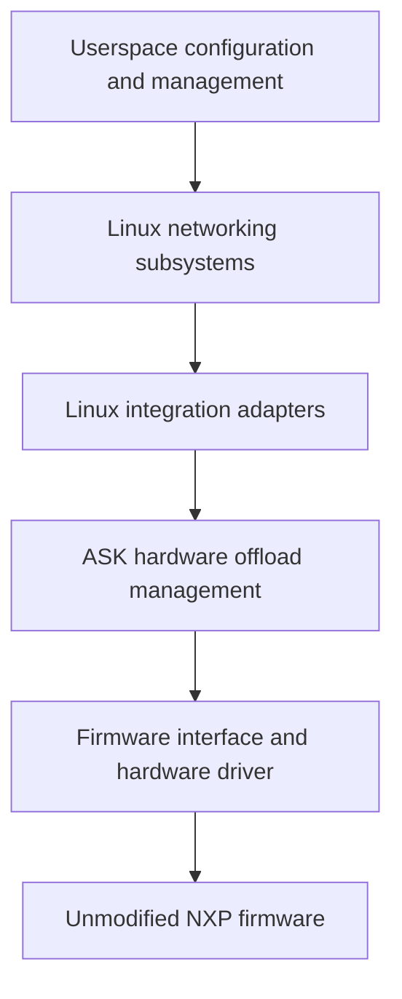

# Linux flowtable offload: design and first proof of concept

Status: bounded multiple-connection IPv4 UDP/TCP offload, ordinary ARP and IPv4
gateway routing demonstrated on the DUT. Neighbour invalidation is selective
with automatic recovery. IPv4 route-prefix, physical-port MTU and administrative
down/up changes use flow-generation retirement and have passed focused DUT proofs.
Other recognized changes to relevant devices and routing-policy changes retain
whole-table invalidation; unrelated devices leave hardware entries alone.
The earlier intermittent UDP loss remains unresolved and deferred; its scope and
evidence are recorded separately below.
Development branch: `feat/linux-flowtable-offload`, starting at `7603f11`.
This document records the direction, initial scope, and acceptance requirements.
Concrete implementation contracts and the remaining acceptance work appear below.

## Purpose and constraints

Develop an alternative to CMM's automatic flow management in which Linux
networking subsystems request hardware offload through a small kernel integration
layer. Reuse the existing FMAN programming knowledge while making ownership,
lifecycle, and compatibility boundaries explicit.

The constraints are:

- NXP's hardware offload firmware is proprietary. Its source is unavailable, and
  the project must work with its existing capabilities and binary interfaces.
- This work will remain downstream. Implementation sources, kernel patches,
  compatibility work, documentation, and tests live in this repository; upstream
  acceptance is not a dependency.
- The existing CMM path must remain available and be the default. Developing the
  new path must preserve the ability to return to established ASK behaviour.
- Time, cost, and implementation complexity do not justify weakening correctness.
- The long-term direction is provisional. Linux interfaces and suitable designs
  may evolve; extend this document as evidence changes the decisions.

The PoC is intended to become the maintained foundation. Its small scope limits
the features supported, not the quality of their implementation. Approach it with
perfection as the engineering objective from the first change: no knowingly
incorrect lifecycle, ignored failure, fabricated success, or deferred cleanup is
acceptable on the grounds that this is an experiment. Verification establishes
bounded evidence; it cannot establish the absence of every possible defect.

## Current architecture and reusable parts

CMM observes Linux conntrack and networking state, resolves dependencies, and
sends commands through FCI. CDX translates those commands into hardware entries
and actions. Eligible packets then run through FMAN without passing through CMM.

CDX contains more than hardware encoding. It also implements command dispatch,
connection pairs, routes, ageing, resource management, and statistics. Replacing
CMM requires adapting this control model; calling the existing command dispatcher
from kernel callbacks would not by itself establish the intended architecture.

Useful starting points in this repository are:

| Responsibility | Existing implementation |
| --- | --- |
| CMM event handling and registration | [cmm/src/conntrack.c](../cmm/src/conntrack.c) |
| FCI dispatch and control serialization | [cdx/cdx_cmdhandler.c](../cdx/cdx_cmdhandler.c) |
| Connection pairs, routes, installation, ageing | [cdx/control_ipv4.c](../cdx/control_ipv4.c) |
| Classifier entries, hardware actions, activity, safe deletion | [cdx/cdx_ehash.c](../cdx/cdx_ehash.c) |
| Initial classifier and physical-port setup | [cdx/dpa_cfg.c](../cdx/dpa_cfg.c) |
| Device and queue information | [cdx/devman.c](../cdx/devman.c) |
| Software RX measurement | [tools/ask_orch/counters.py](../tools/ask_orch/counters.py) |

The baseline [kernel recipe](../meta-ask/recipes-kernel/linux/linux-ask_6.12.bb)
selects Linux 6.12.103 plus the separately pinned NXP SDK and ASK patches. The
[kernel configuration](../meta-ask/recipes-kernel/linux/files/defconfig) already
enables nftables flow offload. The selected SDK DPAA driver has no flowtable
offload callback or native XDP hook; those facilities cannot be assumed from the
capabilities of the separate mainline DPAA driver.

CDX already initializes physical ports through its existing setup. The PoC can
retain firmware loading, `dpa_app`, classifier configuration, and port setup
without starting CMM to install flows. Verify this independence on a clean boot,
including startup scripts and test fixtures.

## Architectural direction



These are responsibility boundaries, not a commitment to separate modules or a
new public API for every box.

Linux owns networking policy and connection state. Our integration translates
eligible operations into hardware requests and reports results and activity.
Hardware bookkeeping remains necessary: handles, shared resources, references,
pending work, synchronization, and recovery belong to the driver.

Concentrate Linux-specific structures, callbacks, references, and execution
contexts in small adapters. Keep common validation and firmware encoding
testable without the board where practical. Avoid both scattered version checks
and a general-purpose compatibility framework that recreates Linux.

Treat the firmware interface as a maintained specification: layouts, byte order,
actions, capabilities, resource limits, synchronization, counters, and reset
semantics. Record exact firmware identities and tested feature combinations.
Preserving this interface does not require preserving CMM or FCI as the new
path's control protocol.

Software forwarding remains the behavioural reference and fallback for supported
product features. Hardware eligibility must account for the complete required
behaviour, including exceptions and policy visibility. An unusable firmware
feature may need to be disabled; a host driver cannot guarantee a repair for
every defect inside an unavailable firmware implementation.

eBPF/XDP may later provide observation, classification, or specialized software
processing. It is not required for this PoC or a substitute for hardware lifetime
management. CPU XDP hooks do not see packets forwarded entirely by FMAN. Adding
BPF does not remove the need to maintain kernel-facing interfaces.

## Parallel development and mode ownership

Both paths must be buildable into the same image. The first PoC selects an
immutable mode at boot; the exact configuration interface is to be designed.

| Mode | Hardware flow controller | Expected behaviour |
| --- | --- | --- |
| Normal, default | CMM through FCI | Existing ASK functionality and interfaces |
| Experimental, explicit opt-in | Linux flowtable adapter | Only the documented PoC subset |

The adapter must be inactive in normal mode. Its presence must not change legacy
ageing, command semantics, statistics, or flow selection. Preserve existing
behaviour when factoring shared helpers, and validate that separately from new
functionality.

Enforce one controller for hardware flow state in the kernel. Stopping a daemon
or hiding a service is not sufficient ownership enforcement. Reject mutations
from the inactive controller before they change shared state; account for reset,
route, interface, and other indirect operations as well as connection insertion.
Audit FCI, ioctls, automatic bridge handling, and startup utilities for relevant
writers. Explicitly distinguish shared initialization and permitted diagnostics
from controller-owned mutations.

Experimental resources need identifiable ownership and a complete teardown path.
They must not accidentally enter CMM notifications or legacy ageing. Shared
physical resources must retain their existing lifetime guarantees.

Initially, returning to normal operation means booting normal mode with clean
hardware and restored normal networking configuration. A clean initramfs alone
does not prove that hardware state was reset; the test must establish that.
Starting CMM on top of experimental entries is not a supported handover.

Live mode changes, simultaneous ownership of different traffic, and preservation
of established connections across a handover are outside the first PoC. A future
live transition would need to stop admission, drain work, retire old hardware
state, detach the previous controller, and activate the next one. Never claim a
successful handover if hardware removal or synchronization is unproven.

## Smallest meaningful PoC

Demonstrate one IPv4 UDP connection, forwarded in both directions by FMAN,
installed, observed, and retired through Linux flowtable with CMM never started.

| Dimension | Initial support |
| --- | --- |
| Topology | Two hosts routed through two physical DPAA ports |
| Network context | Initial network namespace and default conntrack zone |
| Addresses and next hops | Fixed IPv4 routes and permanent neighbour entries |
| Traffic | One explicitly selected unicast UDP echo connection with numbered payloads |
| Forwarding | Normal Ethernet/IPv4 routing, correct MAC rewrite and TTL decrement |
| Encapsulation and translation | No NAT, VLAN, bridge, PPPoE, tunnel, or IPsec |
| Normal packet shape | Ordinary IPv4 headers and packets within the tested MTU |
| Lifecycle | Install, activity/statistics, explicit deletion, idle expiry, rollback, teardown |

Use the existing [test bench](testing.md), with an explicit PoC fixture that
supplies return routes on both hosts and removes NAT for the selected traffic.
Restore the normal fixture when testing CMM mode. Do not hardcode lab addresses
or silently depend on CMM-based test helpers. Confirm userspace tools and the
resolved kernel configuration needed by the fixture are present in the image.

Stable topology is a supported condition, not permission to forward using stale
state. The initial implementation may conservatively invalidate the whole PoC
offload on relevant route, neighbour, interface, MAC, or MTU changes. Define and
verify this response before installation is enabled. Efficient dynamic updates
and broader topology support come later.

Likewise, limiting the admission packet is insufficient: later packets with the
same tuple may have options, fragments, expired TTL, or excessive length. Verify
that the classifier/firmware handles or punts such packets correctly. A claimed
restriction must be enforceable throughout the installed flow's lifetime.

## Implementation increments

### 1. Establish the reference and inspect requests

Boot without CMM and establish empty hardware flow state. Verify the selected
traffic through ordinary Linux forwarding, then software flowtable forwarding.
Record packet contents, forwarding transformations, delivery, and counters.

Add the opt-in ownership mechanism and the smallest flowtable adapter. Initially
record supported request information and decline hardware installation, leaving
the software path operational. Successful binding or request logging is a
plumbing milestone, not proof of hardware offload.

On the baseline kernel, inspect the `TC_SETUP_FT` registration path and
`FLOW_CLS_REPLACE`, `FLOW_CLS_STATS`, and `FLOW_CLS_DESTROY` callbacks. Choose the
driver/indirect binding mechanism against the exact patched source used to build
the DUT. Do not derive behaviour from a neighbouring checkout or kernel version.

### 2. Establish a narrow internal hardware interface

Implement validation and the conceptual operations install, read activity/stats,
and remove. Back them with existing CDX hardware machinery through typed internal
interfaces. Do not make the experimental path depend on per-flow userspace FCI
commands or hardcoded hardware entries.

Resolve the mismatch between directional Linux requests and paired CDX entries.
Treat Linux cookies as opaque identifiers. Document which object owns each
direction, route, resource, and timer, and exactly when an operation may report
success. Reusing code must not import incompatible ownership assumptions.

Linux controls the experimental flow lifecycle. Hardware activity is reported
through the adapter; legacy CDX ageing must not independently expire a flow that
Linux still treats as installed. Preserve legacy behaviour for legacy objects.

### 3. Enable installation and complete the lifecycle

Enable only fully validated PoC rules. Exercise both directions, statistics,
active refresh, idle expiry, explicit removal, duplicate requests, partial
failure, teardown under traffic, and conservative invalidation.

Maintain distinct states for an installed entry, a failed or partial operation,
an entry removed from lookup but awaiting a hardware barrier, and an entry whose
removal cannot be proved. A null software pointer is not evidence of hardware
removal. Reuse existing quarantine and synchronization work only after reviewing
its complete contract. If recovery cannot establish safe software forwarding,
quiesce the affected datapath and report failure; do not announce fallback while
stale hardware may still forward.

### 4. Verify compatibility and return to normal mode

Run focused CMM compatibility tests with the experimental code present but
inactive. Run the PoC in experimental mode, then boot normal mode and repeat
those checks. The full KASAN suite takes about 80 minutes and is explicitly
excluded from this undertaking at the user's request. Include a build with the
experiment excluded if the design provides a compile-time option.

Accept the foundation only with the evidence below. New feature work builds on
accepted increments; discovery of a defect must update the implementation,
regression coverage, and any affected claims.

## Engineering contracts required from day one

- Validate every match, mask, action, ingress/egress device, and network context.
  Unsupported combinations must be declined without incomplete hardware rules.
- Document callback context, lock ordering, references, work cancellation, and
  unload/unbind behaviour. A callback replacing FCI must not bypass the
  serialization on which current CDX code relies.
- Define partial-install rollback, duplicate add/delete behaviour, resource
  exhaustion, and failures during deletion and synchronization. Prevent late work
  from reviving retired state or accessing released devices and flow objects.
- Define how hardware activity and byte/packet counters map to Linux, including
  units, clock conversion, deltas, reset/wrap behaviour, and directional
  aggregation. Avoid double accounting and false refresh of idle entries.
- Specify binary layouts with explicit widths and byte order, and test the
  production encoding functions against independently specified expectations.
- Keep meaningful failure reasons and ownership/resource diagnostics available
  without CMM. Report unsupported functionality and degraded operation honestly.
- Preserve the default CMM mode through focused changes and legacy regression
  coverage. Do not solve experimental lifecycle needs by changing all legacy
  objects' behaviour.

Before hardware installation is enabled, record the concrete choices for these
contracts in this document or a linked design supplement. Open design choices
must not become implicit implementation assumptions.

## Acceptance evidence

All rows are requirements. Passing measurements and remaining acceptance limits
are recorded below; an isolated passing run does not erase an unexplained failure.

| Area | Required demonstration |
| --- | --- |
| Independence | Clean boot, CMM never started, no leftover legacy entries or hidden per-flow FCI setup |
| Ownership | Default mode unchanged; attempts by an inactive controller cannot mutate flow state |
| Admission | Supported rule accepted; unsupported matches/actions/contexts leave no partial installation |
| Installation | Linux requests map to identifiable entries for both directions; success matches hardware reality |
| Packet behaviour | Numbered payloads delivered with correct MAC rewrite, TTL, and checksums, without unexpected loss or duplication |
| Exceptions | Same-tuple exception packets and topology changes are handled, punted, or conservatively invalidated according to the contract |
| Hardware execution | Successful delivery plus advancing per-entry hardware counters and a small measured software RX delta after warm-up |
| Statistics and activity | Defined counter accounting; sustained traffic survives idle thresholds; idle traffic expires |
| Removal | Flowtable removal retires hardware entries; subsequent packets use Linux and cannot recreate offload through the removed table |
| Failure and teardown | Allocation/installation failures, partial directions, deletion/barrier failures, and teardown with pending work follow their documented recovery paths |
| Resource lifetime | Repeated healthy cycles return resource counts to baseline; failure quarantine is accounted for and never silently reused |
| Kernel diagnostics | Relevant sanitizer, locking, and build checks pass; no unexplained kernel diagnostics |
| Legacy compatibility | Focused existing CMM tests pass before the experimental run and after returning to normal mode; the full suite is outside this run's scope |

The `[HW_OFFLOAD]` flag, throughput, CPU idle, and connection presence are
supporting information, not sufficient proof. ASK netdev totals include hardware
traffic. Use the physical SDK DPAA `rx packets [TOTAL]` counter through the
existing helper for software RX, together with successful endpoint delivery and
hardware counters. Missing measurement sources fail the test; do not substitute
a counter with different semantics. See [counter interpretation](testing.md#interpreting-packet-counters).

Define traffic counts, warm-up completion, timeout bounds, and tolerances before
each test; justify allowances for background traffic and counter granularity.
Poll observable state with bounded waits instead of treating a sleep as proof.
Use endpoint captures where CPU capture hooks cannot observe hardware forwarding.

Keep host tests for production validation/encoding and resource-state logic,
appropriate instrumented kernel tests, and real-DUT packet and failure tests.
Mocks do not establish firmware behaviour. Record the source revision and local
diff, resolved kernel/SDK configuration, toolchain, firmware identity, image and
DTB identities, running module identities, fixture configuration, packet traces,
counters, diagnostics, and test results needed to reproduce each acceptance run.

## Expansion and long-term direction

After the first lifecycle is accepted, broaden dynamic route/neighbour/device
behaviour and exception coverage. Exercise the same small feature on a second
kernel version early to test whether the compatibility boundary is useful.
After the bounded multiple-connection increment described below, candidate expansions are
selective invalidation, IPv4 NAT, IPv6, additional interface types,
bridging, QoS, tunnels, and IPsec, each with separate eligibility and verification
criteria. This is a suggested sequence, not a fixed roadmap or a claim that one
Linux API covers every feature.

The direction is to reduce CMM's duplicated networking management while retaining
CDX's useful hardware knowledge in a more focused driver. Linux may supply the
appropriate abstractions through flowtable, bridge/switchdev, traffic control,
XFRM, or future facilities. Keep the existing path available until replacement
behaviour has been demonstrated feature by feature; retirement is not part of
the first PoC.

All compatibility work remains this project's responsibility. Support a declared
set of kernel versions, retain reproducible baselines, and continuously test new
versions. Preserve source and interface documentation independently of opaque
firmware. Longevity means an architecture we can keep adapting, not an assurance
that today's internal Linux interfaces or firmware features will last unchanged.

## References

- [Linux Netfilter flowtable documentation](https://docs.kernel.org/networking/nf_flowtable.html)
  describes software/hardware offload and also notes stale-cache limitations;
  integration alone does not prove invalidation correctness.
- [Linux kernel driver interface policy](https://docs.kernel.org/process/stable-api-nonsense.html)
  explains why a downstream driver must track internal interface changes.
- [BPF kernel functions](https://docs.kernel.org/bpf/kfuncs.html) describe explicit
  exposure and compatibility constraints for BPF access to kernel facilities.
- [ASK testing](testing.md), [versioning](versioning.md), and the
  [SDK source pin](../pins/nxp-sdk-srcrev.inc) define existing project practices.

## Implemented PoC contracts

The implementation is on `feat/linux-flowtable-offload`. The interfaces below
are implemented; the acceptance matrix above remains the gate for claiming a
verified foundation. Hardware measurements and any resulting restrictions will
be recorded alongside the tests.

The test initramfs reads `ask.offload=cmm|flowtable` from the kernel command line;
absence selects CMM. `ask.flowtable_observe=1` with flowtable ownership validates
requests but refuses hardware installation. CDX exposes these as read-only module
parameters `offload_owner` and `flowtable_observe`. Selecting a mode requires a
clean boot. The experimental init script skips `auto_bridge` and CMM; CDX skips
the Wi-Fi and IPsec runtime offload hooks. All FCI commands return
`-EOPNOTSUPP` in experimental mode, including queries. Initial `dpa_app` setup is
shared, and subsequent SET_PARAMS requests are rejected. The boot script loads
`ask_flowtable.ko` after `cdx.ko` only for flowtable ownership. Read-only hardware
inspection is available through `/proc/cdx_flowtable` while the adapter is loaded,
independently of CMM.
The systemd CMM service also checks ownership; the kernel-command-line selector
itself is currently implemented by the test initramfs, not a production installer.

`cdx/ask_flowtable.c` uses Linux's indirect `TC_SETUP_FT` binding callbacks and
`TC_SETUP_CLSFLOWER` requests. It accepts one flowtable, at most two initial-netns
physical Ethernet ports, and at most 64 directional entries (up to 32 two-way
connections). This is a conservative adapter admission bound, not a firmware
capacity claim; it bounds the list walks under the control mutex and neighbour
spinlock. `/proc/cdx_flowtable` exposes it as `max_entries`. Directions consume
slots independently; existing owners are not evicted to admit another flow.
Cookies are opaque
and local to a binding. Unsupported selectors and actions fail before insertion.
The admitted rule has exact IPv4 TCP or UDP addresses and ports, an ingress
ifindex, four Ethernet rewrite words, and a redirect. TCP additionally requires
an assured, established Linux conntrack and the exact FIN/RST exclusion generated
by Netfilter; the parser contract and teardown semantics are described below.
The protocol participates in private hardware encoding and duplicate-key checks.
NAT, nondefault conntrack zones, conntrack marks, unsupported devices, and other
action lists are rejected. An alive, resolved ARP neighbour for the selected route
next hop on the egress port must match the requested destination MAC. Permanent entries
remain supported; ordinary REACHABLE, STALE, DELAY and PROBE entries are also
eligible. NOARP, unresolved, failed and detached entries are declined.
The current source MAC must equal the physical port's
permanent MAC. Both directly reachable destinations and IPv4 gateways are
supported through the route supplied by Linux. IPv6 gateways remain excluded.

Patch `140-ask-flowtable-context.patch` supplies borrowed conntrack and selected
route context for both directions, the directional effective MTU, and the
table's accounting requirement to callbacks. Context version 5 includes an
opaque, reference counted invalidation handle shared by a flow's two directions. The driver owns
one reference per installed direction; the handle retains no flow, conntrack,
route, table or namespace pointer. No borrowed context pointer or Linux flow
object is retained. This explicit, downstream, kernel-internal
interface avoids recovering a parent flow by casting its cookie. The adapter
must be built against this patch; the test image includes the native flowtable
and nftables modules it needs.

`cdx_flowtable_backend.h` defines the private adapter/CDX interface. Its CDX
implementation owns transactions, physical-port identity, an exclusive adapter
claim, hardware admission, statistics, retirement, quarantine recovery and the
terminal failure latch. Immutable owner/observe parameters remain on `cdx.ko`.
The adapter uses no CDX device, control or firmware structures. Transactions
currently use the existing CDX control mutex and also serialize adapter state;
they expose no mutex or internal structure to the adapter. Each transaction
must end before a Netfilter flush. Admission tries RTNL inside a transaction;
bind-time port checks are provisional and admission repeats them under RTNL.
Indirect UNBIND takes the flowtable's write lock before the CDX transaction.
Moving a published callback to the temporary unbind list must exclude native
statistics/add/delete walkers; Netfilter's later locked free alone is insufficient.

CDX configuration and final teardown acquire RTNL, try the control mutex, and
release RTNL before waiting for a busy control mutex and retrying. Neither lock
is waited on while holding the other. This matters even for an unrelated device:
Linux's DOWN notifier flushes native flowtable work, whose callbacks need the
control mutex. Final CDX shutdown stops its timer before releasing both locks
between hardware cleanup retries; external users have already released their
module references. Timer storage survives until the normal teardown callback.

Device events are relevant only when the device is bound or appears as an
installed direction's ingress/egress. Empty bindings remain watched, and egress
devices need not have their own binding. Matching uses pinned device objects,
not names or interface indices. `ft_watch_lock` protects binding publication,
removal and the existing flow dependency watches; a notifier latches invalidation
under that lock without taking a backend transaction. MTU and going-down events invalidate
affected per-flow handles and retire their hardware directions, leaving bindings
available for automatic admission of fresh Linux flow generations. Both routes
are revalidated under RTNL: the IPv4 MTU notifier flushes route caches under the
same lock, so an older queued request cannot install stale context. Empty
bindings need no MTU recovery. `mtu_invalidations` counts affected generations,
once per handle, rather than directions or notifications. Other recognized
events on relevant devices still invalidate the whole table and require table
recreation after recovery. Unrelated device events leave hardware flows alone.
Device recovery never clears a global invalidation or terminal hardware latch;
retirement errors escalate through the existing global recovery path.

Releasing a claim requires zero live directions. CDX keeps any retired storage,
the terminal failure latch and the sealed configuration gate independently of
the adapter. A fresh claim cannot bypass fatal failure or pending retirement.
The configuration ioctl rechecks the gate under the same transaction lock, so
a request already waiting when ownership is claimed cannot mutate configuration.

The interface uses GPL-only exports in the `ASK_CDX_FLOWTABLE` namespace.
`ask_flowtable.ko` depends on `cdx.ko` and `nf_flow_table.ko`; CDX itself has no
flowtable-module dependency. Normal module references prevent unloading CDX
while the adapter is loaded. Adapter exit invalidates its Linux flow handles,
unregisters notifiers, drains work and indirect callbacks, and completes hardware
retirement before releasing its claim. It retries with the transaction lock
released between attempts if a barrier or hardware quiescence is not yet proven.
Unload can therefore wait indefinitely for safe retirement.

Healthy adapter reload preserves CDX configuration and ownership. Existing nft
flowtables continue in software; recreate the table to bind the new adapter and
resume hardware admission. Adapter diagnostic counters reset on reload, while
CDX's sealed configuration and terminal failure latch persist. Reload is not a
recovery mechanism for a fatal hardware failure and cannot switch owners.

`cdx_flowtable_hw.c` is the CDX-internal firmware encoder behind this interface.
Each installed direction owns a private CDX encoding object, a dummy
reverse tuple, and an embedded route. These objects never enter the legacy
connection hash, route hash, CMM notification path, or ageing wheel. The existing
classifier encoder supplies routing actions, preemptive checks, and hardware
statistics. The adapter holds one ingress-device reference per binding and one
egress-device reference per installed direction. Installation uses the existing
ehash encoder and allocator. The adapter's backend owns its installed hardware
handles and their retirement; legacy objects retain their existing ownership.

Linux submits the two directions independently. A direction reports success
only after hardware installation succeeds. An identical replacement is
idempotent; a changed replacement retires the old entry before adding the new
one. A conflicting cookie for an existing hardware key is rejected. A rejected
second direction can leave the valid first direction installed, as permitted by
Linux flowtable semantics; the other direction uses software. Linux's
`[HW_OFFLOAD]` flag is therefore explicitly insufficient evidence that both
directions are accelerated. Tests inspect both hardware entries and both
physical software RX counters.

Statistics use monotonically increasing 64-bit hardware packet/byte counters;
callbacks report only the delta since the previous callback. A backwards sample
disables admission and retires the experiment instead of causing unsigned
underflow. Firmware timestamps use CDX's 32-bit jiffies clock. The adapter expands
them relative to current kernel jiffies; the supported idle interval must remain
below half that clock's range. Linux owns activity refresh and idle expiry.

Firmware counts classifier matches, including some later punts to Linux.
Hardware bytes include the Ethernet header and minimum-frame padding, excluding
FCS. Measurements give 298 bytes for a 256-byte UDP payload and 60 bytes for an
8-byte payload, in both directions. Same-tuple TTL/MTU exceptions also increment
the match counters before Linux handles them. These aggregates cannot recover
independently forwarded packets or exact IP bytes. Passing them into conntrack
accounting would mix byte units and count some packets twice.

The adapter therefore rejects a table with nftables `counter` enabled, leaving
it on software forwarding and accounting. If an existing table enables counters,
the next statistics callback invalidates the experiment without reporting its
hardware deltas to conntrack. Recreate the table to change accounting policy at
a defined boundary; do not interpret a running table's flag change as an atomic
accounting transition. Admitted tables use hardware activity for ageing, while
proc diagnostics expose raw classifier counters. Conntrack does not receive
hardware accounting contributions when the native `counter` flag is absent.
Accurate hardware accounting requires a separately verified post-punt firmware
measurement facility; it is outside this PoC's contract.

Backend transactions serialize list changes and all firmware operations. Netfilter
rule callbacks execute in workqueue context. Binding release runs after the flow
block excludes its callbacks. Notifiers latch invalidation and queue work; they
never enter a backend transaction. ARP callbacks inspect pinned, immutable
dependencies under a separate spinlock, nested inside the neighbour lock.
Global invalidation deletes the experimental entries before flushing Linux
flowtable work, ending the transaction before that flush. Selective
neighbour work removes entries sharing an invalid handle and leaves Linux
teardown to native GC. Module exit removes the proc entry and notifiers, cancels invalidation
work, and unregisters indirect callbacks before global CDX teardown acquires its
locks. The backend uses RTNL trylock for installation and fatal recovery,
because RTNL holders can wait for Netfilter callbacks. A busy RTNL lock on the
request's matching ingress retires that shared generation. Native GC and fresh
traffic can then retry through the same table. Requests visiting the other bound
port are declined before RTNL and cannot invalidate a successful direction.
Fatal recovery ends the transaction and retries. A port
must also match the netdevice recorded by CDX, not merely its name. Flowtables
must be bound after CDX initializes; incomplete indirect replay requests are
declined.

Initial-netns routing-policy events and relevant interface unregister or
upper-device changes conservatively disable hardware admission
until the recovery boundary below. Committed IPv4 route changes invalidate
connections with either endpoint in the changed prefix, conservatively across
all tables and DSCP aliases. Physical-port MTU changes invalidate generations
with that device as ingress or egress, preserving the table for automatic
readmission with current route MTUs. Going-down notifications use the same
per-device generation retirement; native DOWN also flushes Linux flowtable work.
Carrier loss also retires dependent generations. Physical MAC changes retire
both directions for automatic readmission with the current source address.
Queued requests with a stale source MAC invalidate their generation. The
firmware encoder's physical source cache is synchronized under its reader lock
within the admission transaction and RTNL. An OS rename preserves existing
entries and fresh binding because physical lookup and statistics use the pinned
device object, independent of its current name.
The backend refuses admission while either port is down, lacks carrier, or is
no longer registered.
IPv4's built-in nexthop ADD/DEL notifications arise during device/address
synchronization. They conservatively retire all installed generations, since a
revived alternative can change a route through another port. They preserve
bindings and are distinct from the nexthop-object API.
A watched neighbour's changed MAC, unusable state
or detached object invalidates only dependent flow generations, including both directions. Their
cached Linux lookup stops immediately and native GC tears them down. Once
resolution is valid, fresh traffic can return to hardware without recreating
the table. Same-MAC NUD progress and unrelated ARP updates need no retirement.
Routes may change and neighbours may resolve through ordinary ARP after binding.
Selective and global retirement are asynchronous: inspect the affected
entries and reference counts for selective retirement, or `invalidation_done`
for global retirement. A hardware retirement error escalates to global recovery.

The committed-prefix netevent covers every IPv4 FIB alias insertion, replacement,
deletion and flush. The native FIB notifier reports selected aliases only and
can run before commit, so its entry notifications are not used for retirement.
Identical replacements and failed insertions emit no committed event. Both
endpoints are checked even when only one hardware direction exists; this relies
on the current no-NAT admission contract. CDX rechecks both borrowed destinations
under RTNL before admission to reject work queued before a route change. Linux's
existing route generation and expiry checks remain intact; unrelated software
cache entries may still expire under those native rules.

For opted-in flowtables, reverse IPv4 lookup also requires FIB success. The
normal forced-output-interface lookup permits an on-link route after a FIB
error, which could otherwise bypass withdrawal or a blackhole route through
software and hardware offload. The new internal lookup flag disables that
fallback for these tables; ordinary callers retain their existing behaviour.
The driver neither repeats policy routing with incomplete packet context nor
retains FIB objects. `route_invalidations` counts newly invalidated flow
generations, once per shared handle, including stale admission context.

Healthy global invalidation can recover by deleting and recreating the flowtable after
configuration has settled. Admission remains closed while any old binding or
entry exists, invalidation work is incomplete, or either retirement quarantine
contains storage. With all of these cleared, `rearm_ready=1` reports that the
driver can accept recovery. The candidate Linux table must also be empty: a
table with its hooks removed can still contain cached flows and queued callbacks.
The first successful binding to an empty table clears `invalidated` and
`invalidation_done`.
That binding increments `rearms`; adding the second port does not. Allocation
failure leaves the recovery state untouched. Install, delete and error counters
remain cumulative. Every new rule still passes the full Linux-context validation.

The control mutex protects this transition. The worker publishes completion as
its last state change, after hardware retirement and Linux flow cleanup. Binding
never waits for the worker: Netfilter locks held by a binding operation can be
needed by the cleanup being awaited. Recovery depends on complete withdrawal of
the old bindings, not a comparison of opaque table pointers, which can be reused.
The `TC_SETUP_FT` setup call borrows a live `struct nf_flowtable` from Netfilter;
only this call reads its hash population. The retained table pointer is used
solely for identity in other paths. This check is against the exact downstream
kernel interface and must be reviewed when porting the adapter.
Keeping an invalidated table bound does not re-enable it automatically. Fully
detaching and reattaching its devices is refused while cached flows remain;
deleting and recreating the table provides an empty candidate. Fatal
state independently refuses binding and installation, even with empty quarantine;
there is no runtime command to clear the fatal latch.

Deletion has three outcomes: synchronized removal, unlinked storage retained for
a barrier, or unproven unlink. All outcomes consume the adapter's software
handle. Failed deletion retains the already allocated backend owner in a private
retirement list, requiring no new allocation on the failure path. The worker
retries barriers until they succeed; it never retries the destructive unlink.
Quarantine and errors remain observable; a null handle is never treated as proof
of synchronization. Unproven unlink latches a fatal condition
and retries datapath quiescence until it succeeds or module shutdown takes over.
Fatal completion means the datapath was stopped, not that software fallback is
available. Reboot is required. Possibly linked hardware storage stays allocated
until reset; freeing it would leave a dangling hash-chain link. Shutdown releases
unlinked storage only after global datapath quiescence is proven. Healthy
invalidation waits for retirement barriers and flushes the affected software
flowtables, allowing ordinary forwarding.

The test build exposes a one-shot `ask_flowtable.flowtable_fail_stage` parameter: 1 before
adapter allocation, 2 before hardware installation, and 3 after installation,
forcing rollback through the real delete path. Production builds omit this
parameter. The load-only `ask_flowtable.init_fail_stage` parameter injects adapter
initialization failure after claim: 1 proc creation, 2 netdev notifier,
3 neighbour notifier, 4 FIB notifier, 5 indirect registration. A separate
test-only `cdx.flowtable_fail_unlink` boolean consumes one
delete attempt before destructive unlink, leaving the real key linked and
forcing fatal retirement. It exercises stopped classifier ports and retained
storage; it does not simulate a recoverable synchronization failure.
Host tests compile the production rule decoder and lifecycle code
with fault-injected kernel/firmware boundaries under ASan and UBSan; hardware
acceptance uses the real classifier and endpoint traffic.

`tools/tests/test_flowtable_offload.py` is explicitly gated by
`ASK_FLOWTABLE_TESTS=1`. It supplies a selected-protocol NAT exemption, permanent DUT
neighbours, a WAN host return route, and a numbered echo server, then restores
the fixture. TCP tests reuse the topology with a TCP peer instead of the echo
server. It uses the LAN UART and target/WAN agents without CMM helpers.
Runs can set `ASK_FLOWTABLE_ARTIFACTS` to retain measurements and packet captures.
The rearm test exercises three recovery cycles without rebooting. It changes the
DUT LAN device MTU, then adds a routing-policy rule, then injects two
retirement-barrier failures.
Each cycle proves software forwarding during invalidation and fresh hardware
forwarding after table recreation. Strict delivery checks use the NIC's normal
receive filter. Software TX enqueues distinguish software forwarding from
hardware delivery. The SDK RX statistic alone cannot do so: with GRO disabled,
software flowtable forwarding can consume an skb and return before the driver
increments RX. The test also refuses reattachment of a populated table whose
hooks have all been withdrawn. The separate invalidation test covers selective
neighbour deletion and global counter-policy or retirement-barrier failures.

`ASK_FLOWTABLE_TERMINAL=unload|unlink` separately selects a terminal lifecycle
test with `-k flowtable_offload_terminal`. Use a fresh experimental boot for
each variant. The test removes the inactive FCI module dependency, verifies
both hardware directions under traffic, and then unloads CDX or injects an
unproven unlink. The latter checks fatal status and disabled FMan receive ports,
refuses hardware bindings for a newly created flowtable, then removes CDX for
cleanup. Both variants finish by checking 64 ordinary UDP
exchanges with CDX absent. A continuous sender spans the intentional datapath
stop and validates every received payload; interruption during that stop is
recorded separately from the normal zero-loss forwarding oracle. DUT control
and fixture restoration use UART when the datapath can be unavailable. Neither
variant reloads CDX or switches owners; reboot afterward.

## Running the focused checks

Build with `KASAN=1 make ask-image`, then run `make stage-image`. Boot the staged
RAM image with `ask.offload=flowtable`; add `ask.flowtable_observe=1` for an
observe-only boot. Start from a clean boot for each invalidation variant. The
boot selector is transient; returning to CMM means rebooting with both experimental
arguments absent. Do not unload/reload modules to switch owners.

With the normal LAN UART and DUT/WAN agents available, run:

```sh
ASK_FLOWTABLE_TESTS=1 ASK_WAN_IPERF_IP=<WAN-address> make ask-test \
  ASK_TEST_ARGS='-k flowtable_offload -x -q'
```

The ordinary run selects five PoC scenarios: reference/forwarding/lifecycle,
same-tuple exceptions, installation rollback, recovery, and neighbour invalidation. The
optional long-exchange diagnostic skips by default. The lifecycle includes a
512-packet hardware measurement, minimum-size packets, three removals under
traffic, 65 seconds of activity refresh, and a bounded idle-expiry wait. Tests
validate payloads and Ethernet/IP behaviour; they never equate classifier hits
or Linux's hardware flag with successful delivery.

For the recovery increment alone, select just the recovery and fatal-refusal
checks on a fresh experimental boot:

```sh
ASK_FLOWTABLE_TESTS=1 ASK_FLOWTABLE_TERMINAL=unlink \
  ASK_WAN_IPERF_IP=<WAN-address> make ask-test \
  ASK_TEST_ARGS='-k "flowtable_offload_rearm or flowtable_offload_terminal" -x -q'
```

The terminal test removes CDX, so reboot in experimental mode afterward. The
recovery test itself needs no reboot or return to CMM between its cycles.

On a separate experimental boot, exercise failed retirement barriers with:

```sh
ASK_FLOWTABLE_TESTS=1 ASK_FLOWTABLE_INVALIDATION=barrier \
  ASK_WAN_IPERF_IP=<WAN-address> make ask-test \
  ASK_TEST_ARGS='-k flowtable_offload_invalidation -x -q'
```

`ASK_FLOWTABLE_BASELINE=software|flowtable|hardware` with
`-k flowtable_offload_long_exchange` selects an explicit 4,096-packet diagnostic
through ordinary routing, software flowtable, or hardware offload. It leaves the
LAN NIC out of promiscuous mode and records raw frames, classifier state,
conntrack, and endpoint error counters on a timeout. Other packet checks use
promiscuous capture so an unexpected Ethernet destination remains observable.

After a normal CMM boot, the selected compatibility checks are:

```sh
ASK_WAN_IPERF_IP=<WAN-address> make ask-test \
  ASK_TEST_ARGS='-k "test_cmm_unsupported_commands or test_iperf_ipv4_tcp_offload" -x -q'
```

The focused host command is `sudo /opt/askd-agent/venv/bin/pytest -c
tools/pyproject.toml tools/host_tests -k 'flowtable or cdx_shutdown' -q` with the
standard host setup. These tests compile production decoder, backend ownership,
and teardown code under ASan/UBSan. This procedure does not run the full DUT
KASAN suite.

`ASK_FLOWTABLE_INVALIDATION=counter` selects a separate-boot test which enables
accounting on an active hardware table and verifies retirement and software
fallback. It exercises the runtime accounting guard in addition to the normal
test's refusal to install into a table that already requests counters.

## Validation record — 2026-09-14

The final candidate was built and staged with KASAN, lockdep, kmemleak support,
and FAILSLAB enabled. Running kernel/CDX build IDs and the dpa_app, CMM, and FMC
hashes matched the build. Image SHA-256:
`dfcdbc950f5bb3a84f8982a16e360f0d673602f4454da28a44ae13de006600c5`.
Kernel build ID: `e5a2b9c4cbd3e2c2f6b2f3bdf46fcbb9a57e274a`.
CDX build ID: `1fd916d9338c3e2a8464e6ed3431da1f2ba2dc7a`.
Build output contained six existing forced-task/build-path notices and no
compiler warnings. Source manifests include the new, untracked files as well as
the tracked diff captured before this checkpoint.

| Check | Result and bounds |
| --- | --- |
| Focused host checks | 3 passed under ASan/UBSan: decoder/lifecycle, backend ownership, and shutdown ordering |
| Current PoC lifecycle, exceptions, rollback | 3 passed in 128.26 seconds on the final candidate |
| Hardware execution | Both directions advanced from 62 to 574 classifier hits during 512 successful echoes; software RX increased by 1 on eth3 and 9 on eth4; payload, MAC, TTL, and request checksum checks passed |
| Minimum frames | 32 eight-byte UDP payloads advanced each hardware counter by 32 packets and 1,920 Ethernet bytes |
| Activity/removal | Three removals under traffic returned entries/bindings to zero; 65 seconds of active traffic stayed installed; idle expiry retired both directions |
| Counter admission | A counter-enabled table forwarded in software and installed zero hardware entries |
| Counter change | Enabling counters on an active table completed invalidation with zero entries, errors, fatal state, or quarantine; subsequent echoes succeeded |
| Longer forwarding windows | Final candidate passed 4,096 echoes through software flowtable and another 4,096 through hardware, with LAN promiscuous mode disabled |
| Earlier observe/invalidation checks | Observe mode, neighbour invalidation, and two injected delete-barrier failures passed on earlier instrumented builds; the retirement backend is unchanged in the final candidate |
| Kernel diagnostics | Selected scenarios reported no KASAN/UBSAN/BUG/WARN/lockdep findings; a separate I2C error flood is described below |
| CMM return | Final candidate rebooted with CMM ownership; unsupported-command handling and IPv4 TCP hardware offload both passed in 17.11 seconds |

The barrier-failure run consumed both injected failures, recorded two errors,
completed invalidation, drained quarantine to zero, and continued forwarding in
Linux. Host tests additionally exercise failed barrier retries, unproven unlink,
and failed/busy quiescence. Hard unlink failure and module unload with live
experimental traffic had not yet been demonstrated in this initial validation;
the later terminal lifecycle validation is recorded below. Host checks do not
substitute for those hardware cases.

During development, several hardware runs lost an individual UDP request or
reply, including after table removal. In one long run, request 3,014 reached the
WAN endpoint and both directional classifier counters reached 3,012 (the first
two packets had used software), but the reply did not appear in the LAN capture.
LAN NIC error counters did not increase. Ordinary-routing windows of 4,096
packets and CMM windows of 4,096 and 8,192 packets passed. Those failures used the
earlier counter-enabled experiment, which the final adapter now declines because
its accounting is incorrect. The counter restriction is not a demonstrated
explanation or fix for the loss. Preserve this as an open acceptance item;
successful subsequent windows are bounded evidence, not grounds to erase it or
increase test loss tolerances. Do not broaden the PoC on an assumption that this
failure has been explained.

The DUT later began repeatedly reporting `i2c-1: SCL is stuck low` across warm
boots in both ownership modes. That also disrupted UART command parsing. Final
diagnostic boots used `loglevel=1 log_buf_len=4M` to keep UART usable and retain
kernel messages; instrumentation remained enabled. A subsequent live
investigation isolated the stuck branch to the FLEXOPTIX DAC's mux channel;
unplugging and reinserting the DAC restored both modules, and a normal reboot
passed the board self-tests. The original trigger remains unresolved.

The [follow-up UDP investigation](flowtable-udp-loss-investigation.md)
reproduced losses on this exact final image with I2C healthy. It recorded one
ordinary-routing loss with an X550 receive CRC error, and hardware losses
counted by the DUT's LAN transmit MAC without a corresponding LAN reply or
endpoint error increment. Subsequent 16,384-packet software and hardware
windows passed after a diagnostic X550 reset and fresh DUT boot. These results
narrow the investigation but do not establish a common cause or close delivery
acceptance. Detailed counter deltas, excluded diagnostic attempts and the
physical isolation plan are retained in the linked record.

Artifacts are retained under `/tmp/ask-flowtable/` on the build host: image/source
identity, build and boot logs, pytest XML, endpoint capture, hardware counters,
exception results, fault recovery, and failed-exchange diagnostics. The full
suite was stopped at the user's request after 159 passes and no failures; it was
not resumed. No full-suite or full kmemleak-scan acceptance is claimed.

At the end of these initial checks, the DUT returned to default CMM ownership.
No persistent boot configuration or flash image was changed.

## Terminal lifecycle validation — 2026-09-14

A subsequent test image adds the test-only hard-unlink hook described above.
The forwarding and retirement implementation is unchanged; the new hook leaves
one real installed key linked to exercise the existing fatal path. It is absent
from production builds. The image was built and staged with the same KASAN,
lockdep, kmemleak and FAILSLAB configuration. Build output contained three
existing forced-task notices and no compiler warnings. Running identities
matched the build:

- Image SHA-256: `f1afad25011630343366d2c5a1abb89e950f1693abbf1ee656bd743cbbc78bec`.
- Kernel build ID: `365a93b26ed2ecc05966696c1e6e87a7111be0b1`.
- CDX build ID: `65912f90a0bac30c99cf1db93c923f67f02792bb`.

These runs used the operator's replacement RJ45 cable with the same FS module,
X550 and physical ports. They are lifecycle tests, not a controlled comparison
establishing that the original cable caused the earlier UDP loss. The LAN link
was checked after the terminal tests and reported 1 Gb/s. No 10 Gb/s
performance acceptance is claimed or required for these lifecycle checks.

| Check | Result and bounds |
| --- | --- |
| Focused host checks | 3 passed under ASan/UBSan, including one-shot hard-unlink injection, preservation of the linked key, no destructive retry, and a subsequent healthy delete |
| Module unload under traffic | Passed in 23.45 seconds. Both hardware directions had 164 hits immediately before unload. CDX and its proc entry disappeared; 64 subsequent ordinary-routing echoes passed. The 12-second stream spanning shutdown received 1,837 of 1,906 sent packets; lossless unload is not claimed. |
| Hard unlink failure | Passed in 22.54 seconds. Both directions were active before injection; the one-shot hook was consumed, errors increased by one, and fatal invalidation completed with entries/bindings zero. FMan receive ports 6 and 7 both changed from enabled to disabled. The kernel recorded one retained linked key; WAN delivery stopped while the LAN sender continued. |
| Fatal cleanup | Removing CDX after the hard-unlink test restored ordinary forwarding; 64 echoes passed with the module absent. This is explicit teardown after the fatal observation, not software fallback by the invalidation worker. The boot was then reset before using ASK again. |
| Kernel diagnostics | Both successful terminal tests completed their capture windows without KASAN/UBSAN/BUG/WARN/lockdep findings. No full suite or kmemleak scan was run. |
| CMM control compatibility | Unsupported-command handling passed in 4.81 seconds after rebooting the same image with default ownership. |
| CMM forwarding compatibility | A separate five-second paced TCP measurement delivered 500,170,752 bytes at 799.94 Mb/s. CMM's hardware connection table grew from zero to two entries. DUT LAN software RX increased by only 268 packets versus a conservative lower bound of 333,447 data frames. No kernel splats were recorded. |
| DUT CPU during CMM forwarding | `/proc/stat` showed 1.87% average busy time over an idle baseline and 3.46% over the traffic window, averaged across all four CPUs. The busiest core during traffic was 4.68%. These are DUT measurements; iperf's endpoint CPU figures are not used. |

The first hard-unlink attempt stopped before injection because interactive shell
prompts contaminated the test's JSON output. Cleanup succeeded; it is excluded
from hard-unlink acceptance. The maintained test now sends Python as a single
encoded command and explicitly frames actual console output. The successful
replacement run used that framing. The finite traffic task is awaited before
UART reuse, and fatal cleanup runs even if its packet checks fail.

The existing CMM throughput test requires at least 1 Gb/s of application
throughput, which the replacement link cannot supply. Its threshold was not
changed. The paced compatibility measurement instead combines received data,
hardware table population, software-path packet counts and DUT CPU usage. Its
temporary checker and raw measurements are retained with the lifecycle
artifacts. Low CPU usage corroborates the software-path counters; it is not
treated as a delivery oracle by itself.

Artifacts are under `/tmp/ask-flowtable-lifecycle/`: image/source manifests,
build and boot logs, pytest XML, live-entry snapshots, port-enable states,
terminal traffic counts and raw UART logs. The build log is
`/tmp/ask-flowtable-lifecycle-build.log`. The two previously missing terminal
hardware cases now have direct DUT evidence. Earlier unexplained UDP loss
remains documented; the operator explicitly deferred further dedicated loss
diagnosis so work could continue on this foundation.

For subsequent work, keep the DUT in experimental ownership between tests.
Recreate the table after healthy invalidation; reboot within that mode after a
fatal failure or a test that removes CDX. Return
to CMM only when the compatibility test itself requires it. The operator has
made the DUT available for continued development.

Final runtime state: the tested image is booted with `ask.offload=flowtable`,
observe mode off, and entries, bindings, installs, deletes, errors, invalidated,
fatal and quarantine all zero. CMM and auto_bridge are absent, both fault knobs
are clear, and no experimental nftables table remains. The ready boot has no
kernel splats or I2C stuck messages. Persistent boot settings and flash remain
unchanged.

## Healthy invalidation recovery verified (2026-09-14)

The first follow-on increment is complete: healthy invalidation can restore
hardware admission after full detachment and binding an empty Linux flowtable.
Fatal retirement remains latched. Work stops at this increment; ordinary ARP,
gateway routes and selective invalidation are subsequent work.

The KASAN image was rebuilt and staged, and live kernel/CDX build notes matched
the built artifacts before both hardware checks. KASAN, lockdep and FAILSLAB
were enabled; the full KASAN suite was not run. The build had no compiler
warnings; its three BitBake warnings concerned previously forced recipe tasks.

| Identity | Value |
| --- | --- |
| Staged image SHA-256 | `50d8b8510421e8f6998e423baa1f99c958f66731ac06f2c7a1eba5039362af9a` |
| Kernel build ID | `2da28a7c60a44c08886618dfa4bda39e3eeb363b` |
| CDX build ID | `3f04f3e1c4082d88053ddb2c9cbe7dbfc063ec3a` |
| Recovery test boot | `724fcb2a-5349-4580-836e-9fed961aeb1e` |
| Successful fatal test boot | `45bb4344-a8ae-4e36-b604-641b69216e98` |

| Check | Confirmed result |
| --- | --- |
| Focused host checks | 11 passed in 0.48 seconds. Production adapter/backend lifecycle and shutdown checks use ASan/UBSan; counter-parser checks cover both directions. |
| Recovery admission guards | Host checks exercise incomplete cleanup, failed barriers, both quarantine lists, partial detachment, populated Linux tables, allocation failures, shutdown and fatal state. A notifier arriving during ordinary bind allocation remains latched. Eight recovery cycles preserve references and cumulative counters. |
| Healthy DUT recovery | Passed in 24.17 seconds. MAC change, host-route MTU change and two injected retirement-barrier failures each completed invalidation and recovered after table recreation, all within one boot. `rearms` advanced exactly once per cycle, from 0 to 3. |
| Closed admission | Each cycle delivered 64 strict echoes through software with no new hardware installs and exactly 64 LAN software TX enqueues. Existing bindings did not reopen admission. Reattaching the populated, fully detached table returned `Operation not supported`. |
| Recovered forwarding | Each cycle delivered 512 strict echoes with the normal LAN receive filter, exactly 512 hardware hits per direction, and software TX deltas of 0 on eth3 and 8 on eth4. The changed destination MAC was accepted by the endpoint; after the MTU change, the reply rule used 1100 and the original direction retained 1200. |
| Barrier history | Both injected delete-barrier failures were consumed, quarantine drained, and recovery retained the cumulative error count of 2. No fatal condition was raised. |
| Fatal refusal | Passed in 25.64 seconds on the same image. Unproven unlink raised one error, completed fatal invalidation and disabled FMan receive ports 6 and 7. Creating a hardware flowtable returned `Operation not supported`; bindings, entries, `rearm_ready` and `rearms` remained zero. |
| Fatal cleanup | WAN delivery ceased while the finite sender continued attempting traffic. After explicit CDX removal, all 64 ordinary software echoes passed. Neither the worker nor flowtable recreation cleared the fatal latch. |
| Sanitizers | Neither successful DUT check reported a KASAN, UBSan or lockdep splat. |

Transition measurements remain separate from stable forwarding acceptance. The
MAC transition received 980 of 997 datagrams during the deliberate address
mismatch. The successful fatal observation sent 1,158 datagrams, received 687
and recorded 20 send timeouts across the intentional stop. The finite sender
records backpressure and keeps attempting sends; every received payload is
validated. These are not lossless-transition or throughput claims.

The first recovery attempt exposed an unsuitable RX-counter assertion, not a
delivery failure. The SDK counter excludes some software flowtable traffic when
GRO is disabled; the recovered-forwarding proof now uses software TX counters.
Earlier fatal attempts are excluded: malformed nft syntax, a corrupted UART
script, LAN unavailability before the first flow, an already removed FCI module,
and unhandled send backpressure prevented full acceptance. The harness now
requires the specific offload-refusal error, verifies chunked UART scripts by
SHA-256 before execution, tolerates an absent inactive FCI dependency, and records
send timeouts only in the intentional-stop traffic helper. Strict exchange
checks retain their zero-loss requirement.

Artifacts are in `/tmp/ask-flowtable-rearm/`, with the build log at
`/tmp/ask-flowtable-rearm-build.log`. `focused.xml` contains the successful
recovery case and the excluded earlier terminal case; `terminal.xml` contains
the successful replacement terminal run. Separate manifests identify both
boots. Excluded attempts and raw UART logs are retained in subdirectories.
The DUT is restored to a clean boot of this image in experimental ownership;
no return to CMM is needed between healthy recovery cycles.

## TCP increment and validation (2026-09-14)

This increment admits one IPv4 TCP connection using the same physical ports,
direct host routes, permanent neighbours and two-direction limit. CMM remains
absent. It adds no NAT, dynamic ARP or gateway resolution. The backend carries
the protocol through both private tuple objects, hashing and classifier table
selection; the existing TCP encoder provides the forwarding actions. UDP and
TCP tuples with identical addresses and ports are distinct keys. Hardware
ownership, retirement, quarantine and healthy rearm mechanisms are unchanged.

Admission requires the rule protocol to match its borrowed conntrack context.
TCP requires `nf_conntrack_tcp_established()` (ESTABLISHED plus ASSURED) and
exactly Netfilter's TCP flags key zero with mask FIN|RST. Missing flags, extra
selectors, different masks and unsupported protocols are declined before
allocation. No TCP sequence/window tracker is added to CDX.

This relies on a concrete parser contract: the `tcpschema` section of
`dpa_app/files/etc/cdx_sp.xml` exits to the host when `tcp.flags & 7` is nonzero,
before TCP hash lookup. SYN, FIN and RST therefore cannot bypass Linux through
an installed TCP entry. The live soft-parser and PCD XML files were compared
byte-for-byte with this repository. Any change to that parser or firmware
requires revalidation of this contract; merely accepting a flags selector in
the adapter would not establish hardware support.

Linux's observable conntrack state during offloaded teardown is asynchronous:

- A FIN punts and marks the flow for teardown immediately. The flowtable GC
  queues hardware deletion separately. A final pure ACK can cross hardware
  before deletion, leaving conntrack in LAST_ACK even though both endpoints
  completed closure. The test requires both FINs at Linux's forward hook, the
  final ACK in a WAN packet capture, prompt hardware removal, no OFFLOAD flag,
  and eventual conntrack expiry.
- After offloaded data, Linux's saved sequence/ACK state can be stale. The
  RST handling in `nf_conntrack_proto_tcp.c` deliberately permits ESTABLISHED
  to remain while allowing a possible RFC5961 challenge ACK, but applies the
  short CLOSE timeout. The test requires the receiving socket to report reset,
  RST at Linux's forward hook, prompt hardware removal, no OFFLOAD flag, a
  bounded CLOSE timeout and eventual conntrack expiry. It does not require a
  particular intermediate state label.

These are Linux flowtable/conntrack semantics, not new CDX timeout policy.
The two initial test runs stopped on overly strict TIME_WAIT and CLOSE label
assertions respectively. Those runs are excluded from complete acceptance;
the replacement assertions establish delivery, visibility and bounded cleanup.

`tools/tests/test_flowtable_tcp.py` uses a TCP variant of the shared fixture.
The staged `flowtable_tcp_peer.py` keeps a single LAN console operation alive
while commands and payloads travel over the tested TCP connection. Each payload
block is checked and the complete transfer is hashed. Test-only endpoint packet
loss and sysctl changes are restored in cleanup. The FIN test temporarily uses
a four-second flowtable timeout and ten-second LAST_ACK/TIME_WAIT timeouts;
the latter leave time to inspect state after asynchronous retirement.

The KASAN image was rebuilt and staged. Live kernel/CDX build notes and userspace
hashes matched the built files; KASAN, lockdep and FAILSLAB remained enabled.
There were no compiler warnings. The three BitBake warnings concerned previously
forced recipe tasks. Only focused tests were run, not the full KASAN suite.

| Identity | Value |
| --- | --- |
| Staged image SHA-256 | `d49400be27012f9498278f1b38380c330e88acf0b8647911bda240a34dd852fe` |
| Kernel build ID | `c1a3c3ef605c24e3a3bda6dfc45f2c0a4e79d7d6` |
| CDX build ID | `8dac0662d4e27299d067083fb017be7d8f8af907` |
| Test boot | `346ef62e-bfc2-4242-8790-444373f1d214` |

| Check | Confirmed result |
| --- | --- |
| Focused host checks | 11 passed. ASan/UBSan checks cover protocol/state/flag rejection, protocol-separated keys, 128 alternating TCP/UDP adapter and backend lifecycle cycles, and existing failure/shutdown guards. |
| TCP lifecycle | Both TCP tests passed in 57.32 seconds. After increasing the FIN inspection timeout margin, the FIN/expiry test and UDP exception regression passed in 41.94 seconds. |
| Admission | Both handshake SYN packets reached Linux; hardware entries reported protocol 6. Both installed directions remained live through transfers lasting twice the configured idle timeout. |
| Sustained upload | 64 MiB delivered and verified in 8.00 seconds; 59,393 data-direction hardware hits. Software TX deltas: eth3 0, eth4 11. Aggregate DUT CPU 1.80%, versus 2.01% idle; softirq 0.38%. |
| Sustained download | 64 MiB delivered and verified in 8.00 seconds; 59,394 data-direction hardware hits. Software TX deltas: eth3 0, eth4 10. Aggregate DUT CPU 1.80%; softirq 0.35%. |
| Idle and reuse | Both hardware entries expired while the TCP socket remained open. Sending again installed exactly two new entries on the same connection. |
| Retransmission | An exact-tuple WAN INPUT drop rule counted 4 dropped packets. The LAN sender reported 22 retransmissions; all 8 MiB arrived correctly. The temporary rule was removed. |
| Withdrawal during traffic | Deleting the flowtable during a 16 MiB download preserved correct delivery. Entries/bindings/quarantine reached zero; LAN software TX increased by 12,587, demonstrating software forwarding. |
| Recreated table | The same TCP connection offloaded again and delivered another verified 64 MiB, with 59,393 data-direction hits and software TX deltas eth3 0/eth4 10. No CMM restart or reboot was needed. |
| FIN | Both FINs reached Linux, the final ACK appeared on the wire, both sockets closed, hardware entries disappeared within the three-second check, and LAST_ACK expired without an OFFLOAD flag. |
| RST | The WAN socket reported reset, Linux counted RST, hardware entries disappeared within the three-second check, and conntrack expired within the native ten-second CLOSE timeout plus polling margin. |
| UDP regression | Same-tuple TTL expiry, MTU/DF ICMP, IPv4 options, fragments and ordinary echo checks passed. |
| Sanitizers | No KASAN, UBSan or lockdep splats in the successful focused hardware tests. |

These are paced forwarding and lifecycle results, not a maximum-throughput
claim. CPU readings include background work and management traffic; endpoint
delivery together with hardware hits and software TX counters identifies the
forwarding path. The previous unexplained UDP loss is not closed by these tests.

Artifacts are in `/tmp/ask-flowtable-tcp/`: `tcp.xml`, `final-fin-udp.xml`,
`host.xml`, per-case JSON, `tcp-fin.pcap`, image/parser identities and UART logs.
`attempt1.xml` and `attempt2.xml` preserve the excluded runs. The build log is
`/tmp/ask-flowtable-tcp-build.log`. The DUT remains in experimental ownership
with test tables, routes, neighbours, NAT exemptions and timeout changes cleaned
up. Stop at this increment; dynamic ARP and gateway support remain future work.

## Ordinary ARP increment (2026-09-14)

The direct-route topology now supports ordinary ARP neighbours for both UDP and
TCP. Routing, two physical ports, the two-direction limit and explicit
flowtable recreation remain the boundaries. This does not add gateway next-hop
resolution or per-flow invalidation.

Each installed direction pins its actual Linux neighbour and publishes a watch
before hardware insertion. Publication rechecks the address and state under the
neighbour lock; a notification during insertion can therefore latch invalidation
and force rollback. The watch contains immutable dependency data, protected by
`ft_neigh_lock` against removal. Lock ordering is control mutex, neighbour lock,
then watch lock. The notifier never acquires the control mutex or calls firmware.
Removal withdraws the watch before releasing the reference and entry storage.
`neighbour_refs` in `/proc/cdx_flowtable` exposes the reference count, including
zero after failed installation, invalidation and table removal. Recovery also
requires that count to be zero.

An alive neighbour with an unchanged address can progress through REACHABLE,
STALE, DELAY and PROBE without interrupting hardware forwarding. PERMANENT
continues to work. An unusable state, changed MAC or detached neighbour object
latches whole-table invalidation. Unrelated ARP notifications do not invalidate
the table; route and device invalidation retain their conservative scope.

Positive hardware counter deltas call `neigh_event_send(neigh, NULL)` through
the existing Netfilter statistics work. This records use and lets Linux's own
timers send ARP probes. It does not call `neigh_confirm()`: classifier activity,
including reverse traffic, is not treated as proof of reachability. Idle counter
samples do not refresh neighbour use. A valid cache entry remains usable during
probing, as in ordinary Linux output; failed resolution retires hardware.

This increment also fixes the software fallback contract. Native hardware
flowtables can select `FLOW_OFFLOAD_XMIT_DIRECT`, caching Ethernet addresses even
when hardware admission is rejected. A focused counter-enabled-table test
reproduced lost replies after Linux had learned the peer's changed MAC, with
zero hardware entries. That path bypassed normal neighbour output.

Patch 140 now lets CDX request neighbour output for ASK-owned tables. The
kernel initializes this request to false; CDX sets it only on a successful bind,
and it remains set for that table after unbinding. Routed software tuples keep
their route reference and use native `FLOW_OFFLOAD_XMIT_NEIGH`, including when
the hardware request is declined. Hardware rule generation remains available.
A DIRECT tuple constructed concurrently with binding is retired before packet
rewriting in either IP family; its union contains no retained route pointer and
must never be reinterpreted as a NEIGH tuple. Initial binding, like recovery,
requires an empty table. Other tables and the default CMM mode retain their
existing policy. This is a downstream kernel-internal extension, not a new
userspace interface.

The tests in `tools/tests/test_flowtable_arp.py` exercise cold ARP resolution
after binding, sustained forwarding through natural ageing, a real endpoint
MAC change announced through ARP, unsuccessful probes and recovery. Failure
injection suppresses only LAN ARP replies while leaving IP traffic possible.
Starting that bounded failure from STALE avoids depending on a randomized
reachable timer; the preceding steady phase exercises natural ageing. The TCP
peer restores ARP after a finite local lease, allowing the same TCP connection
to recover without relying on an unreachable control path. Packet capture uses
the endpoint's normal receive filter. Temporary parameters, addresses and
capture processes are restored after each case.

One early test used an incorrectly formed gratuitous ARP reply, which Linux
could ignore during its neighbour locktime. The helper now sends a proper ARP
announcement request. That test attempt and the pre-fix software fallback
failure are excluded from complete acceptance and retained as development
evidence in `/tmp/ask-flowtable-arp/initial-image/`.

The first run on the final image encountered RTNL contention during a short
admission burst: every attempted installation returned the existing busy result.
No decoder rejection or hardware error occurred. The warmup now keeps verified
traffic moving across Linux's hardware-refresh interval, with a bounded admission
wait, instead of sending a sub-second burst and only polling state afterward.
The failed warmup is retained in `admission-attempt/`; steady measurement still
requires exact UDP delivery and hardware packet deltas without retries.

The final KASAN image was rebuilt, staged and booted. Live kernel/CDX GNU build
notes and userspace hashes matched the built files. KASAN, lockdep, FAILSLAB and
kmemleak instrumentation remained enabled. There were no compiler warnings.
The final incremental image build reported three previously forced task warnings;
the preceding full kernel rebuild also reported three packaging `buildpaths`
QA warnings for `auto_bridge.ko`, `raid6_pq.ko.zst` and `vmlinux`. These concern
embedded build paths. Only focused tests ran; neither the full KASAN suite nor
a kmemleak scan was run.

| Identity | Value |
| --- | --- |
| Staged image SHA-256 | `cc67474f04cecd330cd7669949fb1eaff24aa096ea6c07dbd8d25c7a23c5fcb4` |
| Kernel build ID | `ddfbd362fefc78efc2174f8f296692fe526e4ff1` |
| CDX build ID | `c5cdb78e7c1d6b3605c3293a28eeb85c8a77e8cb` |
| Test boot | `47987f94-671e-4953-83c3-f6f4c68a94b0` |

| Check | Confirmed result |
| --- | --- |
| Focused host checks | 12 passed in 0.65 seconds. ASan/UBSan cover neighbour state and reference ownership, changes before publication and during insertion, shared dependencies, invalidation/rearm, and the production kernel's DIRECT-union guard. Existing decoder/backend/failure/shutdown checks remain included. |
| Software fallback | Counter-enabled hardware table declined all hardware installation. After a real peer MAC change, all 128 further UDP echoes arrived with the new MAC; LAN software TX increased by 129. Passed in 10.57 seconds. |
| ARP lifecycle | UDP and TCP cases both passed in 73.26 seconds. Each invalidation retired both hardware entries and all neighbour references; explicit table recreation restored hardware admission. No CMM restart or reboot occurred between transitions. |
| UDP ageing | 1,024 exact echoes produced 1,024 additional hardware hits in each direction, with LAN software TX increasing by 8. Capture recorded 8 unicast ARP probes answered by the original peer MAC. The accelerated natural NUD cycle did not reinstall or invalidate hardware. |
| UDP recovery | After MAC replacement and again after failed reachability, 512 exact echoes produced 512 hardware hits per direction. LAN software TX deltas were 2 and 1 respectively. The reachability fault exhausted 3 unanswered probes and reached FAILED. |
| TCP ageing | One connection delivered and verified 64 MiB upload in 8.00 seconds, with 59,393 data-direction hardware hits and no retransmissions. Software TX deltas were eth3 3 / eth4 72. Aggregate CPU was 4.99%, softirq 1.04%, while polling neighbour state every half-second. Capture recorded 3 answered unicast ARP probes. |
| TCP MAC recovery | The same connection delivered through software after the MAC change, then offloaded after table recreation. A verified 64 MiB download in 8.00 seconds produced 59,394 data-direction hardware hits; software TX deltas eth3 3 / eth4 12, CPU 2.05%, softirq 0.44%. |
| TCP reachability recovery | ARP reply suppression reached FAILED and removed hardware. A queued command and verified 1 MiB transfer survived until the peer's eight-second local lease restored ARP. The capture's six-second fault window contained 16 unanswered probes and no replies. After explicit rearm, that same connection delivered another verified 64 MiB upload: 59,393 data-direction hardware hits, software TX eth3 2 / eth4 12, CPU 1.86%, softirq 0.41%. FIN then removed both entries and references. |
| Permanent-neighbour regressions | Reference/lifecycle passed in 112.81 seconds, including removal under traffic and idle expiry. UDP TTL/MTU/options/fragment exceptions and TCP expiry/reuse/FIN checks both passed in 40.87 seconds. |
| Sanitizers | No KASAN, UBSan or lockdep splats during the successful focused hardware tests. |

CPU includes management polling, ARP and other background work; the ageing
measurement has more observer traffic than the recovery measurements. Delivery,
hardware deltas and software TX counters together establish the forwarding path.
These paced tests do not claim maximum throughput or close the earlier unrelated
UDP-loss investigation. The ARP timers were shortened for testing; the production
adapter changes no NUD parameters and grants no synthetic reachability confirmation.

On an experimental boot, select only the three ordinary-ARP cases with:

```sh
ASK_FLOWTABLE_TESTS=1 ASK_WAN_IPERF_IP=<WAN-address> make ask-test \
  ASK_TEST_ARGS='-k flowtable_arp -x -q'
```

Canonical acceptance artifacts are in `/tmp/ask-flowtable-arp/`: `host.xml`,
`software.xml`, `lifecycle.xml`, `regression.xml`, `permanent-lifecycle.log`,
per-case JSON, `arp-udp.pcap`, `arp-tcp.pcap`, `arp-software.pcap`,
`image-identity.json` and `final-state.json`. The final build log is
`/tmp/ask-flowtable-arp-candidate-build.log`; the full kernel rebuild log is
`/tmp/ask-flowtable-arp-final-build.log`.

Final runtime state: experimental ownership, CMM and auto_bridge absent, both
fault controls disabled, 26 installs matched by 26 deletes, and entries,
bindings, neighbour references, errors, invalidation, fatal and quarantine all
zero. Four explicit rearms completed. Test tables, host routes and NAT exemptions
are gone; the LAN MAC and ARP response policy and both DUT ports' NUD parameters
are restored. The DUT remains in flowtable mode. Stop at this proven increment;
gateway routes and selective invalidation remain future work.


## Gateway next-hop increment

This increment extends IPv4 UDP/TCP admission to destinations reached through
an IPv4 gateway on a supported physical port. The two-direction limit, no-NAT
contract, whole-table invalidation and explicit recreation boundary remain.

Patch 140 supplies the selected directional route as borrowed `nf_dst` context
only for `FLOW_OFFLOAD_XMIT_NEIGH`. DIRECT, TC and XFRM provide NULL; their tuple
union must never be read as a retained route pointer. CDX requires a current
IPv4 unicast route whose egress device matches the redirect action, with no XFRM
or lightweight tunnel transformation. IPv6 gateways remain unsupported.

The adapter uses `rt_nexthop()` on that route, preserving Linux's routing choice
without repeating a FIB lookup or reconstructing its policy context. Direct
routes use the destination address; gateway routes use the selected gateway
address. The resolved ARP neighbour must match the hardware Ethernet action.
The entry retains only the next-hop address and its pinned neighbour, not the
borrowed route. Publication revalidation, NUD use reporting and watched-neighbour
invalidation follow the existing ARP lifecycle. An otherwise identical hardware
rule with a different next hop must replace its watch. Per-flow diagnostics now
include `nexthop`, separately from the IP destination used in classification.

The focused gateway fixture places a remote endpoint in a network namespace
behind loki, connected through a veth pair. Loki performs ordinary IP forwarding
between that endpoint and its physical X550 interface. The DUT reaches the
endpoint through loki's IPv4 address; a second address on that same router
allows changing next hops without changing the destination or Ethernet MAC.
The DUT ports remain physical and in the initial namespace. The fixture installs
no NAT and restores its routes, address, namespace, interface and forwarding
settings. UDP checks TTL 62 after the two routers and validates the veth Ethernet
headers; DUT diagnostics must identify the gateway, and the DUT must never learn
an ARP neighbour for the remote endpoint.

The TCP endpoint socket is created in the remote namespace. Its process returns
to loki's namespace for gateway ARP controls; the socket retains its original
network namespace. This keeps one tested TCP connection alive across gateway
MAC changes, route replacement and failed ARP resolution, using the existing
finite local ARP restoration lease.

The image was rebuilt with KASAN and staged before boot. Live kernel/CDX build
notes and userspace hashes matched the candidate. KASAN, lockdep, FAILSLAB and
kmemleak instrumentation were enabled; no full KASAN suite or kmemleak scan ran.
There were no compiler warnings. The six BitBake warnings were the three
previously forced recipe tasks and the existing packaging build-path warnings
for `auto_bridge.ko`, `raid6_pq.ko.zst` and `vmlinux`.

| Identity | Value |
| --- | --- |
| Staged image SHA-256 | `9d93dce7606ac0b6d2e61f63aab9f29bf271b8377987bd1d1dcd7a8e92e4b2e0` |
| Kernel build ID | `5373954a79ef44bd2403375b163f21c18c295686` |
| CDX build ID | `75a20191a4dac5371396897aec54f351ad05c802` |
| Test boot | `a01503e0-03ee-4f41-88f5-29c8f327a00d` |

| Check | Confirmed result |
| --- | --- |
| Focused host checks | 5 passed in 0.83 seconds. ASan/UBSan cover production decoder/backend/neighbour ownership, 32 alternating TCP/UDP gateway lifecycles, stale/mismatched/transformed route refusal, next-hop validation, same-MAC gateway replacement, and kernel union/pointer guards. Shutdown and ehash teardown checks also passed. |
| Routed UDP | Passed in 44.61 seconds. During natural ARP ageing, 1,024 exact echoes produced 1,024 hardware hits per direction and 3 LAN software TX packets. Replies had TTL 62 through DUT and loki. |
| Destination versus gateway | Endpoint `198.18.27.2` remained the classified destination. Its hardware entry used next hop `192.168.1.122`, then `198.18.28.2` after route replacement. The DUT never acquired an ARP neighbour for the remote endpoint. |
| UDP recovery | Gateway MAC change, next-hop replacement and failed reachability each invalidated the table and released neighbour references. After explicit recreation, each 512-echo window produced exactly 512 hardware hits per direction with zero LAN software TX. ARP capture recorded 4 answered healthy unicast probes and 3 unanswered failure probes. |
| Routed TCP | Passed in 44.34 seconds. The socket stayed established through gateway MAC change, route replacement and failed resolution. Correct software transfers bridged each recovery; explicit recreation restored hardware. FIN removed both entries and references. |
| TCP sustained upload | Verified 64 MiB in 8.00 seconds, with 59,393 data-direction hardware hits and zero retransmissions. Software TX: eth3 5 / eth4 76. Aggregate CPU 4.99%, softirq 1.04%, with neighbour polling active. |
| TCP after MAC change | Verified 64 MiB download in 8.00 seconds, with 59,394 data-direction hardware hits and zero retransmissions. Software TX: eth3 5 / eth4 12. Aggregate CPU 5.55%, softirq 0.38%. |
| TCP after reachability recovery | The eight-second local lease restored gateway ARP; the queued command and 1 MiB transfer completed on the same socket. Following recreation, a verified 64 MiB upload produced 59,393 data-direction hits, zero retransmissions, software TX eth3 4 / eth4 12, CPU 1.89% and softirq 0.41%. Capture recorded 5 answered healthy probes and 13 unanswered probes in the six-second fault window. |
| Direct-route regressions | Ordinary ARP UDP lifecycle and TCP transfer/idle-expiry/reuse/FIN checks both passed in 67.52 seconds on this image. |
| Kernel diagnostics | No KASAN, UBSan or lockdep splats in the four focused DUT tests; final diagnostics remained clean. |

These are paced forwarding measurements, not throughput limits. CPU includes
management, ARP and background kernel work; delivery and software TX counters
identify the hardware path. The gateway backend uses the existing firmware
encoding unchanged. Acceptance covers a directly attached IPv4 router with
ordinary unicast routes; it does not establish ECMP, policy-routing variations,
IPv6 next hops, NAT or a larger connection population.

Run only this increment with:

```sh
ASK_FLOWTABLE_TESTS=1 ASK_WAN_IPERF_IP=<WAN-address> make ask-test \
  ASK_TEST_ARGS='-k flowtable_gateway -x -q'
```

Artifacts are in `/tmp/ask-flowtable-gateway/`: `host.xml`, `udp.xml`, `tcp.xml`,
`regression.xml`, per-case JSON, `arp-gateway-udp.pcap`, `arp-gateway-tcp.pcap`,
`image-identity.json`, UART logs and final cleanup evidence. The build log is
`/tmp/ask-flowtable-gateway-build.log`.

Final state: 26 installs and 26 deletes, eight explicit rearms, and zero entries,
bindings, neighbour references, errors, invalidation, fatal or quarantine. Fault
controls are disabled. CMM and auto_bridge remain absent. The remote endpoint
namespace, both veth devices, alternate gateway address, test host routes and
NAT exemptions are removed; loki's forwarding setting, physical MAC and ARP
policy and the DUT's NUD parameters are restored. The DUT remains in experimental
flowtable mode. Stop at this increment; connection scaling, selective invalidation
and NAT remain subsequent work.

## Bounded multiple connections — 2026-09-15

The adapter now admits 64 independent hardware directions, enough for 32
two-way IPv4 TCP/UDP connections in the existing one-table, two-physical-port
topology. The previous two-entry limit was an explicit admission restriction;
the binding/cookie ownership, per-direction hardware objects, statistics and
neighbour references already supported independent lifetimes. The firmware
encoder, kernel patch and CMM ownership boundary did not need changes.

`CDX_FT_MAX_ENTRIES` bounds both control-mutex list walks and the atomic
neighbour-notifier walk. The diagnostic `max_entries` reports the bound. It is
not the hardware's capacity and makes no throughput or large-scale claim.
Admission never evicts another direction. Duplicate updates remain idempotent
at the limit; a distinct owner of the same hardware key is refused, and a new
key beyond the bound receives `-ENOSPC`. Directions are admitted independently;
this increment does not introduce paired reservations or capacity fairness.

Individual connection deletion, TCP close and idle expiry leave other owners
intact. Route/device/dependency changes still invalidate the whole table and
require explicit table recreation. Selective invalidation is the next separate
increment, followed by further resource-pressure and concurrent lifecycle work.
NAT, IPv6 and additional interface types remain outside the admitted contract.

### Verification

The production-code host test fills all 64 directional slots with alternating
TCP/UDP rules sharing addresses, port pairs and a neighbour. It verifies
independent counter deltas, full-capacity idempotency and refusal, removal and
reuse of a middle key, arbitrary deletion order, balanced references and
conservative invalidation of the full set. Host sanitizers cover the existing
decoder, backend ownership and neighbour fallback as well.

The DUT test admits 16 TCP and 16 UDP connections simultaneously. Each TCP/UDP
pair shares addresses and ports, so protocol separation is tested on actual
hardware. The endpoint checks every echoed record's connection ID, serial and
payload. TCP records are also checked independently by the WAN echo server.
The test uses permanent neighbours and the established direct-route fixture;
gateway/ordinary-ARP behaviour is covered by the focused regression below.

A separate, unoffloaded TCP connection controls one concurrent LAN peer through
the existing console transport. Individual streams can stop while others
continue. Cleanup closes the sockets, drains the console operation, deletes the
table and conntracks, and restores NAT exemptions and timeout settings. The
multi-connection source ports use a separate range from the single-connection
tests; TCP sockets set `SO_REUSEADDR` for repeat runs.

| Item | Evidence |
| --- | --- |
| Kernel / firmware | Linux `6.12.103`; existing ASK FMAN firmware `210.10.1` |
| Test boot | `8dadf05e-e894-47e1-9c5f-a7240e3ad9fa` |
| Staged image SHA-256 | `ea09a6e73d93d8fdcd78170a234fedb57d84e4456a7c73fa33a6bb9d43c1dea8` |
| Kernel GNU build ID | `8d242ae536a60881a990c8fa89b17a1abd0036d6` |
| CDX GNU build ID | `2a84a70c05075f8bb490f8bbc12048d2586bf20f` |
| Instrumentation | KASAN generic, lockdep, kmemleak tracking and failslab enabled; taint `4096` only |
| Build | Successful KASAN image build and staging. No compiler warnings; three existing forced-task warnings. Running module/kernel identities matched the image. |
| Focused host tests | 5 passed in 0.87 seconds under ASan/UBSan, including CDX shutdown and ehash teardown. |
| Mixed connection acceptance | Passed in 66.16 seconds on the final harness. All 64 directions and 64 neighbour references were present. |
| Full set traffic | Over eight seconds, 16 TCP connections sent and received verified echoes of 64 MiB in total; each of 16 UDP connections exchanged 256 verified datagrams. All 32 UDP directions counted exactly 256 packets and the expected bytes. Hardware recorded 141,269 classifier hits; software TX was eth3 4 / eth4 23. |
| Explicit UDP deletion | Deleting one conntrack reduced entries/references from 64 to 62 and added exactly two deletes. Every other cookie and counter remained intact. |
| TCP close | FIN reduced entries/references from 62 to 60, adding exactly two more deletes while other traffic continued. |
| Independent idle expiry | Stopping one UDP stream reduced entries/references from 60 to 58. All remaining directions kept their cookies and increased their counters despite sharing the same two neighbours. |
| Tuple reuse and refresh | Sending again on the explicitly deleted UDP tuple and the idle UDP connection added exactly four new directions, with fresh counters; the other owners remained unchanged. |
| Surviving set traffic | A further eight-second window verified 60 MiB of TCP data and its echoes, plus 256 datagrams on each UDP connection. Hardware recorded 133,836 classifier hits; software TX was eth3 5 / eth4 15. |
| CPU | Unloaded baseline 1.83% busy / 0.44% softirq; full set 2.29% / 0.41%; surviving set 2.17% / 0.35%. Raw per-CPU ticks are retained. |
| UDP delivery | 18,595 unique records across warmup, steady traffic, concurrent retirement and reuse; no duplicated records. |
| Focused DUT regressions | IPv4 gateway UDP lifecycle and single-connection TCP transfer/expiry/FIN both passed, in 77.94 seconds combined. |
| Cleanup | Final cumulative installs/deletes both 148, with zero entries, bindings, neighbour references, errors, fatal state, quarantine or invalidation. Three earlier regression rearms; none needed during either mixed-connection lifecycle. |

The first mixed lifecycle also passed, in 62.94 seconds, but total CPU was
21.44–24.75% despite similarly low software forwarding counts. Those early-boot
samples are retained, not used as the performance baseline. The boot's kmemleak
scanner had accumulated 25.51 CPU seconds before the later measurement and was
then asleep; the repeat above measured the quiet baseline and active traffic
without changing instrumentation. This is consistent with background load
affecting the early samples, rather than evidence of sustained forwarding cost.
An intervening rerun stopped before admission on a test-harness TCP bind conflict
with the preceding single-connection regression. The separate source-port range
and socket reuse fix are included in the verified harness.

These are paced correctness and CPU measurements, not a line-rate benchmark.
Only the focused tests were run; no full KASAN suite or forced kmemleak scan was
requested. CMM remained disabled throughout, with no reboot between tests.

Reproduce the focused acceptance on an experimental boot with:

```sh
ASK_FLOWTABLE_TESTS=1 ASK_WAN_IPERF_IP=10.0.0.232 \
  ASK_FLOWTABLE_ARTIFACTS=/tmp/ask-flowtable-connections \
  make ask-test ASK_TEST_ARGS='-k flowtable_connections -x -q'
```

Artifacts are under `/tmp/ask-flowtable-connections/`: `host.xml`, `dut.xml`,
`regression.xml`, `verified.xml`, matching logs, `verified/connections-*.json`,
image and source identities, boot logs and final restoration evidence. The
excluded harness attempt is retained under `steady/` with its log/XML. The build
log is `/tmp/ask-flowtable-connections-build.log`.

Stop at this increment. The DUT remains available in experimental flowtable
ownership with the test configuration and traffic removed. Selective
invalidation has not been implemented.


## Selective neighbour invalidation verified (2026-09-15)

This increment narrows neighbour invalidation to the connections that actually
use that neighbour. A changed MAC, unusable NUD state or detached neighbour
invalidates the connection's two directions, even when only one direction uses
the changed dependency. Other connections retain their hardware entries and
counters. Valid resolution and fresh traffic restore offload automatically,
without deleting conntrack, reconnecting TCP or recreating the flowtable.
Route and device changes still use the conservative global recovery boundary.

Patch 140 context version 4 provides the lifetime contract. Before admission,
CDX opts the table into allocation of an opaque handle per cached Linux flow.
Both directions borrow that handle during callbacks and each installed CDX
direction takes a reference. The handle contains only a reference count, an
atomic invalid bit and RCU reclamation state. It cannot pin or dereference a
flow, table, conntrack, route or namespace. Tables that do not opt in allocate
no handles. Allocation failure follows the existing flow-add failure path and
leaves ordinary stack forwarding available.

The neighbour notifier atomically invalidates every dependent handle under the
watch lock and queues selective work. Cached software lookup declines the
invalid generation immediately; native Netfilter GC performs its usual teardown
and hardware-delete callbacks. The CDX worker independently removes every
installed direction sharing that invalid handle. It does not flush a table or
retain borrowed Linux pointers. Handles are immutable identities until their
last reference is released, and RCU reclamation protects existing lockless
lookups. A stale callback with a reused directional cookie cannot remove,
update or replace an entry belonging to another handle.

Hardware retirement still uses the existing consuming deletion contract. A
barrier failure or unproven unlink escalates to the global worker; selective
recovery cannot bypass quarantine or clear fatal state. Module exit serializes
the stopping flag with callbacks, unregisters notifiers synchronously and
cancels both workers before releasing bindings. `/proc/cdx_flowtable` now
reports `handle_refs` for installed adapter references and
`neighbour_invalidations` for distinct handles first invalidated by neighbour
handling. Ordinary selective recovery leaves `invalidated`, `invalidation_done`
and `rearms` unchanged. The driver reference count does not count Linux's own
references or objects awaiting an RCU grace period.

The acceptance fixture creates two macvlan peers in separate loki network
namespaces, with distinct IPs and real receive MACs on the existing X550 port.
Each peer runs one TCP and one UDP connection; both protocols use the same
source/destination ports. A separate control socket permits ARP restoration
while the affected data path is unavailable. Every data record includes its
connection identity and serial; the WAN TCP server refuses reconnects. Peer B
keeps sending throughout peer A's MAC change, ARP failure and neighbour-object
deletion. The fixture removes its namespaces, addresses, routes, NAT exemptions,
conntracks, table and NUD tuning on exit.

| Check | Observed result |
| --- | --- |
| Host ownership and failure checks | Four focused ASan/UBSan tests passed in 0.81 seconds. They compile production adapter and kernel handle/add/lookup/GC paths, covering allocation/hash rollback, shared references, deferred reclamation, stale callbacks, tuple/cookie reuse, selective retirement and global escalation. Shutdown and ehash teardown checks also passed, two tests in 0.21 seconds. |
| Two-peer acceptance | Passed in 33.94 seconds. Each of three faults reduced entries, neighbour references and adapter handle references from eight to four, preserving all four peer-B cookies and their counters. Recovered traffic restored eight entries without any rearm or unexpected error. |
| Persistent TCP | The original peer-A socket completed verified records across a 3.54-second ARP suppression window. Peer B continued on its original TCP/UDP sockets. No TCP reconnect was accepted. |
| Steady forwarding after recovery | Both TCP connections each sent and received 4 MiB of verified payload over eight seconds. Both UDP connections exchanged 256 verified echoes, with exactly 256 hardware hits and 76,288 hardware bytes in each direction. Software TX was eth3 8 / eth4 15; aggregate CPU was 2.13%, softirq 0.41%. |
| Earlier steady window | The same packet and counter checks passed before faults, with software TX eth3 8 / eth4 16. CPU was 8.85%, softirq 0.44%; retain this separate sample rather than treating either paced window as a line-rate benchmark. |
| Multiple-connection and gateway regressions | Both passed, 104.17 seconds combined. The 64-direction mixed TCP/UDP lifecycle retained independent ownership. Gateway MAC/ARP recovery became selective; next-hop route replacement still required explicit table recreation. |
| Selective retirement failure | Passed in 11.57 seconds. Two injected barrier failures during peer-A neighbour deletion escalated to global invalidation: all eight directions retired, both reference counts and quarantine drained to zero, fatal remained clear, and verified traffic continued in software. Hardware admission remained closed until explicit table recreation. |
| Global recovery regression | Passed in 22.76 seconds. Device MTU change under traffic, route MTU change and two injected barrier failures each recovered after table recreation. Rebinding a populated table remained refused. |
| Final restoration | Cumulative installs/deletes both 134; entries, bindings, neighbour/handle references, quarantine, fatal and invalidation all zero. Four cumulative errors were the four deliberately injected barrier failures. Five global rearms came from route/device/failure checks; the selective acceptance needed none. Test routes, addresses, namespaces, NAT rules, traffic and NUD tuning were removed/restored. |
| Instrumentation | No KASAN, lockdep, Oops or panic reports in the test windows or final dmesg; taint remained 4096 for the existing out-of-tree modules. |

Two earlier acceptance attempts stopped on harness assumptions: sysfs still
represented the original namespace after `setns()`, and a TCP ARP retry could
advance FAILED to INCOMPLETE before the diagnostic read. The helper now queries
links through namespace-aware Netlink, and the fault check accepts either
unusable resolution state. Those logs remain under `proof/` and `proof2/`;
`proof3/` is the complete successful lifecycle. No forwarding-loss tolerance
or hardware counter assertion was relaxed.

The KASAN image was built and staged. Live kernel build ID is
`d8cf2f0ee1cecbb8f51c718edccf422285e17059`; CDX build ID is
`6b35e016d661b58fd677721adeb708a48aefad48`. The final rebuild after a comment-only
clarification produced the same binaries and staged image SHA-256:
`83c134b98e8305747baf910891248a6afde662c89d32cee80192cb6f4af478e4`.
KASAN, lockdep, kmemleak and failslab remained enabled. Only focused tests ran;
there was no full KASAN suite or forced kmemleak scan. CMM stayed disabled and
there was no reboot between acceptance and regression tests.

From a clean experimental boot, reproduce the two new checks with:

```sh
ASK_FLOWTABLE_TESTS=1 ASK_WAN_IPERF_IP=10.0.0.232 \
  ASK_FLOWTABLE_ARTIFACTS=/tmp/ask-flowtable-selective \
  make ask-test ASK_TEST_ARGS='-k selective_neighbour -x -q'
```

Artifacts are under `/tmp/ask-flowtable-selective/`: successful `proof3/`,
`regression/`, `barrier/` and `rearm/` measurements, matching logs/XML, host logs,
image/source identities and restoration evidence. Initial and final build logs
are `/tmp/ask-flowtable-selective-build.log` and
`/tmp/ask-flowtable-selective-final-build.log`.

Stop at this increment. This proves selective neighbour recovery for the
existing bounded IPv4 TCP/UDP scope. Selective route/device handling and further
foundation work remain separate increments; no additional encapsulation,
forwarding feature or firmware capability is introduced here.

## Selective IPv4 route retirement — verified 2026-09-15

This increment extends the existing shared invalidation handle and retirement
worker to committed IPv4 route-prefix changes. It keeps the 64-direction limit,
the no-NAT IPv4 TCP/UDP admission contract, and the existing firmware interface.
CDX matches both endpoints against the changed prefix across all routing tables
and DSCP aliases. This is deliberately conservative within a prefix and does
not claim complete policy-routing or device dependency tracking. Policy,
nexthop-object and device events retain whole-table invalidation.

`test_flowtable_routes_selective` creates two routed LAN peers, each with UDP
and a persistent TCP connection, for eight hardware directions. It proves:

- Replacing peer A's route changes its return MTU from 1200 to 1100; adding a
  more-specific host route changes it to 1000; deleting that route returns to
  1100. Each transition retires A's four directions and admits fresh ones.
- Withdrawing A's route leaves a covering blackhole. A's hardware directions
  stay absent while its original TCP socket attempts traffic. Restoring the
  route allows that socket and UDP to return to hardware automatically.
- Adding and deleting a non-selected DSCP alias also retires A, although the
  native selected-alias FIB notifier omits that alias. Default-TOS traffic
  returns using its 1100-byte route. An identical replacement and rejected
  duplicate insertion leave all entries unchanged.
- Peer B keeps the same four cookies and increasing hardware counters throughout
  all six changes, with continuous validated UDP/TCP exchanges. The table is
  never recreated: `rearms=0`, twelve shared generations invalidated, and final
  cleanup has 32 installs/deletes, zero errors and zero retained references.

The first hardware run exposed a reverse-route lookup problem: forcing an
output interface let Linux synthesize an on-link route after the blackhole FIB
failure. A's TCP flow was admitted again during withdrawal. The corrected
kernel requires successful FIB lookup for the opted-in reverse path, before
creating either a software or hardware cached flow. The failed run is retained
under `proof/`; the complete passing run is under `proof-strict/`. The withdrawal
assertion and packet-delivery checks were not relaxed.

Initial and final eight-second steady windows validate 256 echoes per flow.
UDP hardware deltas are exactly 256 packets and 76,288 bytes in each direction;
each TCP connection transfers 4 MiB and advances its hardware counters. Software
TX deltas are 6/16 packets initially and 3/15 finally on LAN/WAN, with aggregate
softirq time 0.31% in both windows. Total measured CPU busy time is 27.28% and
23.76% respectively; these are instrumented-system measurements, not an idle-CPU
claim or a throughput benchmark.

Seven focused host tests pass with ASan/UBSan. They compile production driver,
handle, lookup and teardown functions and cover prefix boundaries, other
namespaces, partial directional admission, stale or absent routes in either
direction, shared references, policy/nexthop global fallback, and strict FIB
failure handling. The strict lookup test also verifies that successful routes
and ordinary callers' existing fallback behaviour remain intact.

Five focused DUT tests pass: the new route lifecycle and route retirement-failure
tests, selective neighbour recovery, UDP gateway recovery, and global rearm.
Gateway replacement now recovers without table recreation. The rearm test uses
a routing-policy rule for its global routing trigger, alongside device MTU
change and an injected barrier failure. A failed selective route retirement
correctly escalates to global invalidation, drains all eight directions and
their references, preserves software forwarding, and permits healthy rearm.

Final state is 76 installs and 76 deletes, four expected errors from the two
deliberate two-failure barrier injections, and four rearms. Entries, bindings,
neighbour references, handle references, quarantine, fatal and invalidation
state are all zero. Test routes, policy rule, namespaces, NAT exemptions and
fault knobs are removed; endpoint configuration and NUD settings are restored.
There are no KASAN, lockdep, warning or oops reports, and taint remains 4096.

The corrected KASAN image was built, staged and verified against the running
kernel/module and userspace binaries. Kernel build ID is
`3492e3327a061c274ca163522edfe1a33dec0bc5`; CDX build ID is
`2a5741b965312b93386f8460960532080d7eb936`. Staged image SHA-256 is
`2c185dbdc67ab43ab0d89dcd1c69f4450e3dc245829c2ceb99bc233fe5f964b8`.
KASAN, lockdep, kmemleak and failslab stayed enabled. Only focused tests ran;
there was no full KASAN suite or forced kmemleak scan. All five passing DUT tests
ran on the same experimental boot with CMM disabled.

From a clean experimental boot, reproduce the two new tests with:

```sh
ASK_FLOWTABLE_TESTS=1 ASK_WAN_IPERF_IP=10.0.0.232 \
  ASK_FLOWTABLE_ARTIFACTS=/tmp/ask-flowtable-routes \
  make ask-test ASK_TEST_ARGS='-k flowtable_routes -x -q'
```

Artifacts are under `/tmp/ask-flowtable-routes/`: `proof-strict/`, `regression/`,
`barrier/` and `rearm/`, corresponding logs/XML, host results, image/source
identities and final restoration evidence. The initial failing route proof is
under `proof/`. Build logs are `/tmp/ask-flowtable-routes-build.log` and
`/tmp/ask-flowtable-routes-strict-build.log`.

Stop at this increment. Selective device dependencies and broader foundation
coverage remain separate work. This does not add NAT, IPv6, encapsulation or a
new firmware capability, and does not change the chosen per-boot owner.

## CDX backend interface — verified 2026-09-15

The adapter now calls the private interface in `cdx_flowtable_backend.h`.
`cdx_flowtable_backend.c` remains inside `cdx.ko` with the firmware encoder;
`cdx_flowtable.c` remains linked there for this increment too. Kernel patch 140
and firmware behaviour are unchanged. The next separately proved increment is
extracting `ask_flowtable.ko`, including module references and load/unload rules.
No separate module or runtime owner switching is provided by this increment.

CDX now owns the immutable owner/observe options, exclusive adapter claim,
physical-port validation, live hardware count, retirement quarantine and the
terminal failure latch. Releasing a claim cannot reopen configuration or clear
fatal failure. A claim is refused in CMM mode, while another claim exists,
while retirement is pending, or after terminal failure. Release is refused
while live hardware directions remain. The adapter keeps Linux flow decoding,
route/neighbour dependency tracking, per-flow handles, counters and invalidation
work. It no longer reaches CDX control/device structures or firmware functions.

Explicit begin/end operations delimit transactions, using the same CDX control
mutex and lock order as the proved implementation. They also serialize adapter
state, so this extraction adds no second mutex or new nested lock ordering.
Admission tries RTNL while the transaction is held; recovery does the same
before quiescing hardware. Netfilter flushing happens outside a transaction.
Backend operations never call back into the adapter. This is a private source
interface which can evolve with the repository, not a frozen binary ABI.

The configuration gate becomes permanent after the first successful claim.
The ioctl wrapper rejects new requests early, and `cdx_ioc_set_dpa_params`
rechecks under the control mutex before acquiring RTNL or changing hardware.
This covers a request which passed the wrapper before the claim and then waited
for the same mutex. Adapter initialization failure releases its claim and all
acquired registrations; successful teardown releases the claim only after work,
callbacks and live directions have drained. CDX final shutdown owns any retained
hardware storage after adapter teardown.

Eight focused ASan/UBSan host tests pass. The production backend and firmware
encoder are compiled together to check ownership, port identity, observe mode,
live-direction accounting, failed barriers, quiescence and fatal refusal across
release/reclaim. Production adapter initialization/exit is tested with every
acquisition failing in turn, plus active-flow teardown and CMM-mode initialization.
The production configuration ioctl test seals ownership while a request acquires
the mutex and verifies rejection before allocation or hardware work. Existing
flow decoding, selective retirement, handle lifetime and CDX shutdown checks pass.

Four focused DUT tests pass on the KASAN image:

- Mixed TCP/UDP selective route recovery, including withdrawal/restoration and
  preservation of the other peer's cookies and hardware counters.
- Mixed TCP/UDP selective neighbour recovery, including MAC change, unreachable
  neighbour and neighbour-object replacement, with the other peer preserved.
- Global rearm after device and routing-policy changes, plus two deliberately
  failed retirement barriers. Cleanup finishes at 60 installs/deletes, two
  expected errors, three rearms and no entries, bindings or retained references.
- Unproven deletion during traffic. The CDX backend stops receive ports 6 and 7,
  preserves the fatal latch and rejects rearm. State reaches 62 installs/deletes
  and three expected errors, with no retained adapter references or quarantine.
  The possibly linked hardware key is deliberately retained until reset. CDX
  unload succeeds and all 64 subsequent software echoes pass.

The final steady route and neighbour windows each deliver 256 echoes per flow.
UDP hardware deltas remain exactly 256 packets and 76,288 bytes per direction;
each TCP connection transfers 4 MiB with advancing hardware counters. Software
TX deltas on LAN/WAN are 3/15 and 14/15; aggregate softirq time is 0.28% and
0.41% respectively. Raw total CPU busy measurements remain in the artifacts;
these are forwarding checks, not a throughput or idle-CPU benchmark.

All four tests ran on one experimental boot with CMM disabled. There were no
KASAN, lockdep, warning or oops reports, including after terminal CDX unload;
taint remained 4096. The DUT was then rebooted into the same flowtable image to
restore hardware after the intentionally terminal test. No CMM-mode DUT test
or full KASAN suite was run, and no forced kmemleak scan was requested.

The image was built and staged with KASAN, lockdep, kmemleak and failslab enabled.
Live kernel/CDX and userspace identities matched the build. Kernel build ID is
`9cd99ee30eac7bfaeddb55944d89328674f0c831`; CDX build ID is
`6ddf22b19d33e8e5d08cc57b8194643c3d955661`. Staged image SHA-256 is
`b2417573622aa24a4acd6480152b29c66dd6b051cff0b3f27bc9b9316554e439`.
The build emitted no compiler warnings; its four warnings were existing
forced-task/build-path packaging diagnostics.

Artifacts are under `/tmp/ask-flowtable-backend/`: host logs/XML, `healthy/`,
`rearm/` and `terminal/` measurements and corresponding logs/XML, verified image
identities, pre-terminal restoration evidence and post-unload diagnostics. The
final boot's identity and restoration checks are recorded separately from the
acceptance boot. Build log: `/tmp/ask-flowtable-backend-build.log`.

Stop at this increment. The next step extracts the adapter into
`ask_flowtable.ko` and proves provider references, loading, unloading and recovery
using this interface. The code remains in `cdx.ko` until that separate proof.

## Loadable flowtable adapter — verified 2026-09-15

`cdx/ask_flowtable.c` now builds as `ask_flowtable.ko`. The firmware encoder and
backend stay in `cdx.ko`; the adapter imports only the private backend exports,
in the GPL-only `ASK_CDX_FLOWTABLE` namespace. Module metadata confirms dependencies
on `cdx` and `nf_flow_table`, while CDX has no flowtable-module dependency. The
image installs both modules and loads the adapter only for flowtable ownership.
Kernel patch 140 and the firmware encoding are unchanged.

Initialization claims CDX before publishing procfs or registering callbacks.
Every failure unwinds its acquired registrations and releases the claim. Exit
invalidates installed Linux flow handles, unregisters notifiers, cancels work,
drains indirect callbacks and completes hardware retirement before releasing
CDX. Recovery retries release the transaction between attempts. CDX's immutable
owner/observe options, configuration seal and fatal latch survive adapter reload.
Adapter counters are per module instance, so save diagnostics before unloading.

Verification exposed an existing race in ordinary indirect UNBIND: the callback
was moved from the live list to Netfilter's temporary list without excluding a
concurrent statistics worker. The worker followed that temporary list head and
attempted to call `ft_block_list` as code. The adapter now takes the flowtable
write lock before moving the callback, ahead of the CDX transaction, matching
the statistics path's lock order. Netfilter's later locked free alone did not
protect the move. The host regression asserts this exclusion; removing the new
lock reproduces its failure. The DUT regression recreates a live table eight
times while the same TCP and UDP sockets keep sending.

Sixteen focused host cases pass under the applicable ASan/UBSan harnesses. They
cover decoder/backend/handle/route behavior, CDX startup/shutdown, initialization
unwind, retirement retries, fatal reload refusal and six boot-loader cases.
The boot-loader cases cover CMM, flowtable, observe mode, invalid selection and
module load failures. Three focused DUT tests pass on the corrected KASAN image:

| Test | Verified result |
| --- | --- |
| `test_flowtable_module_lifecycle` | With inactive FCI removed, CDX unload is refused solely because `ask_flowtable` holds it. All five injected initialization failures leave no adapter, proc node or holder; the provider reference count returns to zero and a healthy load succeeds each time. SET_PARAMS remains rejected while the adapter is absent. |
| Same lifecycle test, live traffic | TCP and UDP continue across healthy unload/reload and a second cycle failing all four directional deletion barriers. The same TCP socket survives both. Software TX advances while the adapter is absent. Reload leaves the existing table in software; recreating it restores four hardware directions. Eight further live UNBIND/rebind cycles pass. |
| `test_flowtable_routes_selective` | Mixed TCP/UDP selective route replacement, more/less-specific routes, DSCP aliases and withdrawal/restoration still work. The unaffected peer retains its cookies and hardware counters. |
| `test_flowtable_offload_terminal`, `ASK_FLOWTABLE_TERMINAL=unlink` | An unproven deletion stops receive ports 6/7 and rejects rearm. Unloading the adapter succeeds, but reloading it returns `EOPNOTSUPP` while the same CDX remains loaded. CDX unload then restores ordinary forwarding; all 64 subsequent echoes pass. |

Steady hardware windows transfer 256 UDP echoes and 4 MiB over TCP per connection.
UDP hardware deltas remain exactly 256 packets and 76,288 bytes per direction.
After both reloads and the repeated UNBIND exercise, software TX deltas are
4 LAN / 15 WAN packets per window, with aggregate softirq time 0.37–0.44%.
During the two adapter-absent windows, software TX instead advances by thousands
of packets. Total CPU busy time varies and is retained in the artifacts; these
measurements establish the forwarding path, not a throughput or idle-CPU result.

Before the terminal test, the last adapter instance has 68 installs/deletes,
zero errors and no entries, bindings, neighbour/handle references or quarantine.
Terminal retirement reaches 70 installs/deletes and one deliberately injected
error, with no retained adapter references or quarantine. The possibly linked
hardware key remains intentionally retained until reset. The corrected image
has no KASAN, lockdep, warning or oops reports through post-unload inspection;
taint remains 4096. The three final tests use one experimental boot with CMM
disabled. No CMM-mode DUT test, full KASAN suite or forced kmemleak scan was run.

After terminal testing, the DUT was rebooted into the same verified flowtable
image. CDX, the adapter and inactive FCI are loaded; all adapter counters,
references and fault controls are clear. CMM remains stopped. DUT and host
routes, nftables rules, neighbour settings and LAN test resources are restored.

Both image builds succeeded and were staged. The final image has KASAN, lockdep,
kmemleak and failslab enabled; live kernel/module and userspace identities match
the build. Kernel build ID is `61857ba9b3856d272b47440a1d3ee777678bae8d`, CDX
`1c4d4bdbf8e81af9e88303923dec8f9035fd54ac`, adapter
`0d06de0feb46477172f1e5463c842ebd66d7d7b0`. Staged image SHA-256 is
`8668fe993aae99bf763f7cc0e35ab7a48e9154d8f3ecb045c2d285fa24cf067f`.
The final build has no compiler warnings and three existing forced-task warnings.

Artifacts are under `/tmp/ask-flowtable-module/`: `host-fixed.log`, `lifecycle/`,
`routes/`, `terminal/`, their logs/XML, image identities, provider metadata and
restoration checks. `*-before-unbind-fix` preserves the earlier run and kernel
fault; `unbind-negative/` preserves the host regression with the lock removed.
The first lifecycle attempt also records a corrected test setup error: the
injection hook applies only to deletion, so four directions consume four armed
failures; recovery syncs are real. Build logs are
`/tmp/ask-flowtable-module-build.log` and
`/tmp/ask-flowtable-module-fixed-build.log`.

Stop at this increment. Healthy reload requires flowtable recreation to resume
hardware admission; fatal hardware failure still requires reset. This extraction
adds no new traffic features or runtime ownership switching. Selective device
dependencies and broader foundation coverage remain separate increments.

### 2026-09-15: device dependency filtering

Unrelated interface changes no longer disable hardware admission. The adapter
watches every binding, including an empty one, and both physical devices of
each installed direction. An egress device remains a dependency even without
its own ingress binding. Matching compares referenced device objects, so reused
names or interface indices cannot inherit a previous device's dependency.
Binding mutations now share the existing dependency watch lock with notifiers;
event selection and invalidation happen in the same critical section, without
taking a backend transaction from a notifier. No new lock or backend ABI is added.

The first DUT run passed the forwarding assertions but failed its diagnostic
check: bringing an unrelated dummy interface down exposed a lockdep cycle.
Linux's DOWN notifier holds RTNL while flushing native flowtable work. That
work needs the flow-block lock and CDX control mutex, while CDX's existing
SET_PARAMS startup path had established the opposite control-mutex-to-RTNL
dependency. The new dependency watch lock was not part of this cycle.

Configuration and final teardown now acquire RTNL and try the control mutex.
On contention they drop RTNL, wait for the control mutex with no other lock
held, release it, and retry before changing state. This also accommodates the
legacy FCI control-to-RTNL path without introducing a blocking reverse edge.
The authoritative configuration gate is checked after both locks are acquired,
so a claim during the wait still seals the ioctl. Final shutdown stops the CDX
timer first, retaining its storage until its normal exit callback; port and
QoS cleanup retries then release both locks. The adapter's runtime admission
and recovery continue to use the existing backend transaction and RTNL trylock.

Thirteen focused host tests pass in 2.29 seconds, covering device selection,
unbound egress dependencies, object identity, rollback, ownership sealing during
lock contention, and shutdown retries with the timer stopped and both locks
available. Existing decoder, handle, route, startup and QoS lifecycle coverage
also passes. The test image now includes the already configured dummy module
for isolated interface-event tests.

On the rebuilt KASAN image, `test_flowtable_device_dependencies` passes in
83.89 seconds. One TCP connection and one UDP flow retain their four hardware
cookies through twelve unrelated changes: dummy creation, up, MTU, MAC,
bridge creation, upper attach/detach, down, rename, up under the new name,
unregistration while up, and bridge deletion. Every step advances all four
hardware packet counters without installation, deletion or rearm changes.
The TCP socket remains connected throughout the test.

Changing each real port's MTU separately retires all four hardware directions
and releases their handle/neighbour references. Both protocols continue through
Linux; restoring MTU and recreating the table resumes hardware admission.
Across the four measured hardware windows, each UDP direction advances exactly
256 packets and 76,288 bytes, and TCP hardware counters cover the validated
4 MiB transfers in each direction. Software TX advances only four LAN packets
and 15–16 WAN packets per window; the software fallback windows advance roughly
2,900 packets per port. Sampled aggregate softirq usage is 0.28–0.67%. Total CPU
busy usage varies from 2.28% to 27.01% on this instrumented image, so this proof
does not claim zero CPU usage; hardware counters and software TX establish where
the measured traffic was forwarded.

`test_flowtable_module_lifecycle` passes in 110.74 seconds. It covers all five
adapter initialization failures, provider pinning and persistent configuration
sealing, live healthy and barrier-failure unloads, software continuation and
readmission after table recreation, and eight live UNBIND/rebind cycles. Device
watches and all other adapter references drain on each removal. Both focused
DUT tests finish without KASAN or lockdep reports.

The third focused DUT test, `test_flowtable_offload_terminal` with
`ASK_FLOWTABLE_TERMINAL=unlink`, passes in 27.18 seconds. An injected unproven
deletion stops both physical receive ports, refuses table rearm and adapter
reload, and retains the fatal latch until CDX unload. Final provider shutdown
completes with the timer stopped, and 64 software echoes pass afterward.
Post-unload dmesg has no KASAN, lockdep, warning or oops reports, lockdep remains
enabled (`debug_locks: 1`), and taint remains 4096 for the out-of-tree modules.

Both KASAN image builds succeeded and were staged. The corrected image's kernel
build ID is `d320991b5e8736f0f657bd3224a298f74e405a1a`, CDX
`c6c0f308d581d77ef1047ea1dcc68ab53b1802d5`, and adapter
`498b29824dd5837f4254e3e93d82fb68d55fa1ab`. Staged image SHA-256 is
`93571aeea152a56f7b2fed6758d4a8c1689bb6b1f2602fbbfa4879cc7886d6a1`.
KASAN, lockdep, kmemleak and failslab remain enabled. The build has no CDX
compiler warnings and three existing forced-task warnings. Only focused tests
ran; the full KASAN suite was not run.

Artifacts are under `/tmp/ask-flowtable-devices/`: `host-locks.log`, `proof/`,
`module/`, `terminal/`, their logs/XML, image identities, and post-unload
diagnostics. `first-image-lockdep/` preserves the failed diagnostic run and its
full dependency report. Build logs are
`/tmp/ask-flowtable-devices-build.log` and
`/tmp/ask-flowtable-devices-rebuild.log`.

The final fresh flowtable boot matches the staged kernel, modules and userspace
binaries. CDX and the adapter are loaded, CMM remains stopped, and counters,
bindings, references, quarantine and fault controls are clear. Both physical
MTUs are restored to 1500; test interfaces, routes and firewall rules are gone,
and host/LAN settings are restored. Final diagnostics remain clean with lockdep
enabled and taint 4096. `final-state.json` and `final-dmesg.txt` record this state.

Stop at this increment. Recognized changes to a relevant device still retire
the whole table and require recreation; automatic recovery after real-port
changes and down/up cycles remains a separate increment. This adds no VLAN,
bridge, tunnel or other traffic support, and does not change owner selection.

## Automatic physical-port MTU recovery — verified 2026-09-15

MTU changes now invalidate only installed flow generations using the changed
device as ingress or egress. The existing shared handle invalidation and
retirement worker remove both hardware directions, stop cached Linux lookup,
and let native flowtable GC retire that generation. Bindings remain available;
fresh packets on the same connection can create a generation with current
routes and MTUs. This needs no table recreation, adapter reload, new recovery
gate or additional kernel patch. Other relevant device events remain global.

The pinned kernel's IPv4 `fib_netdev_event()` handles `NETDEV_CHANGEMTU` by
synchronizing route MTUs and flushing the route cache under RTNL. Admission
already revalidates both borrowed destinations after obtaining RTNL. A queued
request with stale context is therefore refused before allocation, including
when only its reverse route became stale. This dependency must be retained or
replaced explicitly when updating the kernel. Empty bindings have no installed
MTU state to retire. Diagnostics add `mtu_invalidations`, counting a shared
generation once even when both directions match or notifications repeat.

The handler never clears global invalidation or CDX's fatal latch. A retirement
barrier failure still escalates to the existing global recovery boundary; an
unproven unlink still stops classification and requires a hardware reset.

Five focused host tests pass in 1.12 seconds. ASan/UBSan exercise the production
adapter and hardware lifecycle, handle ownership and kernel route checks.
New cases cover UDP/TCP, ingress and unbound egress dependencies, empty bindings,
same-ifindex objects and other namespaces, repeated notification, stale reverse
routes, fresh MTU admission, global/fatal latch preservation, retirement errors
and shutdown without queuing new retirement work.

Three focused tests pass on the staged KASAN image:

| Proof | Result |
|---|---|
| Automatic MTU recovery | `test_flowtable_mtu_recovery`, 88.41 seconds. One persistent TCP connection and one UDP tuple survive 1500 → 1400 → 1500 on each real port. The nft flowtable object and handle remain unchanged throughout. Each transition retires exactly four hardware directions, invalidates two generations, installs four current directions and leaves global rearm at zero. |
| Global recovery boundary | `test_flowtable_offload_rearm`, 23.17 seconds. Rename, routing-policy change and injected retirement-barrier failures retain their global recovery boundary. MTU decrease/restore cannot reopen any of them. Table recreation then restores hardware forwarding, with 512 strict echoes and exactly 512 hardware hits per direction in each cycle. |
| Fatal retirement boundary | `test_flowtable_offload_terminal` with `ASK_FLOWTABLE_TERMINAL=unlink`, 26.89 seconds. MTU decrease/restore on each physical port leaves the fatal latch set and both physical receive ports disabled while traffic is active. Table rearm and adapter reload remain refused. CDX unload completes and 64 software echoes pass afterward. |

The MTU proof uses fixture-owned routes without a fixed MTU override. After
each transition, an eight-second hardware window delivers 256 UDP echoes and
4 MiB of validated TCP data in each direction. Each UDP hardware counter
advances exactly 256 packets and 76,288 bytes. Software TX advances only three
LAN packets and fourteen WAN packets per window; aggregate softirq usage is
0.31–0.41% and total busy usage is 2.18–4.07% on this instrumented image.
The TCP socket stays open across all four transitions; its serial payload
validation and the unchanged flowtable identity rule out reconnect/recreation
as the recovery mechanism.

The same table and UDP tuple then verify actual firmware packet-size limits.
At WAN MTU 1400, 256 datagrams with IP length 1400 advance each hardware
direction by exactly 256 packets and 361,984 Ethernet bytes. A same-tuple DF
packet with IP length 1401 produces ICMP type 3/code 4 advertising MTU 1400 and
never reaches the WAN echo endpoint. After restoring WAN MTU 1500, IP length
1460 advances each direction by 256 packets and 377,344 bytes. Both size windows
have zero LAN software TX and eight WAN software TX packets.

The first run failed the final large-packet raw-frame check despite successful
UDP payload delivery, consistent with endpoint PMTU/fragmentation affecting the
measurement. The boundary phase now uses `IP_PMTUDISC_PROBE` on both endpoint
sockets, restoring the WAN option afterward, so the full packet reaches the DUT
for the test. Exact payload, frame, hardware-counter and software-TX assertions
remain intact. No adapter change was needed for this test correction. The first
run and its endpoint observations are preserved separately from the passing run.

The KASAN image build succeeded and was staged. Kernel build ID is
`117089510f6f135400e45aedd59310562fd041bf`, CDX
`c6c0f308d581d77ef1047ea1dcc68ab53b1802d5`, and adapter
`0d210167e781b632321aaf9992aaf0f3589ded2e`. Staged image SHA-256 is
`0fc6173ec1c3d751cfe014d7819a60087fce2ff357c230bfebd9e39d4584d85e`.
There are no CDX compiler warnings; the build reports three existing forced-task
warnings. KASAN, lockdep, kmemleak and failslab remain enabled. The full KASAN
suite was not run.

Artifacts are under `/tmp/ask-flowtable-mtu/`: `host.log`, the `proof/`, `rearm/`
and `terminal/` directories and their logs/XML, image identities, post-unload
diagnostics, and `endpoint-pmtu-before-fix/`. The build log is
`/tmp/ask-flowtable-mtu-build.log`. Post-unload and final fresh-boot diagnostics
have no KASAN, lockdep, warning or oops reports; `debug_locks` remains 1 and taint
remains 4096. The final boot matches the staged image with CMM stopped, CDX and
the adapter loaded, zero counters/references/bindings and cleared fault controls.
Both MTUs are 1500, test routes/interfaces/firewall rules are gone, and host/LAN
settings are restored. `final-state.json` records the checked restoration.

Stop at this increment. Real-port down/up recovery remains a separately proved
step. The bounded IPv4 TCP/UDP, no-NAT admission contract, capacity limit and
owner selection are unchanged; this does not introduce further traffic features.

## Administrative port recovery — verified 2026-09-15

`NETDEV_GOING_DOWN` now invalidates dependent flow generations without latching
global failure. Native DOWN flushes flowtable work; hardware admission remains
conditional on both ports running with carrier and both routes still valid.
UP never clears a failure latch. Fresh packets can re-enter hardware through the
existing bindings after Linux networking becomes usable again.

The first DUT run identified another notification in the same transition:
IPv4 emits `FIB_EVENT_NH_DEL`/`ADD` while synchronizing built-in route nexthops.
These previously entered the global policy-invalidation case. They now retire
all installed generations conservatively, preserving the table; a newly usable
alternative may affect routing even through another device. RTNL and both
destination checks exclude stale queued admission. These notifications do not
cover the separate nexthop-object API, which remains foundation audit work.

`test_flowtable_link_recovery` passes in 106.39 seconds. It performs two down/up
cycles on each real port while keeping one TCP connection, one UDP socket and
the same nft flowtable object alive. Each DOWN returns four hardware directions
and all flow references to zero, keeps both bindings, and prevents further UDP
delivery during the measured one-second down window. Each completed cycle
installs four fresh directions without global rearm. TCP serial delivery remains
exact with no reconnect; each outage records 26 lost UDP attempts explicitly.
Only outage windows permit UDP loss. The reusable peer now completes console
cleanup even when its control connection resets, preserving failure evidence.

The control connection is exempt from NAT just like the measured traffic:
MASQUERADE legitimately deletes its conntracks on WAN DOWN, so leaving the test
controller on that path interrupted the original harness. Fixture-owned host
routes/neighbours are restored after UP if the transition discarded them.
Traffic can briefly use the connected route before the lower-MTU host route is
restored; the test accounts for additional retired generations in that window
and requires balanced installs/deletes, four current directions and MTU 1200.
The passing run needed exactly four new directions per cycle.

After every recovery, eight seconds of strict traffic validates 256 UDP echoes
and 4 MiB TCP data in each direction. UDP hardware counters advance exactly
256 packets and 76,288 bytes per direction. Software TX increases by three LAN
packets and 15–17 WAN packets; aggregate softirq usage is 0.38–0.47% and total
busy usage 2.10–2.19%. The table identity, TCP socket and boot remain unchanged.

Five focused ASan/UBSan host checks pass in 1.11 seconds. They cover shared
generation retirement, stale-route and unavailable-port admission, reference
drain, IPv4 nexthop synchronization and preservation of policy/failure state.
The existing global rearm test passes in 23.62 seconds, and terminal unproven
unlink in 27.42 seconds. Post-unload KASAN/lockdep diagnostics are clean,
`debug_locks` remains 1 and taint 4096. Terminal teardown releases the adapter
and CDX, and 64 software echoes succeed afterward. A fresh boot is required
before the following hardware increment.

Both KASAN builds succeeded and were staged. The corrected kernel build ID is
`e732d7ef9f004085a27a2e28febbf80532e1e317`, CDX
`c6c0f308d581d77ef1047ea1dcc68ab53b1802d5`, and adapter
`63ba4408b9237f40b1d6d337faf6c58379eaa077`. Staged SHA-256 is
`259f20701f7f51910703d8d0529dbabdc0b4438e5fa404e87c9d757b28b926a5`.
The adapter source matches the proved image. Builds have no CDX compiler
warnings and three existing forced-task warnings; the full KASAN suite was not
run. Artifacts are in `/tmp/ask-flowtable-link/`, including host/DUT logs/XML,
image identity and post-unload diagnostics. `first-global-stop/` preserves the
initial notification finding; `route-restoration-window/` and
`masqueraded-control/` preserve harness failures. Build logs are
`/tmp/ask-flowtable-link-build.log` and `/tmp/ask-flowtable-link-rebuild.log`.

The authorized continuation completes the remaining device lifecycle, useful
configuration and policy integration, startup independence, concurrent
reconfiguration and resource-pressure acceptance. Each increment is proved and
committed separately. Validation on a second kernel version is explicitly
excluded from this foundation work at the user's request. NAT, IPv6 and broader
traffic features remain subsequent work.


## Physical MAC and rename recovery — verified 2026-09-15

Physical-port lookup and statistics now use the retained kernel device object.
Renaming a port leaves installed hardware generations intact and permits a
fresh binding under the new OS name. The physical interface index and valid
CDX onif entry still have to agree; an unregistering device is inadmissible.

MAC changes retire dependent shared handles without disabling their bindings.
The decoder invalidates queued generations carrying an obsolete source MAC.
Admission checks the current address under RTNL and the backend transaction,
then synchronizes the legacy encoder's source cache under `dpa_devlist_lock`.
Linux's NEIGH fallback uses the live address. Carrier-loss notifications also
retire affected generations. None of these events clears a global/fatal stop.

Five focused ASan/UBSan host checks pass in 1.13 seconds. The two DUT identity
tests pass in 180.00 seconds: MAC recovery 103.31 seconds and rename identity
76.59 seconds. MAC recovery changes and restores each real port while retaining
one TCP connection, UDP socket and nft flowtable. Every recovered window checks
256 exact UDP hardware hits and 76,288 bytes per direction, 4 MiB TCP data per
direction, and 256 WAN Ethernet frames carrying the current source MAC. A raw
LAN receive test also verifies 256 hardware echoes using the changed LAN MAC.
Software TX is 3–4 LAN packets and 15 WAN packets per eight-second window;
aggregate softirq is 0.37–0.44% and busy CPU 2.10–2.31%. TCP remains connected
with exact serial delivery. Intentional MAC-transition windows report 0–1 UDP
losses each in the passing run; steady windows retain exact delivery checks.

Each port is then renamed while UP. Existing generations retain their cookies,
counters and table identity. Deleting and recreating the table while the port
is renamed admits fresh TCP/UDP hardware entries on the same sockets. Each
retained/rebound window verifies exact UDP counters, TCP payload delivery and
small software TX deltas. Both original port names and MACs are restored.

ARP's CHANGEADDR notifier can retire the shared handle before the adapter's MAC
notifier; the first invalidator owns the diagnostic counter. CHANGEADDR also
evicts fixture-owned permanent neighbours. The tests account for this ordering
and restore those records before normal fixture cleanup. These were two harness
corrections. A separate repeat received one UDP ENETUNREACH during a recovered
window, after successful admission; TCP stayed connected. A following run with
ARP/ICMP capture passed unchanged strict traffic checks and did not reproduce
that error. Its cause is unconfirmed; the failure evidence is retained rather
than silently counted as a passing run or weakening steady-state assertions.

The KASAN image was built and staged. Running kernel build ID is
`ccb4027552dba75cfd057f215fa8810f30e0f80f`, CDX
`39b4e97367935f61d634be70e24658e5d80e2357`, and adapter
`71dc918ea3cdbcde2b765c358321927a35f0795c`. Staged SHA-256 is
`1d741690933e2096dca08566902611627c93afecdddb8e8276e934e2a9ede21c`.
Artifacts live in `/tmp/ask-flowtable-mac/`: host and DUT logs/XML, image identity,
MAC/name evidence, and ARP/ICMP captures. `first-invalidator/`,
`mac-pass-neighbour-cleanup/`, and `delayed-udp-error/` retain the earlier runs.
The successful build log is `/tmp/ask-flowtable-mac-rebuild.log`; the earlier
build caught and corrected an SDK header include-order problem. The successful
build has no compiler warnings and three existing forced-task warnings.

The updated device-dependency and global rearm regressions pass together in
106.29 seconds. Twelve unrelated dummy/bridge events preserve established
hardware entries; attaching/removing an upper device on either real port
retires both connections and keeps admission stopped until explicit table
recreation. UDP loss is allowed only during that intentional routed-path
interruption. Rule invalidation, rejected reuse of a populated table, and
recovery after retried deletion barriers remain verified. KASAN and lockdep
diagnostics are clean, `debug_locks` is 1, taint is 4096, and both original port
names, MACs, MTUs and UP states are restored. No full suite was run.


## Physical removal and terminal restart guard — verified 2026-09-15

An unproven hardware unlink now prevents `NETDEV_PRE_UP` on every physical
port still owned by the failed CDX provider. The SDK's ordinary open method
otherwise enables FMAN ports independently of the adapter. The guard belongs
to CDX, survives adapter unload and uses device identity under the interface
list lock; it never takes the control mutex from an RTNL notifier. CDX publishes
its fatal latch with WRITE_ONCE. The guard is absent in default CMM mode and
is unregistered only after provider configuration teardown has detached PCD
and released physical interface records. Full provider teardown allows Linux
port operation again; restarting hardware offload still requires a fresh boot.

Physical driver removal is an explicit maintenance operation. Native netdevice
teardown removes ingress hooks, flushes flowtable work and retires dependent
hardware. CDX also holds physical configuration and queue references, which
outlive adapter bindings. A blocking `fsl_dpa` unbind therefore needs full
provider teardown to release those pins. The preferred maintenance sequence is
to remove the flowtable, unload `ask_flowtable` and any inactive dependent FCI
module, unload CDX, then unbind the physical driver. Do not force module removal
or drop CDX's device references while its queues/classifier still use them.
Recovery to offload uses a fresh boot with the intended physical topology.

The focused terminal unlink test passes in 38.14 seconds. After injected hard
unlink, both physical receive ports are stopped. Administrative DOWN followed
by UP returns EIO for both ports, and actual FMAN receive-port state remains
disabled. The same restart attempts are refused after unloading the adapter;
loading a fresh adapter also remains refused. Full CDX unload followed by UP
restores software forwarding, verified with 64 exact echoes. DOWN discards the
fixture's host routes; its cleanup now restores those before normal undo actions.

The physical unregister test passes in 34.01 seconds. It starts real LAN driver
unbind during an active UDP hardware flow. Both directions and their handle/
neighbour references drain to zero, the removed ingress binding disappears,
and the pending unbind remains pinned by CDX. Full adapter/provider teardown
then completes the unbind. Driver rebind restores the original interface and
IPv4 state; 256 exact software echoes pass afterward. The intentional 24-second
transition reports 2,795 sends and 2,377 validated echoes. The private unbind
worker publishes completion atomically and its result directory is removed.

Five ASan/UBSan flowtable host checks pass in 1.15 seconds, including failed
guard registration, legacy no-op, both physical ports, renamed identity,
unrelated same-name objects, and retained fatal state after consumer release.
Five startup/shutdown host checks also pass. Both DUT runs leave clean KASAN
and lockdep diagnostics, debug_locks 1 and taint 4096 after full provider unload.
The KASAN image was built and staged without compiler warnings (three existing
forced-task warnings). Kernel build ID is
`f29af715ee88846a3abd8ef3ef6b819ae8495de7`, CDX
`ed4251e6275e1ecbe06998b28203deb1a659b67a`, and adapter
`71dc918ea3cdbcde2b765c358321927a35f0795c`. Staged SHA-256 is
`964e1ca377e1d1f330f25e0f5d75c06e9c0bcb796f2c37a4b979efd1dd20f93b`.
Evidence is in `/tmp/ask-flowtable-lifecycle/`; build log is
`/tmp/ask-flowtable-lifecycle-build.log`. No full suite was run.

One attempt stopped before fault injection because admission encountered RTNL
contention: one direction installed and its peer stayed in software. This is a
separate foundation recovery gap, retained in `partial-admission-before-fault/`.
Transient admission recovery will be addressed next; the terminal guard proof
subsequently passed with both initial directions installed.


## Transient admission recovery — verified 2026-09-15

RTNL contention during one directional ADD could leave the peer direction
installed indefinitely: native hardware statistics kept that generation active,
while the rejected direction remained in software. A matching busy request now
invalidates its shared handle and schedules selective retirement. Native GC
releases the old generation, and fresh traffic can retry without replacing the
flowtable or socket. This does not clear global/fatal state and is inactive in
observe or stopping state. Unsupported and capacity refusals retain their
existing software-fallback contract.

Native work visits every bound device for each direction. The adapter first
checks immutable META ingress identity, so a visit to the other port cannot
consume the fault hook, contend unnecessarily for RTNL, or invalidate a valid
connection. `admission_invalidations` reports retired generations. Debug failure
stage 4 is consumed only after another directional cookie for the same handle
already owns an entry; it exercises the actual busy-recovery path without
blocking a kernel lock.

Five focused ASan/UBSan host checks pass in 1.16 seconds. They prove UDP/TCP
partial retirement, real and injected contention, wrong-ingress rejection,
refusal of the obsolete generation, balanced references, fresh admission, and
preservation of observe/global/fatal/stopping states. The two DUT transient
admission cases pass in 104.75 seconds. Each fault retires one installed
direction and recovers two fresh directions on the same socket/table. The UDP
window delivers 256 exact echoes with 256 hardware hits per direction; TCP
transfers 4 MiB per direction. Software TX is 4/17 packets for UDP and 3/15 for
TCP. Aggregate softirq is 0.82% and 0.34%; total busy CPU is 27.69% and 2.06%,
respectively. The UDP busy spike is retained in the raw measurements without
attributing it to an unmeasured background task.

The existing bounded 32-connection regression passes in 69.93 seconds. It
proves 64 installed directions, selective conntrack deletion, TCP FIN, idle
expiry, unaffected surviving flows and resource reuse. Idle CPU is 1.89%; the
full-set hardware window is 2.23% busy / 0.41% softirq with 4/17 software TX
packets. Surviving flows use 2.14% busy / 0.38% softirq with 4/16 software TX.
No full suite was run.

The first hardware attempt ended before admission because loki's X550 had no
physical carrier after reboot. Peer/DUT administrative cycling and X550
renegotiation did not restore it. The SFP core reports no attached upstream
controller and asserted TX_DISABLE; temporarily releasing that pin did not
restore carrier either, so no causality is claimed. Its original driver/GPIO
ownership was restored. Restricting X550 advertisement to 1 Gb/s restored the
link. Its default route, removed during administrative cycling, was also
restored. Initial diagnostic pings did not pass, but the subsequent TCP control
connections and strict UDP/TCP hardware proofs above did. The remaining tests
use that 1 Gb/s link, as authorized; line-rate throughput is not the criterion.

Kernel build ID is `eee2d20d6df912752efb8e414fe83c8cfc57f8d9`, CDX
`ed4251e6275e1ecbe06998b28203deb1a659b67a`, and adapter
`ffa21d2010260477d080a0895d0e78e3192ae0bb`. The KASAN image was built and staged;
SHA-256 is `931805066a369cba022afd588cc85b2bcd7039ce132ecc07325278980858f437`.
Build log is `/tmp/ask-flowtable-admission-build.log` (no compiler warnings,
three existing forced-task warnings). Artifacts in `/tmp/ask-flowtable-admission/`
retain host/DUT logs, image identities, all failed pre-traffic diagnostics and
passing hardware/connection evidence.
KASAN/lockdep diagnostics remain clean, `debug_locks` is 1 and taint is 4096.
All entries/bindings/references are drained, installs equal deletes, and no
backend error or quarantine remains. SFP driver/GPIO ownership is restored.
