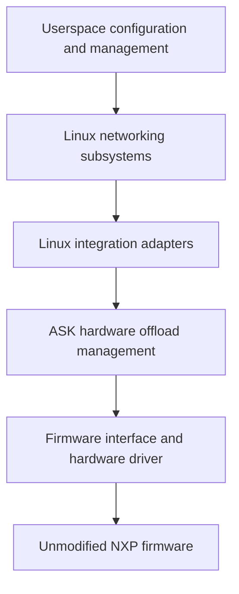

# Linux flowtable offload: design and first proof of concept

Status: PoC implemented; controlled lifecycle demonstrated. Acceptance remains
open pending investigation of intermittent UDP loss observed during development.
Development branch: `feat/linux-flowtable-offload`, starting at `7603f11`.
This document records the direction, initial scope, and acceptance requirements.
Concrete implementation contracts and the remaining acceptance work appear below.

## Purpose and constraints

Develop an alternative to CMM's automatic flow management in which Linux
networking subsystems request hardware offload through a small kernel integration
layer. Reuse the existing FMAN programming knowledge while making ownership,
lifecycle, and compatibility boundaries explicit.

The constraints are:

- NXP's hardware offload firmware is proprietary. Its source is unavailable, and
  the project must work with its existing capabilities and binary interfaces.
- This work will remain downstream. Implementation sources, kernel patches,
  compatibility work, documentation, and tests live in this repository; upstream
  acceptance is not a dependency.
- The existing CMM path must remain available and be the default. Developing the
  new path must preserve the ability to return to established ASK behaviour.
- Time, cost, and implementation complexity do not justify weakening correctness.
- The long-term direction is provisional. Linux interfaces and suitable designs
  may evolve; extend this document as evidence changes the decisions.

The PoC is intended to become the maintained foundation. Its small scope limits
the features supported, not the quality of their implementation. Approach it with
perfection as the engineering objective from the first change: no knowingly
incorrect lifecycle, ignored failure, fabricated success, or deferred cleanup is
acceptable on the grounds that this is an experiment. Verification establishes
bounded evidence; it cannot establish the absence of every possible defect.

## Current architecture and reusable parts

CMM observes Linux conntrack and networking state, resolves dependencies, and
sends commands through FCI. CDX translates those commands into hardware entries
and actions. Eligible packets then run through FMAN without passing through CMM.

CDX contains more than hardware encoding. It also implements command dispatch,
connection pairs, routes, ageing, resource management, and statistics. Replacing
CMM requires adapting this control model; calling the existing command dispatcher
from kernel callbacks would not by itself establish the intended architecture.

Useful starting points in this repository are:

| Responsibility | Existing implementation |
| --- | --- |
| CMM event handling and registration | [cmm/src/conntrack.c](../cmm/src/conntrack.c) |
| FCI dispatch and control serialization | [cdx/cdx_cmdhandler.c](../cdx/cdx_cmdhandler.c) |
| Connection pairs, routes, installation, ageing | [cdx/control_ipv4.c](../cdx/control_ipv4.c) |
| Classifier entries, hardware actions, activity, safe deletion | [cdx/cdx_ehash.c](../cdx/cdx_ehash.c) |
| Initial classifier and physical-port setup | [cdx/dpa_cfg.c](../cdx/dpa_cfg.c) |
| Device and queue information | [cdx/devman.c](../cdx/devman.c) |
| Software RX measurement | [tools/ask_orch/counters.py](../tools/ask_orch/counters.py) |

The baseline [kernel recipe](../meta-ask/recipes-kernel/linux/linux-ask_6.12.bb)
selects Linux 6.12.103 plus the separately pinned NXP SDK and ASK patches. The
[kernel configuration](../meta-ask/recipes-kernel/linux/files/defconfig) already
enables nftables flow offload. The selected SDK DPAA driver has no flowtable
offload callback or native XDP hook; those facilities cannot be assumed from the
capabilities of the separate mainline DPAA driver.

CDX already initializes physical ports through its existing setup. The PoC can
retain firmware loading, `dpa_app`, classifier configuration, and port setup
without starting CMM to install flows. Verify this independence on a clean boot,
including startup scripts and test fixtures.

## Architectural direction



These are responsibility boundaries, not a commitment to separate modules or a
new public API for every box.

Linux owns networking policy and connection state. Our integration translates
eligible operations into hardware requests and reports results and activity.
Hardware bookkeeping remains necessary: handles, shared resources, references,
pending work, synchronization, and recovery belong to the driver.

Concentrate Linux-specific structures, callbacks, references, and execution
contexts in small adapters. Keep common validation and firmware encoding
testable without the board where practical. Avoid both scattered version checks
and a general-purpose compatibility framework that recreates Linux.

Treat the firmware interface as a maintained specification: layouts, byte order,
actions, capabilities, resource limits, synchronization, counters, and reset
semantics. Record exact firmware identities and tested feature combinations.
Preserving this interface does not require preserving CMM or FCI as the new
path's control protocol.

Software forwarding remains the behavioural reference and fallback for supported
product features. Hardware eligibility must account for the complete required
behaviour, including exceptions and policy visibility. An unusable firmware
feature may need to be disabled; a host driver cannot guarantee a repair for
every defect inside an unavailable firmware implementation.

eBPF/XDP may later provide observation, classification, or specialized software
processing. It is not required for this PoC or a substitute for hardware lifetime
management. CPU XDP hooks do not see packets forwarded entirely by FMAN. Adding
BPF does not remove the need to maintain kernel-facing interfaces.

## Parallel development and mode ownership

Both paths must be buildable into the same image. The first PoC selects an
immutable mode at boot; the exact configuration interface is to be designed.

| Mode | Hardware flow controller | Expected behaviour |
| --- | --- | --- |
| Normal, default | CMM through FCI | Existing ASK functionality and interfaces |
| Experimental, explicit opt-in | Linux flowtable adapter | Only the documented PoC subset |

The adapter must be inactive in normal mode. Its presence must not change legacy
ageing, command semantics, statistics, or flow selection. Preserve existing
behaviour when factoring shared helpers, and validate that separately from new
functionality.

Enforce one controller for hardware flow state in the kernel. Stopping a daemon
or hiding a service is not sufficient ownership enforcement. Reject mutations
from the inactive controller before they change shared state; account for reset,
route, interface, and other indirect operations as well as connection insertion.
Audit FCI, ioctls, automatic bridge handling, and startup utilities for relevant
writers. Explicitly distinguish shared initialization and permitted diagnostics
from controller-owned mutations.

Experimental resources need identifiable ownership and a complete teardown path.
They must not accidentally enter CMM notifications or legacy ageing. Shared
physical resources must retain their existing lifetime guarantees.

Initially, returning to normal operation means booting normal mode with clean
hardware and restored normal networking configuration. A clean initramfs alone
does not prove that hardware state was reset; the test must establish that.
Starting CMM on top of experimental entries is not a supported handover.

Live mode changes, simultaneous ownership of different traffic, and preservation
of established connections across a handover are outside the first PoC. A future
live transition would need to stop admission, drain work, retire old hardware
state, detach the previous controller, and activate the next one. Never claim a
successful handover if hardware removal or synchronization is unproven.

## Smallest meaningful PoC

Demonstrate one IPv4 UDP connection, forwarded in both directions by FMAN,
installed, observed, and retired through Linux flowtable with CMM never started.

| Dimension | Initial support |
| --- | --- |
| Topology | Two hosts routed through two physical DPAA ports |
| Network context | Initial network namespace and default conntrack zone |
| Addresses and next hops | Fixed IPv4 routes and permanent neighbour entries |
| Traffic | One explicitly selected unicast UDP echo connection with numbered payloads |
| Forwarding | Normal Ethernet/IPv4 routing, correct MAC rewrite and TTL decrement |
| Encapsulation and translation | No NAT, VLAN, bridge, PPPoE, tunnel, or IPsec |
| Normal packet shape | Ordinary IPv4 headers and packets within the tested MTU |
| Lifecycle | Install, activity/statistics, explicit deletion, idle expiry, rollback, teardown |

Use the existing [test bench](testing.md), with an explicit PoC fixture that
supplies return routes on both hosts and removes NAT for the selected traffic.
Restore the normal fixture when testing CMM mode. Do not hardcode lab addresses
or silently depend on CMM-based test helpers. Confirm userspace tools and the
resolved kernel configuration needed by the fixture are present in the image.

Stable topology is a supported condition, not permission to forward using stale
state. The initial implementation may conservatively invalidate the whole PoC
offload on relevant route, neighbour, interface, MAC, or MTU changes. Define and
verify this response before installation is enabled. Efficient dynamic updates
and broader topology support come later.

Likewise, limiting the admission packet is insufficient: later packets with the
same tuple may have options, fragments, expired TTL, or excessive length. Verify
that the classifier/firmware handles or punts such packets correctly. A claimed
restriction must be enforceable throughout the installed flow's lifetime.

## Implementation increments

### 1. Establish the reference and inspect requests

Boot without CMM and establish empty hardware flow state. Verify the selected
traffic through ordinary Linux forwarding, then software flowtable forwarding.
Record packet contents, forwarding transformations, delivery, and counters.

Add the opt-in ownership mechanism and the smallest flowtable adapter. Initially
record supported request information and decline hardware installation, leaving
the software path operational. Successful binding or request logging is a
plumbing milestone, not proof of hardware offload.

On the baseline kernel, inspect the `TC_SETUP_FT` registration path and
`FLOW_CLS_REPLACE`, `FLOW_CLS_STATS`, and `FLOW_CLS_DESTROY` callbacks. Choose the
driver/indirect binding mechanism against the exact patched source used to build
the DUT. Do not derive behaviour from a neighbouring checkout or kernel version.

### 2. Establish a narrow internal hardware interface

Implement validation and the conceptual operations install, read activity/stats,
and remove. Back them with existing CDX hardware machinery through typed internal
interfaces. Do not make the experimental path depend on per-flow userspace FCI
commands or hardcoded hardware entries.

Resolve the mismatch between directional Linux requests and paired CDX entries.
Treat Linux cookies as opaque identifiers. Document which object owns each
direction, route, resource, and timer, and exactly when an operation may report
success. Reusing code must not import incompatible ownership assumptions.

Linux controls the experimental flow lifecycle. Hardware activity is reported
through the adapter; legacy CDX ageing must not independently expire a flow that
Linux still treats as installed. Preserve legacy behaviour for legacy objects.

### 3. Enable installation and complete the lifecycle

Enable only fully validated PoC rules. Exercise both directions, statistics,
active refresh, idle expiry, explicit removal, duplicate requests, partial
failure, teardown under traffic, and conservative invalidation.

Maintain distinct states for an installed entry, a failed or partial operation,
an entry removed from lookup but awaiting a hardware barrier, and an entry whose
removal cannot be proved. A null software pointer is not evidence of hardware
removal. Reuse existing quarantine and synchronization work only after reviewing
its complete contract. If recovery cannot establish safe software forwarding,
quiesce the affected datapath and report failure; do not announce fallback while
stale hardware may still forward.

### 4. Verify compatibility and return to normal mode

Run focused CMM compatibility tests with the experimental code present but
inactive. Run the PoC in experimental mode, then boot normal mode and repeat
those checks. The full KASAN suite takes about 80 minutes and is explicitly
excluded from this undertaking at the user's request. Include a build with the
experiment excluded if the design provides a compile-time option.

Accept the foundation only with the evidence below. New feature work builds on
accepted increments; discovery of a defect must update the implementation,
regression coverage, and any affected claims.

## Engineering contracts required from day one

- Validate every match, mask, action, ingress/egress device, and network context.
  Unsupported combinations must be declined without incomplete hardware rules.
- Document callback context, lock ordering, references, work cancellation, and
  unload/unbind behaviour. A callback replacing FCI must not bypass the
  serialization on which current CDX code relies.
- Define partial-install rollback, duplicate add/delete behaviour, resource
  exhaustion, and failures during deletion and synchronization. Prevent late work
  from reviving retired state or accessing released devices and flow objects.
- Define how hardware activity and byte/packet counters map to Linux, including
  units, clock conversion, deltas, reset/wrap behaviour, and directional
  aggregation. Avoid double accounting and false refresh of idle entries.
- Specify binary layouts with explicit widths and byte order, and test the
  production encoding functions against independently specified expectations.
- Keep meaningful failure reasons and ownership/resource diagnostics available
  without CMM. Report unsupported functionality and degraded operation honestly.
- Preserve the default CMM mode through focused changes and legacy regression
  coverage. Do not solve experimental lifecycle needs by changing all legacy
  objects' behaviour.

Before hardware installation is enabled, record the concrete choices for these
contracts in this document or a linked design supplement. Open design choices
must not become implicit implementation assumptions.

## Acceptance evidence

All rows are requirements. Passing measurements and remaining acceptance limits
are recorded below; an isolated passing run does not erase an unexplained failure.

| Area | Required demonstration |
| --- | --- |
| Independence | Clean boot, CMM never started, no leftover legacy entries or hidden per-flow FCI setup |
| Ownership | Default mode unchanged; attempts by an inactive controller cannot mutate flow state |
| Admission | Supported rule accepted; unsupported matches/actions/contexts leave no partial installation |
| Installation | Linux requests map to identifiable entries for both directions; success matches hardware reality |
| Packet behaviour | Numbered payloads delivered with correct MAC rewrite, TTL, and checksums, without unexpected loss or duplication |
| Exceptions | Same-tuple exception packets and topology changes are handled, punted, or conservatively invalidated according to the contract |
| Hardware execution | Successful delivery plus advancing per-entry hardware counters and a small measured software RX delta after warm-up |
| Statistics and activity | Defined counter accounting; sustained traffic survives idle thresholds; idle traffic expires |
| Removal | Flowtable removal retires hardware entries; subsequent packets use Linux and cannot recreate offload through the removed table |
| Failure and teardown | Allocation/installation failures, partial directions, deletion/barrier failures, and teardown with pending work follow their documented recovery paths |
| Resource lifetime | Repeated healthy cycles return resource counts to baseline; failure quarantine is accounted for and never silently reused |
| Kernel diagnostics | Relevant sanitizer, locking, and build checks pass; no unexplained kernel diagnostics |
| Legacy compatibility | Focused existing CMM tests pass before the experimental run and after returning to normal mode; the full suite is outside this run's scope |

The `[HW_OFFLOAD]` flag, throughput, CPU idle, and connection presence are
supporting information, not sufficient proof. ASK netdev totals include hardware
traffic. Use the physical SDK DPAA `rx packets [TOTAL]` counter through the
existing helper for software RX, together with successful endpoint delivery and
hardware counters. Missing measurement sources fail the test; do not substitute
a counter with different semantics. See [counter interpretation](testing.md#interpreting-packet-counters).

Define traffic counts, warm-up completion, timeout bounds, and tolerances before
each test; justify allowances for background traffic and counter granularity.
Poll observable state with bounded waits instead of treating a sleep as proof.
Use endpoint captures where CPU capture hooks cannot observe hardware forwarding.

Keep host tests for production validation/encoding and resource-state logic,
appropriate instrumented kernel tests, and real-DUT packet and failure tests.
Mocks do not establish firmware behaviour. Record the source revision and local
diff, resolved kernel/SDK configuration, toolchain, firmware identity, image and
DTB identities, running module identities, fixture configuration, packet traces,
counters, diagnostics, and test results needed to reproduce each acceptance run.

## Expansion and long-term direction

After the first lifecycle is accepted, broaden dynamic route/neighbour/device
behaviour and exception coverage. Exercise the same small feature on a second
kernel version early to test whether the compatibility boundary is useful.
Candidate expansions are TCP, IPv4 NAT, IPv6, additional interface types,
bridging, QoS, tunnels, and IPsec, each with separate eligibility and verification
criteria. This is a suggested sequence, not a fixed roadmap or a claim that one
Linux API covers every feature.

The direction is to reduce CMM's duplicated networking management while retaining
CDX's useful hardware knowledge in a more focused driver. Linux may supply the
appropriate abstractions through flowtable, bridge/switchdev, traffic control,
XFRM, or future facilities. Keep the existing path available until replacement
behaviour has been demonstrated feature by feature; retirement is not part of
the first PoC.

All compatibility work remains this project's responsibility. Support a declared
set of kernel versions, retain reproducible baselines, and continuously test new
versions. Preserve source and interface documentation independently of opaque
firmware. Longevity means an architecture we can keep adapting, not an assurance
that today's internal Linux interfaces or firmware features will last unchanged.

## References

- [Linux Netfilter flowtable documentation](https://docs.kernel.org/networking/nf_flowtable.html)
  describes software/hardware offload and also notes stale-cache limitations;
  integration alone does not prove invalidation correctness.
- [Linux kernel driver interface policy](https://docs.kernel.org/process/stable-api-nonsense.html)
  explains why a downstream driver must track internal interface changes.
- [BPF kernel functions](https://docs.kernel.org/bpf/kfuncs.html) describe explicit
  exposure and compatibility constraints for BPF access to kernel facilities.
- [ASK testing](testing.md), [versioning](versioning.md), and the
  [SDK source pin](../pins/nxp-sdk-srcrev.inc) define existing project practices.

## Implemented PoC contracts

The implementation is on `feat/linux-flowtable-offload`. The interfaces below
are implemented; the acceptance matrix above remains the gate for claiming a
verified foundation. Hardware measurements and any resulting restrictions will
be recorded alongside the tests.

The test initramfs reads `ask.offload=cmm|flowtable` from the kernel command line;
absence selects CMM. `ask.flowtable_observe=1` with flowtable ownership validates
requests but refuses hardware installation. CDX exposes these as read-only module
parameters `offload_owner` and `flowtable_observe`. Selecting a mode requires a
clean boot. The experimental init script skips `auto_bridge` and CMM; CDX skips
the Wi-Fi and IPsec runtime offload hooks. All FCI commands return
`-EOPNOTSUPP` in experimental mode, including queries. Initial `dpa_app` setup is
shared, and subsequent SET_PARAMS requests are rejected. Read-only hardware
inspection remains available through `/proc/cdx_flowtable`, independently of CMM.
The systemd CMM service also checks ownership; the kernel-command-line selector
itself is currently implemented by the test initramfs, not a production installer.

`cdx_flowtable.c` uses Linux's indirect `TC_SETUP_FT` binding callbacks and
`TC_SETUP_CLSFLOWER` requests. It accepts one flowtable, at most two initial-netns
physical Ethernet ports, and at most two directional entries. Cookies are opaque
and local to a binding. Unsupported selectors and actions fail before insertion.
The admitted rule has exactly IPv4/UDP addresses and ports, an ingress ifindex,
four Ethernet rewrite words, and a redirect. NAT, nondefault conntrack zones,
conntrack marks, unsupported devices, and other action lists are rejected. A
permanent neighbour for the destination on the egress port must match the
requested destination MAC. The current source MAC must equal the physical port's
permanent MAC. This first implementation therefore requires directly reachable
hosts; gateway next-hop resolution is not generalized yet.

Patch `140-ask-flowtable-context.patch` supplies borrowed conntrack context,
the directional effective MTU, and the table's accounting requirement to
callbacks. Neither the conntrack pointer nor a
Linux flow object is retained. This explicit, downstream, kernel-internal
interface avoids recovering a parent flow by casting its cookie. The adapter
must be built against this patch; the test image includes the native flowtable
and nftables modules it needs.

`cdx_flowtable_hw.c` presents install, statistics, and consuming deletion
operations. Each installed direction owns a private CDX encoding object, a dummy
reverse tuple, and an embedded route. These objects never enter the legacy
connection hash, route hash, CMM notification path, or ageing wheel. The existing
classifier encoder supplies routing actions, preemptive checks, and hardware
statistics. The adapter holds one ingress-device reference per binding and one
egress-device reference per installed direction. Installation uses the existing
ehash encoder and allocator. The adapter's backend owns its installed hardware
handles and their retirement; legacy objects retain their existing ownership.

Linux submits the two directions independently. A direction reports success
only after hardware installation succeeds. An identical replacement is
idempotent; a changed replacement retires the old entry before adding the new
one. A conflicting cookie for an existing hardware key is rejected. A rejected
second direction can leave the valid first direction installed, as permitted by
Linux flowtable semantics; the other direction uses software. Linux's
`[HW_OFFLOAD]` flag is therefore explicitly insufficient evidence that both
directions are accelerated. Tests inspect both hardware entries and both
physical software RX counters.

Statistics use monotonically increasing 64-bit hardware packet/byte counters;
callbacks report only the delta since the previous callback. A backwards sample
disables admission and retires the experiment instead of causing unsigned
underflow. Firmware timestamps use CDX's 32-bit jiffies clock. The adapter expands
them relative to current kernel jiffies; the supported idle interval must remain
below half that clock's range. Linux owns activity refresh and idle expiry.

Firmware counts classifier matches, including some later punts to Linux.
Hardware bytes include the Ethernet header and minimum-frame padding, excluding
FCS. Measurements give 298 bytes for a 256-byte UDP payload and 60 bytes for an
8-byte payload, in both directions. Same-tuple TTL/MTU exceptions also increment
the match counters before Linux handles them. These aggregates cannot recover
independently forwarded packets or exact IP bytes. Passing them into conntrack
accounting would mix byte units and count some packets twice.

The adapter therefore rejects a table with nftables `counter` enabled, leaving
it on software forwarding and accounting. If an existing table enables counters,
the next statistics callback invalidates the experiment without reporting its
hardware deltas to conntrack. Recreate the table to change accounting policy at
a defined boundary; do not interpret a running table's flag change as an atomic
accounting transition. Admitted tables use hardware activity for ageing, while
proc diagnostics expose raw classifier counters. Conntrack does not receive
hardware accounting contributions when the native `counter` flag is absent.
Accurate hardware accounting requires a separately verified post-punt firmware
measurement facility; it is outside this PoC's contract.

The control mutex serializes list changes and all firmware operations. Netfilter
rule callbacks execute in workqueue context. Binding release runs after the flow
block excludes its callbacks. Notifiers latch invalidation and queue work; they
never acquire the control mutex. Invalidation deletes the experimental entries
before flushing Linux flowtable work, releasing the control mutex before that
flush. Module exit removes the proc entry and notifiers, cancels invalidation
work, and unregisters indirect callbacks before global CDX teardown acquires its
locks. Installation and fatal recovery use RTNL trylock under the control mutex,
because RTNL holders can wait for Netfilter callbacks. A busy RTNL lock declines
installation to software; fatal recovery releases the mutex and retries. A port
must also match the netdevice recorded by CDX, not merely its name. Flowtables
must be bound after CDX initializes; incomplete indirect replay requests are
declined.

Relevant initial-netns IPv4 route and ARP-neighbour changes, or interface down,
unregister, MTU, MAC, rename, or upper-device changes conservatively disable new
hardware admission until reboot. The current notifier scope includes unrelated
IPv4 routes/neighbours in that namespace: conservative invalidation can reduce
availability but must not retain stale forwarding. Configure routes and permanent
neighbours before binding the table. Invalidation is asynchronous; inspect
`invalidation_done` before claiming retirement is complete.

Deletion has three outcomes: synchronized removal, unlinked storage retained for
a barrier, or unproven unlink. All outcomes consume the adapter's software
handle. Failed deletion retains the already allocated backend owner in a private
retirement list, requiring no new allocation on the failure path. The worker
retries barriers until they succeed; it never retries the destructive unlink.
Quarantine and errors remain observable; a null handle is never treated as proof
of synchronization. Unproven unlink latches a fatal condition
and retries datapath quiescence until it succeeds or module shutdown takes over.
Fatal completion means the datapath was stopped, not that software fallback is
available. Reboot is required. Possibly linked hardware storage stays allocated
until reset; freeing it would leave a dangling hash-chain link. Shutdown releases
unlinked storage only after global datapath quiescence is proven. Healthy
invalidation waits for retirement barriers and flushes the affected software
flowtables, allowing ordinary forwarding.

The test build exposes a one-shot `flowtable_fail_stage` parameter: 1 before
adapter allocation, 2 before hardware installation, and 3 after installation,
forcing rollback through the real delete path. Production builds omit this
parameter. A separate test-only `flowtable_fail_unlink` boolean consumes one
delete attempt before destructive unlink, leaving the real key linked and
forcing fatal retirement. It exercises stopped classifier ports and retained
storage; it does not simulate a recoverable synchronization failure.
Host tests compile the production rule decoder and lifecycle code
with fault-injected kernel/firmware boundaries under ASan and UBSan; hardware
acceptance uses the real classifier and endpoint traffic.

`tools/tests/test_flowtable_offload.py` is explicitly gated by
`ASK_FLOWTABLE_TESTS=1`. It supplies a selected-UDP NAT exemption, permanent DUT
neighbours, a WAN host return route, and a numbered echo server, then restores
the fixture. It uses the LAN UART and target/WAN agents without CMM helpers.
Runs can set `ASK_FLOWTABLE_ARTIFACTS` to retain measurements and packet captures.
The last test invalidates the experiment until the next boot.

`ASK_FLOWTABLE_TERMINAL=unload|unlink` separately selects a terminal lifecycle
test with `-k flowtable_offload_terminal`. Use a fresh experimental boot for
each variant. The test removes the inactive FCI module dependency, verifies
both hardware directions under traffic, and then unloads CDX or injects an
unproven unlink. The latter checks fatal status and disabled FMan receive ports,
then removes CDX for cleanup. Both variants finish by checking 64 ordinary UDP
exchanges with CDX absent. A continuous sender spans the intentional datapath
stop and validates every received payload; interruption during that stop is
recorded separately from the normal zero-loss forwarding oracle. DUT control
and fixture restoration use UART when the datapath can be unavailable. Neither
variant reloads CDX or switches owners; reboot afterward.

## Running the focused checks

Build with `KASAN=1 make ask-image`, then run `make stage-image`. Boot the staged
RAM image with `ask.offload=flowtable`; add `ask.flowtable_observe=1` for an
observe-only boot. Start from a clean boot for each invalidation variant. The
boot selector is transient; returning to CMM means rebooting with both experimental
arguments absent. Do not unload/reload modules to switch owners.

With the normal LAN UART and DUT/WAN agents available, run:

```sh
ASK_FLOWTABLE_TESTS=1 ASK_WAN_IPERF_IP=<WAN-address> make ask-test \
  ASK_TEST_ARGS='-k flowtable_offload -x -q'
```

The ordinary run selects four PoC scenarios: reference/forwarding/lifecycle,
same-tuple exceptions, installation rollback, and neighbour invalidation. The
optional long-exchange diagnostic skips by default. The lifecycle includes a
512-packet hardware measurement, minimum-size packets, three removals under
traffic, 65 seconds of activity refresh, and a bounded idle-expiry wait. Tests
validate payloads and Ethernet/IP behaviour; they never equate classifier hits
or Linux's hardware flag with successful delivery.

On a separate experimental boot, exercise failed retirement barriers with:

```sh
ASK_FLOWTABLE_TESTS=1 ASK_FLOWTABLE_INVALIDATION=barrier \
  ASK_WAN_IPERF_IP=<WAN-address> make ask-test \
  ASK_TEST_ARGS='-k flowtable_offload_invalidation -x -q'
```

`ASK_FLOWTABLE_BASELINE=software|flowtable|hardware` with
`-k flowtable_offload_long_exchange` selects an explicit 4,096-packet diagnostic
through ordinary routing, software flowtable, or hardware offload. It leaves the
LAN NIC out of promiscuous mode and records raw frames, classifier state,
conntrack, and endpoint error counters on a timeout. Other packet checks use
promiscuous capture so an unexpected Ethernet destination remains observable.

After a normal CMM boot, the selected compatibility checks are:

```sh
ASK_WAN_IPERF_IP=<WAN-address> make ask-test \
  ASK_TEST_ARGS='-k "test_cmm_unsupported_commands or test_iperf_ipv4_tcp_offload" -x -q'
```

The focused host command is `sudo /opt/askd-agent/venv/bin/pytest -c
tools/pyproject.toml tools/host_tests -k 'flowtable or cdx_shutdown' -q` with the
standard host setup. These tests compile production decoder, backend ownership,
and teardown code under ASan/UBSan. This procedure does not run the full DUT
KASAN suite.

`ASK_FLOWTABLE_INVALIDATION=counter` selects a separate-boot test which enables
accounting on an active hardware table and verifies retirement and software
fallback. It exercises the runtime accounting guard in addition to the normal
test's refusal to install into a table that already requests counters.

## Validation record — 2026-09-14

The final candidate was built and staged with KASAN, lockdep, kmemleak support,
and FAILSLAB enabled. Running kernel/CDX build IDs and the dpa_app, CMM, and FMC
hashes matched the build. Image SHA-256:
`dfcdbc950f5bb3a84f8982a16e360f0d673602f4454da28a44ae13de006600c5`.
Kernel build ID: `e5a2b9c4cbd3e2c2f6b2f3bdf46fcbb9a57e274a`.
CDX build ID: `1fd916d9338c3e2a8464e6ed3431da1f2ba2dc7a`.
Build output contained six existing forced-task/build-path notices and no
compiler warnings. Source manifests include the new, untracked files as well as
the tracked diff captured before this checkpoint.

| Check | Result and bounds |
| --- | --- |
| Focused host checks | 3 passed under ASan/UBSan: decoder/lifecycle, backend ownership, and shutdown ordering |
| Current PoC lifecycle, exceptions, rollback | 3 passed in 128.26 seconds on the final candidate |
| Hardware execution | Both directions advanced from 62 to 574 classifier hits during 512 successful echoes; software RX increased by 1 on eth3 and 9 on eth4; payload, MAC, TTL, and request checksum checks passed |
| Minimum frames | 32 eight-byte UDP payloads advanced each hardware counter by 32 packets and 1,920 Ethernet bytes |
| Activity/removal | Three removals under traffic returned entries/bindings to zero; 65 seconds of active traffic stayed installed; idle expiry retired both directions |
| Counter admission | A counter-enabled table forwarded in software and installed zero hardware entries |
| Counter change | Enabling counters on an active table completed invalidation with zero entries, errors, fatal state, or quarantine; subsequent echoes succeeded |
| Longer forwarding windows | Final candidate passed 4,096 echoes through software flowtable and another 4,096 through hardware, with LAN promiscuous mode disabled |
| Earlier observe/invalidation checks | Observe mode, neighbour invalidation, and two injected delete-barrier failures passed on earlier instrumented builds; the retirement backend is unchanged in the final candidate |
| Kernel diagnostics | Selected scenarios reported no KASAN/UBSAN/BUG/WARN/lockdep findings; a separate I2C error flood is described below |
| CMM return | Final candidate rebooted with CMM ownership; unsupported-command handling and IPv4 TCP hardware offload both passed in 17.11 seconds |

The barrier-failure run consumed both injected failures, recorded two errors,
completed invalidation, drained quarantine to zero, and continued forwarding in
Linux. Host tests additionally exercise failed barrier retries, unproven unlink,
and failed/busy quiescence. Hard unlink failure and module unload with live
experimental traffic had not yet been demonstrated in this initial validation;
the later terminal lifecycle validation is recorded below. Host checks do not
substitute for those hardware cases.

During development, several hardware runs lost an individual UDP request or
reply, including after table removal. In one long run, request 3,014 reached the
WAN endpoint and both directional classifier counters reached 3,012 (the first
two packets had used software), but the reply did not appear in the LAN capture.
LAN NIC error counters did not increase. Ordinary-routing windows of 4,096
packets and CMM windows of 4,096 and 8,192 packets passed. Those failures used the
earlier counter-enabled experiment, which the final adapter now declines because
its accounting is incorrect. The counter restriction is not a demonstrated
explanation or fix for the loss. Preserve this as an open acceptance item;
successful subsequent windows are bounded evidence, not grounds to erase it or
increase test loss tolerances. Do not broaden the PoC on an assumption that this
failure has been explained.

The DUT later began repeatedly reporting `i2c-1: SCL is stuck low` across warm
boots in both ownership modes. That also disrupted UART command parsing. Final
diagnostic boots used `loglevel=1 log_buf_len=4M` to keep UART usable and retain
kernel messages; instrumentation remained enabled. A subsequent live
investigation isolated the stuck branch to the FLEXOPTIX DAC's mux channel;
unplugging and reinserting the DAC restored both modules, and a normal reboot
passed the board self-tests. The original trigger remains unresolved.

The [follow-up UDP investigation](flowtable-udp-loss-investigation.md)
reproduced losses on this exact final image with I2C healthy. It recorded one
ordinary-routing loss with an X550 receive CRC error, and hardware losses
counted by the DUT's LAN transmit MAC without a corresponding LAN reply or
endpoint error increment. Subsequent 16,384-packet software and hardware
windows passed after a diagnostic X550 reset and fresh DUT boot. These results
narrow the investigation but do not establish a common cause or close delivery
acceptance. Detailed counter deltas, excluded diagnostic attempts and the
physical isolation plan are retained in the linked record.

Artifacts are retained under `/tmp/ask-flowtable/` on the build host: image/source
identity, build and boot logs, pytest XML, endpoint capture, hardware counters,
exception results, fault recovery, and failed-exchange diagnostics. The full
suite was stopped at the user's request after 159 passes and no failures; it was
not resumed. No full-suite or full kmemleak-scan acceptance is claimed.

At the end of these initial checks, the DUT returned to default CMM ownership.
No persistent boot configuration or flash image was changed.

## Terminal lifecycle validation — 2026-09-14

A subsequent test image adds the test-only hard-unlink hook described above.
The forwarding and retirement implementation is unchanged; the new hook leaves
one real installed key linked to exercise the existing fatal path. It is absent
from production builds. The image was built and staged with the same KASAN,
lockdep, kmemleak and FAILSLAB configuration. Build output contained three
existing forced-task notices and no compiler warnings. Running identities
matched the build:

- Image SHA-256: `f1afad25011630343366d2c5a1abb89e950f1693abbf1ee656bd743cbbc78bec`.
- Kernel build ID: `365a93b26ed2ecc05966696c1e6e87a7111be0b1`.
- CDX build ID: `65912f90a0bac30c99cf1db93c923f67f02792bb`.

These runs used the operator's replacement RJ45 cable with the same FS module,
X550 and physical ports. They are lifecycle tests, not a controlled comparison
establishing that the original cable caused the earlier UDP loss. The LAN link
was checked after the terminal tests and reported 1 Gb/s. No 10 Gb/s
performance acceptance is claimed or required for these lifecycle checks.

| Check | Result and bounds |
| --- | --- |
| Focused host checks | 3 passed under ASan/UBSan, including one-shot hard-unlink injection, preservation of the linked key, no destructive retry, and a subsequent healthy delete |
| Module unload under traffic | Passed in 23.45 seconds. Both hardware directions had 164 hits immediately before unload. CDX and its proc entry disappeared; 64 subsequent ordinary-routing echoes passed. The 12-second stream spanning shutdown received 1,837 of 1,906 sent packets; lossless unload is not claimed. |
| Hard unlink failure | Passed in 22.54 seconds. Both directions were active before injection; the one-shot hook was consumed, errors increased by one, and fatal invalidation completed with entries/bindings zero. FMan receive ports 6 and 7 both changed from enabled to disabled. The kernel recorded one retained linked key; WAN delivery stopped while the LAN sender continued. |
| Fatal cleanup | Removing CDX after the hard-unlink test restored ordinary forwarding; 64 echoes passed with the module absent. This is explicit teardown after the fatal observation, not software fallback by the invalidation worker. The boot was then reset before using ASK again. |
| Kernel diagnostics | Both successful terminal tests completed their capture windows without KASAN/UBSAN/BUG/WARN/lockdep findings. No full suite or kmemleak scan was run. |
| CMM control compatibility | Unsupported-command handling passed in 4.81 seconds after rebooting the same image with default ownership. |
| CMM forwarding compatibility | A separate five-second paced TCP measurement delivered 500,170,752 bytes at 799.94 Mb/s. CMM's hardware connection table grew from zero to two entries. DUT LAN software RX increased by only 268 packets versus a conservative lower bound of 333,447 data frames. No kernel splats were recorded. |
| DUT CPU during CMM forwarding | `/proc/stat` showed 1.87% average busy time over an idle baseline and 3.46% over the traffic window, averaged across all four CPUs. The busiest core during traffic was 4.68%. These are DUT measurements; iperf's endpoint CPU figures are not used. |

The first hard-unlink attempt stopped before injection because interactive shell
prompts contaminated the test's JSON output. Cleanup succeeded; it is excluded
from hard-unlink acceptance. The maintained test now sends Python as a single
encoded command and explicitly frames actual console output. The successful
replacement run used that framing. The finite traffic task is awaited before
UART reuse, and fatal cleanup runs even if its packet checks fail.

The existing CMM throughput test requires at least 1 Gb/s of application
throughput, which the replacement link cannot supply. Its threshold was not
changed. The paced compatibility measurement instead combines received data,
hardware table population, software-path packet counts and DUT CPU usage. Its
temporary checker and raw measurements are retained with the lifecycle
artifacts. Low CPU usage corroborates the software-path counters; it is not
treated as a delivery oracle by itself.

Artifacts are under `/tmp/ask-flowtable-lifecycle/`: image/source manifests,
build and boot logs, pytest XML, live-entry snapshots, port-enable states,
terminal traffic counts and raw UART logs. The build log is
`/tmp/ask-flowtable-lifecycle-build.log`. The two previously missing terminal
hardware cases now have direct DUT evidence. Earlier unexplained UDP loss
remains documented; the operator explicitly deferred further dedicated loss
diagnosis so work could continue on this foundation.

For subsequent work, keep the DUT in experimental ownership between tests.
Reboot within that mode when a test latches invalidation or removes CDX; return
to CMM only when the compatibility test itself requires it. The operator has
made the DUT available for continued development.

Final runtime state: the tested image is booted with `ask.offload=flowtable`,
observe mode off, and entries, bindings, installs, deletes, errors, invalidated,
fatal and quarantine all zero. CMM and auto_bridge are absent, both fault knobs
are clear, and no experimental nftables table remains. The ready boot has no
kernel splats or I2C stuck messages. Persistent boot settings and flash remain
unchanged.
