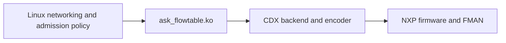

<a id="linux-flowtable-offload-design-and-first-proof-of-concept"></a>

# Linux flowtable offload

The bounded CMM-retirement foundation and IPv4 TCP/UDP NAT
increments are implemented and verified. Native Linux flowtables and the loadable
`ask_flowtable` adapter control CDX hardware without starting CMM or loading FCI.
This is a maintained development path with a defined feature boundary; it does
not yet replace every feature available through CMM.

Development branch: `feat/linux-flowtable-offload`, starting at `7603f11`.
Current checkpoint: IPv4 TCP/UDP NAT and 32,768-direction capacity (2026-09-15).

## Reading guide

| Need | Document |
| --- | --- |
| Current interfaces, ownership, locking and lifetime contracts | [Architecture](flowtable-architecture.md) |
| Accepted foundation, recovery matrix and verification limits | [Foundation checkpoint](flowtable-foundation.md) |
| Configure scope/exclusions, revoke active flows, migrate CMM settings | [Policy guide](flowtable-policy.md) |
| Supported NAT mappings and their focused proof | [NAT guide](flowtable-nat.md) |
| Admission budget, pressure and resource reuse | [Capacity guide](flowtable-capacity.md) |
| Original proposal, implementation snapshots and dated measurements | [History by topic and chronology](flowtable/history/README.md) |
| Remaining intermittent UDP/link observations | [UDP loss investigation](flowtable-udp-loss-investigation.md) |
| Bench setup and packet-counter interpretation | [Testing guide](testing.md) |

The architecture and feature guides describe current behaviour. Historical
records retain original wording, failures and superseded restrictions. In
particular, the initial proposal and implementation snapshot are not current
configuration instructions.

## Supported scope

| Area | Current boundary |
| --- | --- |
| Kernel and hardware | Repository Linux 6.12.103 with its pinned SDK, LS1046A DPAA/FMAN and existing proprietary NXP firmware |
| Topology and capacity | One hardware flowtable, two initial-netns physical Ethernet ports, at most 32,768 directional entries |
| Routed traffic | Unicast IPv4 UDP and established/assured TCP; default conntrack zones and zero conntrack mark |
| Throughput | Loki → Vision TCP NAT: 9.414 Gb/s receive, 1.84% aggregate DUT CPU on the KASAN image |
| NAT | TCP/UDP static source NAT, MASQUERADE, destination and hairpin/double NAT, including address/port translation and inverse reply translation |
| Routing and neighbours | Direct routes, IPv4 gateways, permanent neighbours and ordinary ARP |
| Automatic recovery | Dependent route, neighbour, physical MTU/MAC and link-state retirement followed by fresh admission |
| Lifetime and policy | Conntrack/flow expiry and deletion, safe adapter unload, explicit global recovery, live policy revocation, bounded capacity fallback |
| Ownership | CMM remains the default boot path; flowtable ownership is explicit and immutable for the boot |

The bound is 32,768 **directions**, sufficient for 16,384 fully accelerated connections.
Admission is directional: a capacity or unsupported-direction refusal can leave
the other direction accelerated. Matching transient admission contention has
explicit partial-generation recovery. Hardware flags alone do not establish
that both directions are offloaded.

Counter-enabled hardware tables are refused because firmware counters include
classifier hits that can later be punted to Linux. IPv6, VLAN/bridge/PPPoE, multicast, IPsec, tunnels and Wi-Fi
need their own eligibility contracts and proofs. Unsupported hardware traffic
remains governed by Linux forwarding and firewall policy.

## How the components fit



Linux owns conntrack, NAT mappings, routing, neighbours and flow lifetimes.
The adapter validates native requests and tracks dependencies. CDX owns hardware
resources, encoding and safe retirement. `dpa_app`/FMC still initialize the
hardware once; there are no per-flow FCI commands in this path.

The [architecture](flowtable-architecture.md) defines the kernel patch, private
provider API, lock ordering, references, selective/global invalidation and fatal
failure boundary. The source interface can evolve with this repository; upstream
acceptance and a stable binary ABI are not dependencies.

## Operation and verification

The test initramfs selects flowtable mode with `ask.offload=flowtable`; absence
selects CMM. `ask.flowtable_observe=1` validates requests without installing
hardware. Switching owner requires a clean boot. Healthy adapter reload retains
provider ownership; recreate the flowtable to restore hardware binding.

The shipped `/etc/ask/flowtable.json` is disabled. Use `ask-flowtable check`,
`render`, `apply`, `status` and `stop` as described in the [policy guide](flowtable-policy.md).
Policy replacement drains existing hardware before publishing new admission.
Changing unrelated firewall rules alone does not revoke a cached hardware flow;
follow the [firewall revocation sequence](flowtable-policy.md#firewall-ordering-and-revocation).

For relevant hardware validation, build with `KASAN=1 make ask-image` and always
run `make stage-image` after a successful image build. Boot the staged image
with the intended owner and verify its running identities. Select individual
tests using `-k`; `make ask-test` without that filter runs unrelated tests too.
For example, on the current bench:

```sh
ASK_FLOWTABLE_TESTS=1 ASK_WAN_IPERF_IP=10.0.0.232 ASK_FLOWTABLE_SPORT=55000 \
  make ask-test ASK_TEST_ARGS='-q -k test_flowtable_udp_snat'
```

The [foundation](flowtable-foundation.md#focused-reproduction) and
[NAT](flowtable-nat.md#focused-verification) guides give focused reproduction
commands; the [capacity guide](flowtable-capacity.md#focused-verification) covers
full occupancy, overflow and resource reuse. Failure tests can stop the datapath or require a fresh boot; follow
their documented boundaries. The full KASAN suite and alternative-kernel exercise
were explicitly excluded from the foundation work.

Proof combines exact endpoint delivery, packet rewrites/checksums, directional
hardware counters, software TX counts, CPU observations and clean diagnostics.
Neither throughput nor `[HW_OFFLOAD]` alone is sufficient. The latest
[UDP SNAT evidence](flowtable/history/udp-snat.md) includes both ordinary and zero
UDP checksums, route readmission, software fallback on the same conntrack and
socket, and the existing TCP/UDP startup regression. No broader acceptance is
implied by reorganizing these documents.

The [TCP SNAT evidence](flowtable/history/tcp-snat.md) extends this to established
TCP, including bulk transfers, retransmission, policy withdrawal and FIN/RST.

The [DNAT evidence](flowtable/history/dnat.md) covers WAN-initiated TCP/UDP port
forwarding, receive checksums, route retirement and live software fallback.

The [combined NAT evidence](flowtable/history/double-nat.md) covers simultaneous
source/destination translation and same-port hairpin routing through the DUT.

The [capacity evidence](flowtable/history/capacity.md) proves 16,384 fully
accelerated mixed TCP/UDP connections, overflow fallback, slot reuse and paced
recovery after full route retirement. Its small explicit UDP loss allowance
does not change the earlier delivery proofs.

## Next work and longer-term direction

The four bounded IPv4 TCP/UDP NAT increments and the
[full-rate Loki → Vision benchmark](flowtable/history/nat-throughput.md) are complete:
9.414 Gb/s TCP receive throughput with 1.84% aggregate DUT CPU.
The full 32,768-direction capacity proof also passes. Admission-rate stress,
simultaneous recovery bursts and longer soaks remain distinct work: an unpaced
restart after full route retirement produced material UDP loss during readmission.
Prove each increment before expanding its supported boundary. The
[foundation checkpoint](flowtable-foundation.md) remains the base for further
interface and protocol features.

PPPoE, bridges/VLANs, multicast, IPsec and tunnels need feature-specific Linux
integration and firmware eligibility; they should not be forced through a
unicast flowtable contract that cannot express their behaviour. Scheduling those
features depends on product needs and evidence from the preceding increments.

The durable direction is Linux ownership of networking state with a maintained
hardware backend. Firmware is proprietary and cannot be changed here. Kernel
interfaces, adapters and patches remain in this repository and must evolve with
Linux. Preserve focused compatibility boundaries rather than freezing an
assumption about how Linux will develop over decades.

eBPF/XDP is optional later work for observation, policy or specialised software
processing. It is not required to deploy the supported flowtable/CDX subset.
CPU XDP hooks do not observe traffic already forwarded entirely by FMAN, and
BPF would still need the same hardware ownership and retirement guarantees.

## Engineering and documentation rules

The PoC is the maintained base. Small scope never excuses incomplete validation,
ignored cleanup, unsafe retirement or a fabricated success result. Preserve the
CMM path, decline unsupported requests, and establish actual software fallback
before claiming it. Terminal failure must retain its stop and ownership guards.

Update the architecture or feature guide when behaviour changes. Record each
proved increment in the relevant history topic, including source/image identity,
measurements, failed attempts and limitations; update the
[chronology](flowtable/history/README.md#chronology). Keep current explanations in
one guide and link to them from new evidence. Create descriptive topic files as
needed, without returning to an ever-growing overview or date-only filenames.

Existing unexplained link observations remain documented. A passing later test
does not establish that an unrelated failure was fixed. Historical artifact paths
refer to bench files and are not a guarantee of permanent storage.

## Earlier section links

These links preserve the former document's section fragments for bookmarks.
They lead to the unchanged historical section in its new location. Use the
reading guide above for current contracts and operating instructions.

| Former section | Archived location |
| --- | --- |
| <a id="purpose-and-constraints"></a>Purpose and constraints | [Open section](flowtable/history/initial-proposal.md#purpose-and-constraints) |
| <a id="current-architecture-and-reusable-parts"></a>Current architecture and reusable parts | [Open section](flowtable/history/initial-proposal.md#current-architecture-and-reusable-parts) |
| <a id="architectural-direction"></a>Architectural direction | [Open section](flowtable/history/initial-proposal.md#architectural-direction) |
| <a id="parallel-development-and-mode-ownership"></a>Parallel development and mode ownership | [Open section](flowtable/history/initial-proposal.md#parallel-development-and-mode-ownership) |
| <a id="smallest-meaningful-poc"></a>Smallest meaningful PoC | [Open section](flowtable/history/initial-proposal.md#smallest-meaningful-poc) |
| <a id="implementation-increments"></a>Implementation increments | [Open section](flowtable/history/initial-proposal.md#implementation-increments) |
| <a id="1-establish-the-reference-and-inspect-requests"></a>1. Establish the reference and inspect requests | [Open section](flowtable/history/initial-proposal.md#1-establish-the-reference-and-inspect-requests) |
| <a id="2-establish-a-narrow-internal-hardware-interface"></a>2. Establish a narrow internal hardware interface | [Open section](flowtable/history/initial-proposal.md#2-establish-a-narrow-internal-hardware-interface) |
| <a id="3-enable-installation-and-complete-the-lifecycle"></a>3. Enable installation and complete the lifecycle | [Open section](flowtable/history/initial-proposal.md#3-enable-installation-and-complete-the-lifecycle) |
| <a id="4-verify-compatibility-and-return-to-normal-mode"></a>4. Verify compatibility and return to normal mode | [Open section](flowtable/history/initial-proposal.md#4-verify-compatibility-and-return-to-normal-mode) |
| <a id="engineering-contracts-required-from-day-one"></a>Engineering contracts required from day one | [Open section](flowtable/history/initial-proposal.md#engineering-contracts-required-from-day-one) |
| <a id="acceptance-evidence"></a>Acceptance evidence | [Open section](flowtable/history/initial-proposal.md#acceptance-evidence) |
| <a id="expansion-and-long-term-direction"></a>Expansion and long-term direction | [Open section](flowtable/history/initial-proposal.md#expansion-and-long-term-direction) |
| <a id="references"></a>References | [Open section](flowtable/history/initial-proposal.md#references) |
| <a id="implemented-poc-contracts"></a>Implemented PoC contracts | [Open section](flowtable/history/implementation-snapshot.md#implemented-poc-contracts) |
| <a id="running-the-focused-checks"></a>Running the focused checks | [Open section](flowtable/history/implementation-snapshot.md#running-the-focused-checks) |
| <a id="validation-record--2026-09-14"></a>Validation record — 2026-09-14 | [Open section](flowtable/history/udp-poc.md#validation-record--2026-09-14) |
| <a id="terminal-lifecycle-validation--2026-09-14"></a>Terminal lifecycle validation — 2026-09-14 | [Open section](flowtable/history/udp-poc.md#terminal-lifecycle-validation--2026-09-14) |
| <a id="healthy-invalidation-recovery-verified-2026-09-14"></a>Healthy invalidation recovery verified (2026-09-14) | [Open section](flowtable/history/udp-poc.md#healthy-invalidation-recovery-verified-2026-09-14) |
| <a id="tcp-increment-and-validation-2026-09-14"></a>TCP increment and validation (2026-09-14) | [Open section](flowtable/history/connections-and-admission.md#tcp-increment-and-validation-2026-09-14) |
| <a id="ordinary-arp-increment-2026-09-14"></a>Ordinary ARP increment (2026-09-14) | [Open section](flowtable/history/neighbours-and-gateways.md#ordinary-arp-increment-2026-09-14) |
| <a id="gateway-next-hop-increment"></a>Gateway next-hop increment | [Open section](flowtable/history/neighbours-and-gateways.md#gateway-next-hop-increment) |
| <a id="bounded-multiple-connections--2026-09-15"></a>Bounded multiple connections — 2026-09-15 | [Open section](flowtable/history/connections-and-admission.md#bounded-multiple-connections--2026-09-15) |
| <a id="verification"></a>Verification | [Open section](flowtable/history/connections-and-admission.md#verification) |
| <a id="selective-neighbour-invalidation-verified-2026-09-15"></a>Selective neighbour invalidation verified (2026-09-15) | [Open section](flowtable/history/neighbours-and-gateways.md#selective-neighbour-invalidation-verified-2026-09-15) |
| <a id="selective-ipv4-route-retirement--verified-2026-09-15"></a>Selective IPv4 route retirement — verified 2026-09-15 | [Open section](flowtable/history/route-retirement.md#selective-ipv4-route-retirement--verified-2026-09-15) |
| <a id="cdx-backend-interface--verified-2026-09-15"></a>CDX backend interface — verified 2026-09-15 | [Open section](flowtable/history/backend-and-module.md#cdx-backend-interface--verified-2026-09-15) |
| <a id="loadable-flowtable-adapter--verified-2026-09-15"></a>Loadable flowtable adapter — verified 2026-09-15 | [Open section](flowtable/history/backend-and-module.md#loadable-flowtable-adapter--verified-2026-09-15) |
| <a id="2026-09-15-device-dependency-filtering"></a>2026-09-15: device dependency filtering | [Open section](flowtable/history/backend-and-module.md#2026-09-15-device-dependency-filtering) |
| <a id="automatic-physical-port-mtu-recovery--verified-2026-09-15"></a>Automatic physical-port MTU recovery — verified 2026-09-15 | [Open section](flowtable/history/device-lifecycle.md#automatic-physical-port-mtu-recovery--verified-2026-09-15) |
| <a id="administrative-port-recovery--verified-2026-09-15"></a>Administrative port recovery — verified 2026-09-15 | [Open section](flowtable/history/device-lifecycle.md#administrative-port-recovery--verified-2026-09-15) |
| <a id="physical-mac-and-rename-recovery--verified-2026-09-15"></a>Physical MAC and rename recovery — verified 2026-09-15 | [Open section](flowtable/history/device-lifecycle.md#physical-mac-and-rename-recovery--verified-2026-09-15) |
| <a id="physical-removal-and-terminal-restart-guard--verified-2026-09-15"></a>Physical removal and terminal restart guard — verified 2026-09-15 | [Open section](flowtable/history/device-lifecycle.md#physical-removal-and-terminal-restart-guard--verified-2026-09-15) |
| <a id="transient-admission-recovery--verified-2026-09-15"></a>Transient admission recovery — verified 2026-09-15 | [Open section](flowtable/history/connections-and-admission.md#transient-admission-recovery--verified-2026-09-15) |
| <a id="nexthop-object-retirement--verified-2026-09-15"></a>Nexthop-object retirement — verified 2026-09-15 | [Open section](flowtable/history/route-retirement.md#nexthop-object-retirement--verified-2026-09-15) |
| <a id="configuration-and-live-exclusion-replacement--verified-2026-09-15"></a>Configuration and live exclusion replacement — verified 2026-09-15 | [Open section](flowtable/history/policy-and-startup.md#configuration-and-live-exclusion-replacement--verified-2026-09-15) |
| <a id="startup-independence--verified-2026-09-15"></a>Startup independence — verified 2026-09-15 | [Open section](flowtable/history/policy-and-startup.md#startup-independence--verified-2026-09-15) |
| <a id="resource-pressure-and-concurrent-reconfiguration--verified-2026-09-15"></a>Resource pressure and concurrent reconfiguration — verified 2026-09-15 | [Open section](flowtable/history/connections-and-admission.md#resource-pressure-and-concurrent-reconfiguration--verified-2026-09-15) |
| <a id="foundation-closure-and-legacy-return--2026-09-15"></a>Foundation closure and legacy return — 2026-09-15 | [Open section](flowtable/history/policy-and-startup.md#foundation-closure-and-legacy-return--2026-09-15) |
| <a id="static-udp-source-nat--2026-09-15"></a>Static UDP source NAT — 2026-09-15 | [Open section](flowtable/history/udp-snat.md#static-udp-source-nat--2026-09-15) |
